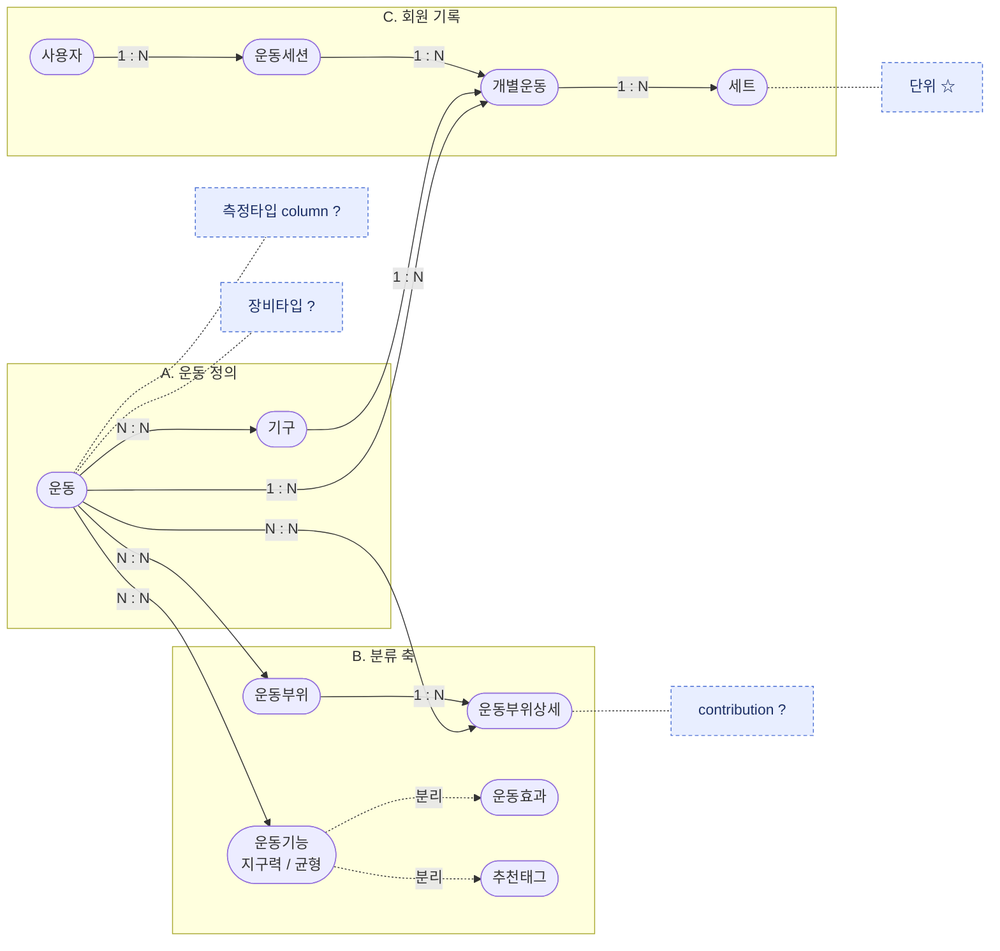
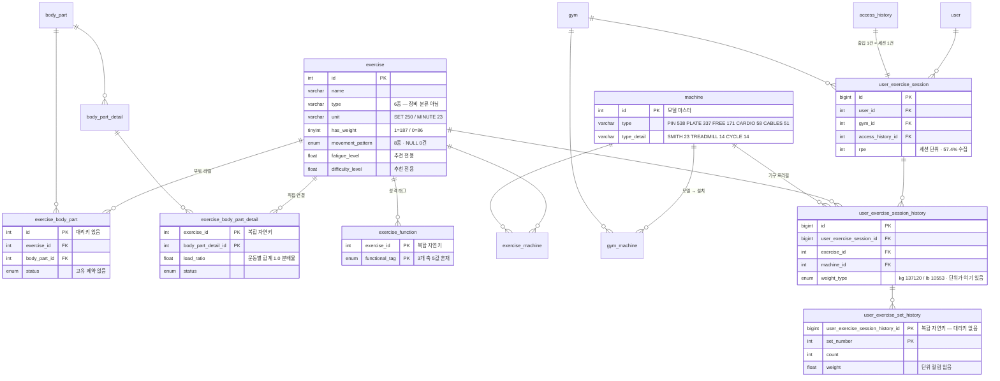
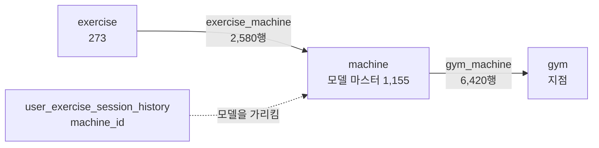

# 운동 데이터 구조 모형 — 화이트보드 모형과 현재 gymboxx의 차이

> 원본 스케치: [`exercise_data.jpg`](exercise_data.jpg)
> 실측 기준일 2026-08-25(운영 읽기전용 계정, SELECT/SHOW만 실행) · 마스터 행수는 2026-08-21 기준
> 근거: [`DB_구조_업그레이드_방안.md`](DB_구조_업그레이드_방안.md) · [`DB_구조_업그레이드_실행일정.md`](DB_구조_업그레이드_실행일정.md)(v2, 실측 재확인)

## 이 문서가 하는 일

화이트보드 스케치를 mermaid로 옮기고, **그 모형과 현재 gymboxx DB가 어디서 어긋나는지**를 정리한다.

결론부터: 모형은 **개념 모형이고 대체로 맞다.** 어긋나는 지점은 네 종류다.

| 유형 | 건수 | 성격 |
|---|---|---|
| A. 모형에 `?`로 적힌 것 | 5 | 아직 없는 것 — 이번 개편으로 만든다 |
| B. 한 덩어리로 그린 "기구"가 실제 3개 테이블 | 1 | **가장 큰 불일치.** 만들려던 것이 이미 있다 |
| C. 모형에 없는데 실제로 있는 것 | 6 | 모형이 생략한 것 |
| D. 모형이 표현하지 못하는 결함 | 5 | 관계선으로는 안 보이는 제약·PK 문제 |

---

## 1. 화이트보드 모형

### 모형을 읽는 법

- **가운데가 `운동`이다.** 왼쪽 위 `기구`, 오른쪽 `분류 축`, 아래 `회원 기록`이 전부 운동에 붙는다. 분류와 기록 사이에 직접 연결이 없고 **반드시 운동을 경유한다** — 부위별 랭킹이 3단 조인이 되는 이유다.
- **파란 항목 4개가 이번에 새로 붙일 것**이다. 스케치에서 파란 펜으로 `?`를 단 것들이 그대로 개편 항목이 됐다.
- `운동기능`에서 갈라지는 점선 두 개가 **효과 축과 추천용 태그의 분리**다.

### 모형이 맞게 짚은 것 3가지

1. **`운동 → 운동부위상세`가 `운동부위`를 경유하지 않는다.** 상단의 큰 호가 그것이고, 실제 스키마도 `exercise_body_part_detail.exercise_id`가 `exercise`를 직접 참조한다. 부위와 세부부위는 서로 독립적으로 붙는다.
2. **단위가 세트에 있어야 한다**(`세트 ☆ 단위`). 지금은 세트 위 행에만 있다.
3. **운동기능이 한 덩어리면 안 된다.** 한 컬럼에 세 축이 섞여 있다.

---

## 2. 현재 gymboxx 물리 구조

### 행수

| 테이블 | 행수 | 비고 |
|---|---|---|
| `exercise` | 273 | |
| `body_part` / `body_part_detail` | 8 / 21 | 사전 |
| `exercise_body_part` | 376 | |
| `exercise_body_part_detail` | 514 | |
| `exercise_function` | 87 | 제거 예정 |
| `machine` | **1,155** | 모델 마스터 |
| `gym_machine` | **6,420** | 지점 설치 |
| `exercise_machine` | **2,580** | 운동↔기구 연결 |
| `user_exercise_session` | 327,844 | |
| `user_exercise_session_history` | 136,087 → **146,969** | 하루 약 1,800행 증가 |
| `user_exercise_set_history` | 301,572 → **329,330** | 하루 약 4,600~6,900행 증가 |

이력 테이블 2개는 계속 증가 중이라 **착수 직전 재실측이 필요**하다.

---

## 3. 안 맞는 부분

### A. 모형에 `?`로 적힌 것 — 아직 없다

| 모형 표기 | 현재 gymboxx | 개편 | 이슈 |
|---|---|---|---|
| `측정타입 column ?` | **없음.** `unit`(SET/MINUTE) × `has_weight`(0/1) 조합으로 유추. 실측 조합 **3종**(SET·1=187, SET·0=63, MINUTE·0=23), `unit` NULL 0건 | §4 `measure_type` 신설 | [TECH-998](https://linear.app/suppliesfitness/issue/TECH-998) |
| `장비타입 ?` | **없음.** `exercise.type` varchar(30) 6종은 장비 분류가 아님 | §5 `equipment_type` 12종 병행 컬럼 | [TECH-1001](https://linear.app/suppliesfitness/issue/TECH-1001) |
| `운동기능 ?` → 운동효과·추천태그 | **한 테이블 87행에 3개 축 5값 혼재.** 지구력·균형·이완(효과) + 감량(회원 목적) + 회복(운동 용도) | §1 두 테이블로 분리 | [TECH-997](https://linear.app/suppliesfitness/issue/TECH-997) |
| `contribution ?` | **없음.** `load_ratio` float만 있고, 이것은 운동별 합계가 정확히 1.0인 **분배율**이라 등록 부위 수에 따라 값이 달라짐 | §6 `DIRECT`/`ASSIST` | [TECH-1001](https://linear.app/suppliesfitness/issue/TECH-1001) |
| `세트 ☆ 단위` | **없음.** 단위는 상위 `user_exercise_session_history.weight_type`에만(kg 137,120 / lb 10,553, NULL 0건) | §9 `weight_unit` + `weight_kg` 생성 열 | [TECH-999](https://linear.app/suppliesfitness/issue/TECH-999) |

`측정타입`은 방안 문서가 "단위 × 무게 보유 조합 **12종** 매핑표 확정"을 착수 전제로 걸었지만, **실측 조합은 3종**이고 `measure_type` 3값에 1:1 대응한다(12종은 `type`을 곱한 수인데 `type`은 판정에 영향이 없다). 판정 모호성 0건이다.

### B. "기구" 하나가 실제로는 3개 테이블 — 가장 큰 불일치

모형은 `기구` 한 덩어리인데, gymboxx는 **3계층**이다.

**모형이 그린 `운동 N:N 기구`는 이미 `exercise_machine` 2,580행으로 존재한다.** 새로 만들 것이 아니다. 그래서 두 가지가 따라온다.

**(1) 장비타입 컬럼은 "지점별 가능 운동 판정"의 답이 아니다.** §5가 내세운 목적이 그 판정인데, 그 판정은 `exercise → exercise_machine → machine → gym_machine → gym` 경로로 **이미 더 정확하게 성립한다.** `equipment_type` 다수결 값은 **대표 표기일 뿐 사실이 아니어서**, 핀 머신만 있는 지점에서 '플레이트'로 표기된 머신 풀다운이 불가능으로 판정되는 식으로 틀린 답이 나온다.

**(2) 자동 분류 가능 범위가 장비 종류마다 완전히 다르다.** 기구 연결률 실측:

| 장비 | 연결률 | |
|---|---|---|
| `CABLE` | 27/27 = **100%** | 자동 분류 가능 |
| `MACHINE` | 68/77 = **88.3%** | 자동 분류 가능 |
| `BARBELL` | 5/31 = 16.1% | |
| `BODY` | 4/41 = 9.8% | |
| `PROP` | 3/42 = **7.1%** | 사람 판단 필요 |
| `DUMBBELL` | 1/55 = 1.8% | |

방안 문서 §5의 "소도구는 어떤 시설이 필요한지 알 수 없음"은 **PROP에 대해서는 사실이지만 MACHINE에 대해서는 사실이 아니다.** 그리고 `machine.type`(PIN 538 · PLATE_LOADED 337 · FREE_WEIGHT 171 · CARDIO 58 · CABLES 51)과 `type_detail`(SMITH 23 · TREADMILL 14 · CYCLE 14)에 **장비 12종 중 5종의 판정 근거가 이미 있다.** 사람이 볼 목록이 68종 → 29종으로 줄어든 것이 이 때문이다.

**방안 문서 자체의 오기 2건도 여기서 나온다.**

| 방안 문서 서술 | 실측 |
|---|---|
| §5 "지점 기구 인벤토리 **6,149대**" | `machine` 1,155 / `gym_machine` 6,420 — **두 계층을 하나로 본 것** |
| §5 "기구 연결률 머신 **98.1%**" | **88.3%** |

### C. 모형에 없는데 gymboxx에 있는 것

| 있는 것 | 왜 중요한가 |
|---|---|
| `access_history` — 세션과 **1:1** | 출입 1건 = 세션 1건. **방문 목표 계산의 원천**이라 습관 지표의 뿌리다 |
| `gym` — 세션에 `gym_id` | 지점별 집계 |
| `exercise.movement_pattern` 8종 | 분류 축이 하나 더 있다. **NULL 0건**(ISOLATION 114 · PUSH 42 · PULL 40 · HINGE 22 · SQUAT 18 · LOCOMOTION 14 · LUNGE 12 · STRETCH 11 = 273 전건) |
| `exercise.fatigue_level` · `difficulty_level` | 추천 알고리즘 전용. 강도 컬럼과 **독립 운영** |
| `user_exercise_session.rpe` | 세션 단위 자각 강도, 188,095건(57.4%) 이미 축적. 세트 단위 `rpe` 신설의 수집률 기준선 |
| `exercise_body_part` · `exercise_body_part_detail` | 모형은 관계선 하나로 그렸지만 **속성을 가진 개체**다(`status`, `load_ratio`, 곧 `contribution`). 관계가 아니라 테이블이다 |

### D. 모형이 표현하지 못하는, 지금 실제로 깨져 있는 것

| 결함 | 실측 | 결과 |
|---|---|---|
| `exercise_body_part`에 **고유 제약이 전혀 없음** | 대리키 `id` PK + 각 FK별 KEY만 존재 | 같은 (운동, 부위) 중복 등록 가능 → **부위 집계 2배 계상** |
| `exercise_body_part_detail` PK가 **자연키 복합** | `(exercise_id, body_part_detail_id)`, `body_part_detail_id`만 별도 KEY | 정정 이력 보존 불가. 대리키 전환 시 `exercise_id`를 지지하던 인덱스가 사라져 **신규 KEY를 반드시 함께 생성**해야 함 |
| `운동 → 운동부위상세`가 부위를 경유하지 않음 | 모형이 맞게 그린 구조 | 부위와 세부부위의 **정합이 DB로 보장되지 않음** |
| `user_exercise_set_history` PK가 **자연키 복합** | `(user_exercise_session_history_id, set_number)`, FK 지지 인덱스는 PK뿐 | 세트를 가리킬 안정된 식별자가 없어 **최고기록의 근거 세트 참조가 불가능** |
| 측정 방식이 선언되지 않아 **오염 입력이 이미 있음** | `has_weight=0`인데 무게가 들어온 세트 **4,390건 / 43종목** · `unit='MINUTE'`인데 무게 **2건** | 기준선 **4,392건**. 신규분 0건 판정은 이 위에서 해야 함 |

`user_exercise_set_history`는 데이터 20.5MB(인덱스 0MB)로 물리 크기가 작아 `ALGORITHM=INPLACE` 리빌드 자체는 초~분 단위로 끝날 가능성이 높다. **"30만 행이라 위험"의 실체는 DDL 실행시간이 아니라** 대리키 전건 부여·백필의 정합성 검증 범위와 리빌드 타이밍이다. 다만 MySQL 8.0.45(RDS)에서 `AUTO_INCREMENT` 대리키를 수반하는 PK 교체는 **동시 DML을 허용하지 않으므로**(Permits Concurrent DML: No) 저트래픽 시간대 실행이 필수다.

---

## 4. 확인이 필요한 것

이 문서로 결론을 내지 못한 2건이다.

**`exercise_equipment` · `exercise_type` 테이블의 정체.** [`table.probe`](table.probe)에 두 테이블의 조회 쿼리가 있는데, **방안 문서와 실행일정 문서 어디에도 등장하지 않는다.** 장비 분류 신설(§5)과 역할이 겹치는지, 이미 쓰이지 않는 테이블인지 확인해야 한다. 겹친다면 `equipment_type` 컬럼 신설의 전제 자체가 바뀐다.

**`user_exercise_session_history.machine_id`가 무엇을 가리키는가.** FK는 `machine.id`인데 `machine`은 **모델 마스터**(1,155행)다. 지점 설치 개체는 `gym_machine`(6,420행)이므로, 현재 구조에서는 **"어느 지점의 어느 대에서 했는지"가 기록에 남지 않는다.** 두 문서의 서술을 교차해 얻은 추론이므로 스키마로 직접 확인이 필요하다.

---

## 5. 요약

모형은 **개념 수준에서 맞다.** `?`로 남긴 5개가 정확히 이번 개편 항목이 됐고, 세트에 단위를 놓아야 한다는 판단도 맞다.

실무에서 갈리는 지점은 하나다 — **`기구`를 한 덩어리로 본 것.** 실제로는 모델 마스터·지점 설치·운동 연결 3계층이고, 모형이 새로 그리려던 `운동 N:N 기구`는 이미 2,580행으로 존재한다. 그래서 장비 분류 작업은 "없는 것을 만드는 일"이 아니라 **"이미 있는 연결을 어디까지 신뢰할지 정하는 일"**에 가깝다(연결률 CABLE 100% ↔ DUMBBELL 1.8%).

## 근거

- [`DB_구조_업그레이드_방안.md`](DB_구조_업그레이드_방안.md) — §1~§12 변경 명세, §17 개체 관계도 작성 근거
- [`DB_구조_업그레이드_실행일정.md`](DB_구조_업그레이드_실행일정.md) — 2절 실측 재확인 요약표, 2-1절 "방안 문서와 실측이 어긋나는 지점", 3-4절 장비 분류
- [`DB_구조_업그레이드_실행일정_요약.md`](DB_구조_업그레이드_실행일정_요약.md)
- [`느슨하게작성일정.md`](느슨하게작성일정.md) · Linear TECH-997 ~ TECH-1002
