# 운동 추천 로직 흐름

> 작성 2026-08-31 · 대상 `gymboxx-app-server` `src/modules/exercise-recommendation`
> 기준 커밋 — `feature/tech-997/exercise-effect-split` (lib `4.30.0-dev.1`)
> 관련 — `TECH-997-효과축-추천태그-분리.claude.md` · `DB_구조_업그레이드_방안.md` §01

§ 번호는 코드 주석이 참조하는 기획서 절 번호를 그대로 따랐다.

---

## 1. 전체 흐름

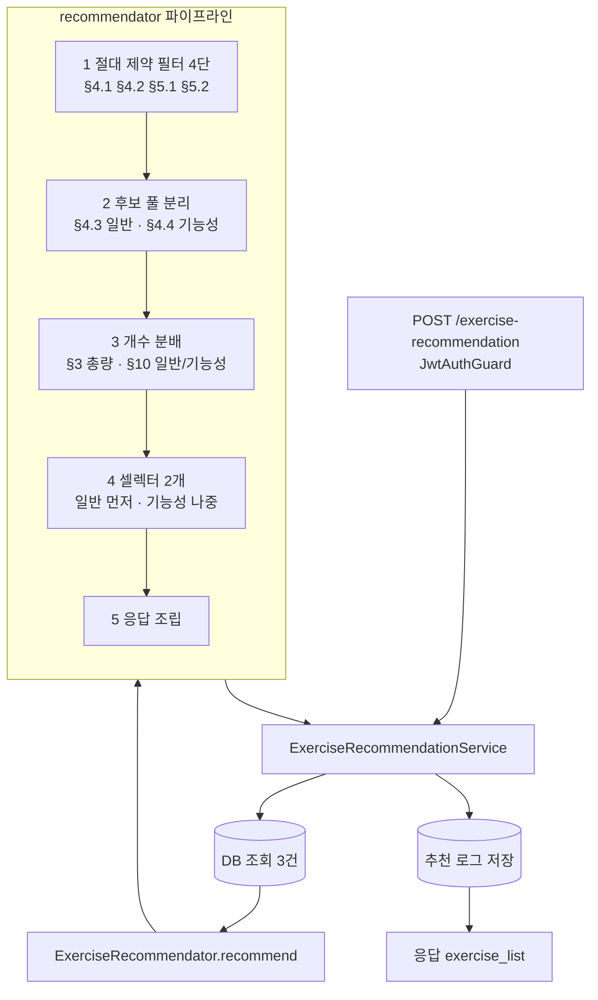

추천 자체는 **완전히 in-memory 순수 계산**이다. DB는 진입 시 3번 읽고, 끝에 로그를 1번 쓴다.

| 진입점 | 시간 | 특이사항 |
|---|---|---|
| `POST /exercise-recommendation` | 요청값 | 회원 metadata 필수 |
| `POST /exercise-recommendation/simple` | **30분 고정** | 온보딩 미완 회원 허용 (`purpose=STRENGTH_GAIN`, `level=2` 기본값) · `exclude_exercise_id_list` 지원 |

---

## 2. 입력 조회 — 여기서 이미 후보가 줄어든다

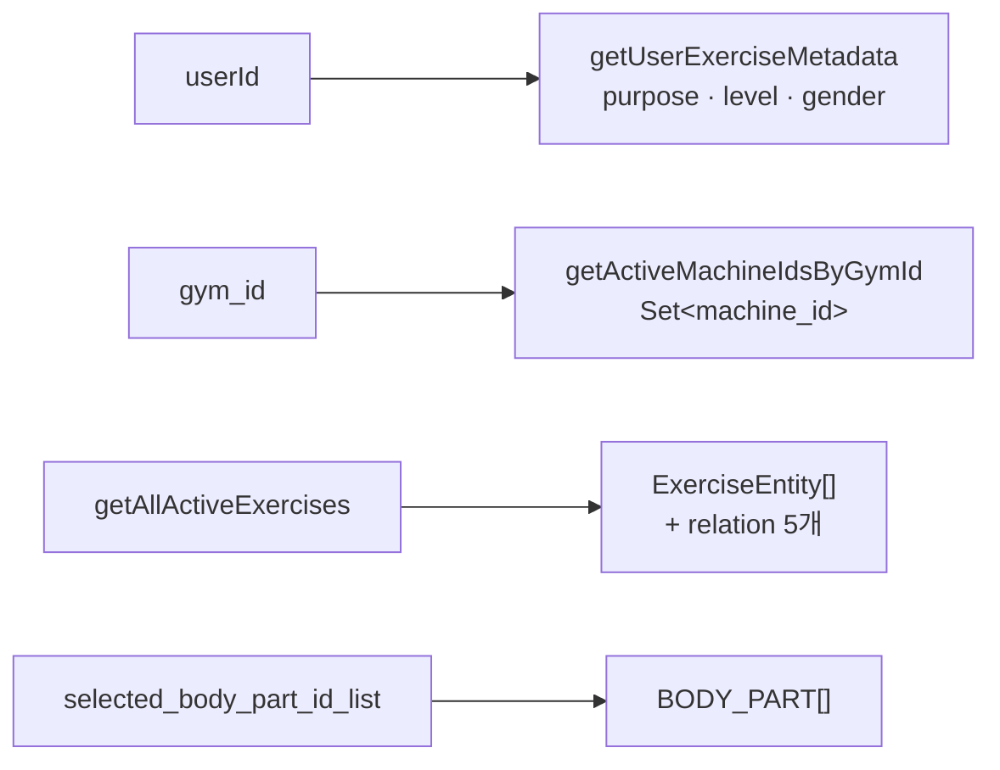

`getAllActiveExercises()` 가 함께 로드하는 relation 5개와 용도.

| relation | 쓰는 곳 |
|---|---|
| `exercise_machine` | §4.1 보유 기구 매칭 |
| `exercise_body_parts.body_part` | §4.2 CARDIO 제외 + §4.3 부위 매칭 |
| `exercise_effect` | §4.4 기능성 풀 분리 + §9 점수 (TECH-997 신설) |
| `exercise_recommend_tag` | 위와 동일 (TECH-997 신설) |
| `exercise_body_part_detail.body_part_detail` | §7 보조근 점수 |

### 🔴 주의 — 부위 매핑이 없는 운동은 조회 자체에서 빠진다

```ts
where: {
  status: STATUS.ACTIVE,
  exercise_body_parts: { status: STATUS.ACTIVE },   // ← relation 조건 = INNER JOIN
}
```

relation에 `where` 를 걸면 TypeORM이 inner join으로 만들기 때문에, **ACTIVE 부위 매핑이 하나도 없는 운동은 결과에 나타나지 않는다.** 필터가 떨어뜨리는 것이 아니라 애초에 후보 목록에 없다.

dev 실측 (2026-08-31) — `exercise` ACTIVE **236종** → `getAllActiveExercises()` **197종**. 39종이 이 지점에서 사라진다.

---

## 3. §4.1 ~ §5.2 절대 제약 필터

후보 절감 효과가 큰 것부터 순서대로 적용한다.

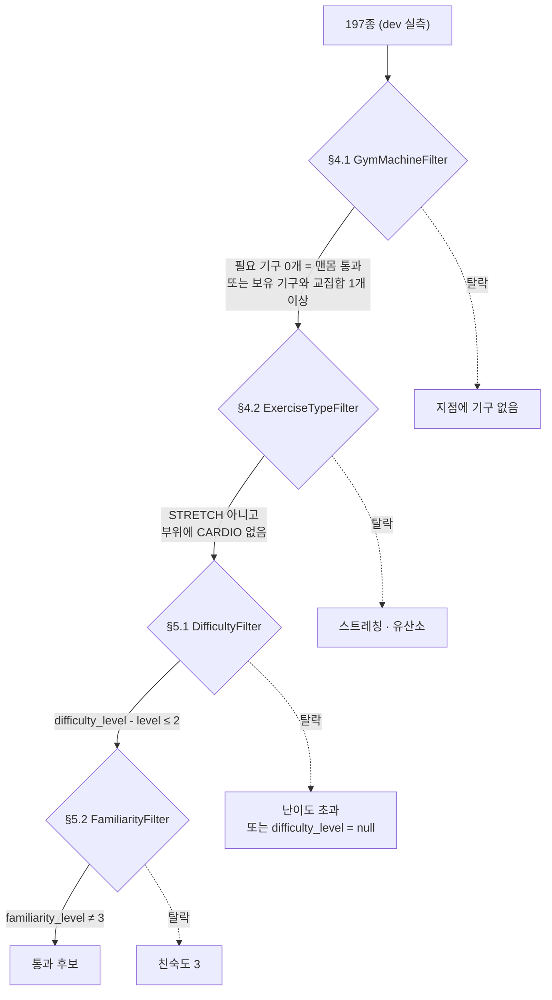

| 필터 | 조건 | 경계 |
|---|---|---|
| §4.1 `GymMachineFilter` | 필요 기구 중 **하나라도** 지점 보유 | 필요 기구 0개(맨몸)는 **통과** |
| §4.2 `ExerciseTypeFilter` | `movement_pattern = STRETCH` 제외 · 부위에 `CARDIO` 포함 시 제외 | 부위 배열이 없으면 통과 |
| §5.1 `DifficultyFilter` | `difficulty_level - level ≤ 2` | `null` 은 **제외** (하한은 무제한) |
| §5.2 `FamiliarityFilter` | `familiarity_level = 3` 제외 | `null` 은 통과 (셀렉터에서 다시 막힌다) |

dev 실측 통과율(각각 197종 기준 독립 측정) — §4.1 **184** · §4.2 **179**.

---

## 4. §4.3 · §4.4 후보 풀 분리

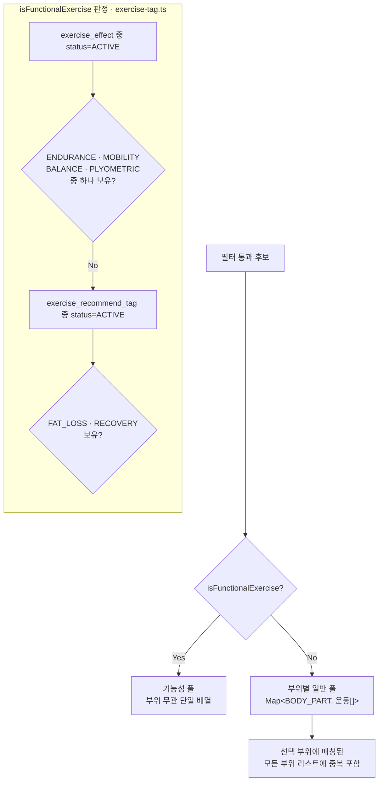

**핵심 규칙 — 기능성으로 판정된 운동은 일반 풀에 들어가지 않는다.** 두 풀은 배타적이다.

`STRENGTH` 는 판정에서 **제외**한다. TECH-997 백필로 근력이 195~225종에 붙기 때문에, `exercise_effect` 보유 여부만 보면 거의 전부가 기능성 풀로 가서 일반 루틴이 비어버린다. 근력을 뺀 집합이 이관 전 기능성 집합과 일치한다.

dev 실측 — 기능성 풀 **24종** · CHEST 일반 17 · ARM 일반 28.

---

## 5. §3 · §10 개수 분배 — 3단계로 쪼개진다

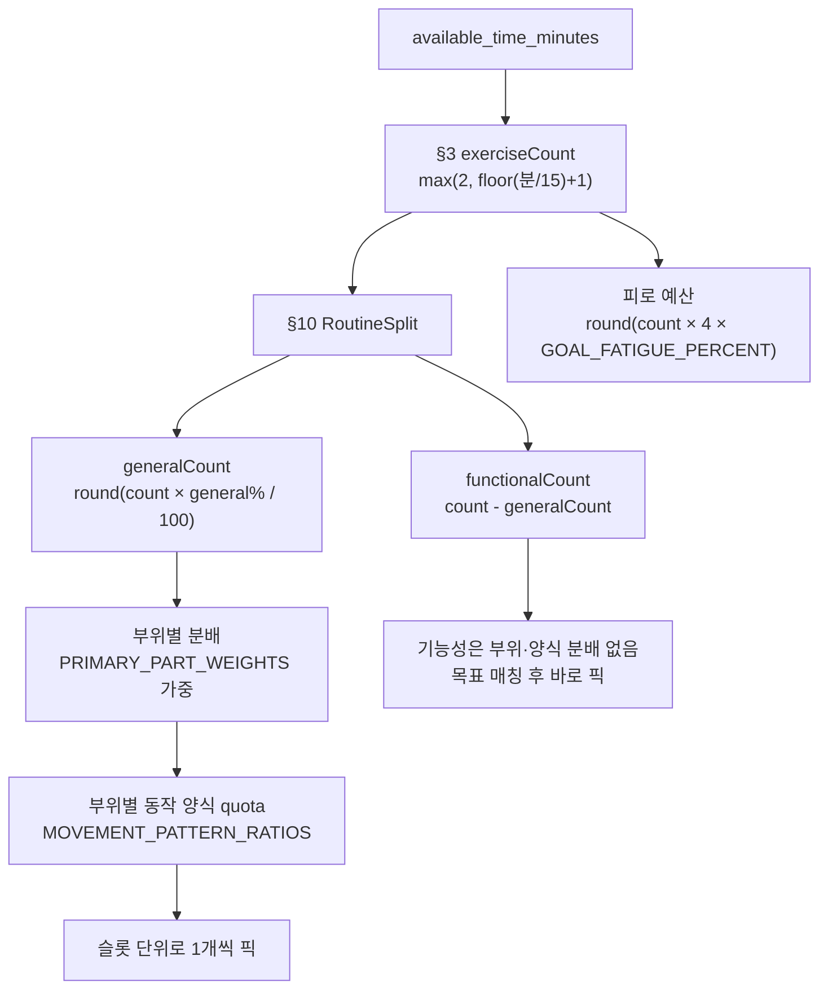

### 5-1. 총 운동 수 (§3)

`max(2, floor(분/15) + 1)` — 실제로 나오는 값은 **2~5** 뿐이다.

| 분 | 15 | 30 | 45 | 60 |
|---|---|---|---|---|
| count | 2 | 3 | 4 | 5 |

### 5-2. 일반/기능성 분배 (§10)

`generalCount` 를 먼저 `round` 로 구하고 나머지를 기능성에 준다. **`round` 때문에 낮은 count에서 기능성이 0으로 떨어진다.**

| 비율 (목적) | count 2 | 3 | 4 | 5 |
|---|---|---|---|---|
| 60/40 `WEIGHT_LOSS` `ENDURANCE_GAIN` | 1 | 1 | 2 | 2 |
| 70/30 `HEALTH_MANAGEMENT` | 1 | 1 | 1 | 1 |
| 80/20 `POSTURE_CORRECTION` `ATHLETIC_PERFORMANCE` | **0** | 1 | 1 | 1 |
| 100/0 `STRENGTH_GAIN` | 0 | 0 | 0 | 0 |

15분 + 80/20 목적은 기능성이 0이다 — `round(2 × 0.8) = 2` 라 남는 슬롯이 없다.

### 5-3. 부위별 분배 — 가중치를 쓴다

`PRIMARY_PART_WEIGHTS` 로 비례 배분한 뒤, `floor` 하고 남은 슬롯을 **소수부가 큰 순서**로 +1 한다 (소수부 동률이면 입력 배열 순서).

| CHEST | BACK | LEG | SHOULDER | ARM | CORE |
|---|---|---|---|---|---|
| 10 | 10 | 10 | 8 | 3 | 3 |

> ⚠️ **코드와 주석이 어긋난다.** `recommendation.type.ts` 의 `BodyPartGeneralCount` 주석은 *"균등 분배 + 앞쪽 부위부터 +1 · 부위별 가중치를 적용하지 않는다"* 라고 적혀 있지만, `body-part-general-count.calculator.ts` 는 `PRIMARY_PART_WEIGHTS` 를 쓴다. 균등 분배는 `totalWeight <= 0` 인 경우의 fallback 경로일 뿐이다.
> 예) `generalCount=3`, `[CHEST, ARM]` → 가중치 10:3 이므로 CHEST 2 / ARM 1. 주석의 균등 분배로도 같은 값이 나와 증상이 드러나지 않는다. `[ARM, CHEST]` 순서로 넣으면 갈린다.

### 5-4. 동작 양식 quota

부위별로 `MOVEMENT_PATTERN_RATIOS` 비율대로 슬롯을 쪼갠다. 배분 방식은 5-3과 같다 (floor + 소수부 큰 순).

| 부위 | 비율 |
|---|---|
| CHEST | PUSH 3 · ISOLATION 1 |
| SHOULDER | PUSH 2 · ISOLATION 1 |
| BACK | PULL 3 · HINGE 1 |
| LEG | SQUAT 1 · LUNGE 0.5 · HINGE 0.5 · ISOLATION 1 |
| ARM · CORE | ISOLATION 1 |

---

## 6. 일반 루틴 셀렉터 — 슬롯 1개를 채우는 과정

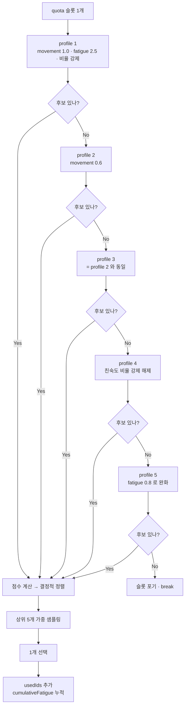

후보 필터 3조건 — ① `usedIds` 에 없음 ② `movement_pattern` 이 슬롯의 목표 양식과 **정확히 일치** ③ 친숙도 규칙 통과.

### 친숙도 규칙 (`canPickByFamiliarity`)

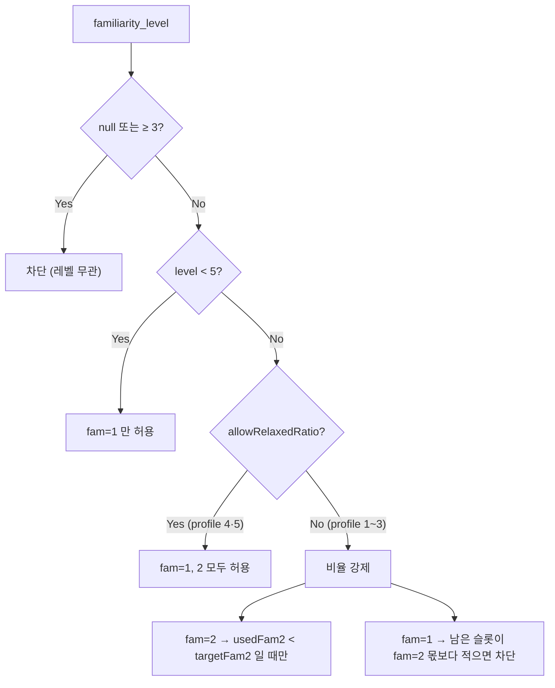

`targetFam2 = level >= 5 ? round(부위슬롯수 × 0.25) : 0` — 부위 단위로 센다.

`usedIds` 는 **부위 간 공유**한다. `CandidatePoolFilter` 가 한 운동을 여러 부위 풀에 중복 넣을 수 있으므로, 공유하지 않으면 같은 운동이 두 번 뽑힌다.

---

## 7. 기능성 루틴 셀렉터

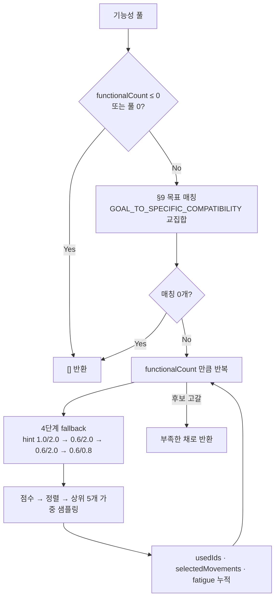

**부위·동작 양식 분배가 없다.** 목표 태그와 교집합만 보고 바로 뽑는다.

목표 매칭 표 — 6개 목적 중 **4개가 효과 축 태그만으로** 판정된다. 추천이 `exercise_recommend_tag` 만 읽으면 이 4개가 전부 빈 배열이 된다.

| 회원 목적 | 매핑 태그 | 효과 축 | 추천 태그 |
|---|---|---|---|
| `WEIGHT_LOSS` | FAT_LOSS · ENDURANCE | ENDURANCE | FAT_LOSS |
| `STRENGTH_GAIN` | ENDURANCE | ENDURANCE | — |
| `ENDURANCE_GAIN` | ENDURANCE · BALANCE | 둘 다 | — |
| `HEALTH_MANAGEMENT` | RECOVERY · MOBILITY | MOBILITY | RECOVERY |
| `POSTURE_CORRECTION` | MOBILITY · BALANCE | 둘 다 | — |
| `ATHLETIC_PERFORMANCE` | BALANCE · MOBILITY · ENDURANCE | 셋 다 | — |

### 부족분 정책

`meta.functional_count` 는 **요청 개수**, `functional_routine[]` 길이는 **실제 선택 개수**다. 예외를 던지지 않고 부족한 채로 내보내므로 두 값이 다를 수 있다.

---

## 8. 점수 산식

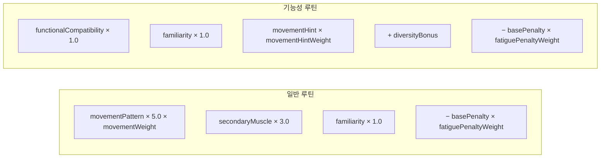

| 항목 | 계산 | 가중치 |
|---|---|---|
| `movementPattern` | `MOVEMENT_PATTERN_RATIOS[부위][양식]` | 5.0 |
| `secondaryMuscle` | 보조근별 우선순위 합 (level 5 기준 표 분기 · 여성 LEG 보너스) | 3.0 |
| `familiarity` | fam 1 → 1.0 · fam 2 → 0.5 · 그 외 0 | 1.0 |
| `functionalCompatibility` | **목표 태그와의 교집합 개수** | 1.0 |
| `movementHint` | `GOAL_TO_MOVEMENT_HINTS[목적]` 에 포함되면 가산 | profile |
| `diversity` | 이미 뽑힌 양식이 아니면 가산 (기능성 전용) | 고정 |

결정적 정렬 — `score desc` → `secondaryMuscleScore desc` → `exercise.id asc`.

### 가중 샘플링

```
상위 5개만 후보 (TOP_CANDIDATE_POOL_SIZE)
weight = (5 - 순위) × 0.7 + 1/(1 + 최고점과의 차이) × 0.3
```

1등이 항상 뽑히지 않는다. 순위 비중 70% · 점수 근접도 30%.

---

## 9. 피로 예산 — 두 셀렉터가 하나의 트래커를 공유한다

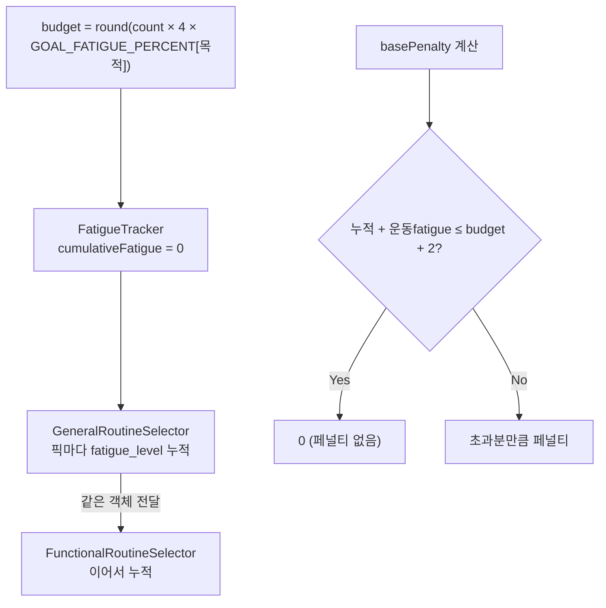

**일반 루틴이 먼저 예산을 쓰고, 기능성이 그 뒤를 이어받는다.** 일반에서 피로도 높은 운동이 몰리면 기능성 후보가 페널티를 받는다. 순서가 결과에 영향을 준다.

| 목적 | 예산 계수 |
|---|---|
| `STRENGTH_GAIN` | 1.1 |
| `ATHLETIC_PERFORMANCE` | 1.0 |
| `ENDURANCE_GAIN` | 0.9 |
| `WEIGHT_LOSS` | 0.85 |
| `HEALTH_MANAGEMENT` | 0.75 |
| `POSTURE_CORRECTION` | 0.7 |

`fatigue_level` 이 `null` 이면 1로 본다. 여유 `+2` 는 `OVER_BUDGET_TOLERANCE`.

---

## 10. 결정성과 RNG

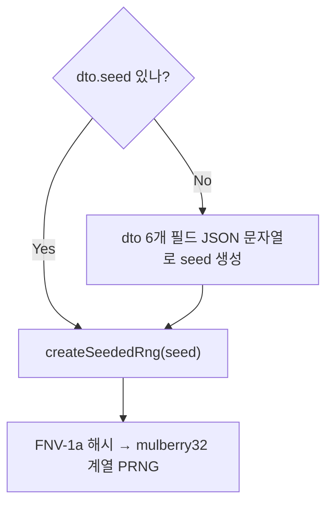

### 🔴 주의 — API 경로에서는 seed가 항상 채워진다

```ts
seed: body?.seed ?? `${userId}_${dayjs().format('YYYYMMDDHHmmss')}`
```

서비스가 seed를 **항상** 만들기 때문에, `createRngFromDto` 의 "seed 없으면 dto 필드로 만든다" 경로는 API 경로에서 실행되지 않는다. `recommendation.type.ts` 주석의 *"seed 미지정 시 동일 입력 → 동일 출력"* 은 recommendator를 직접 호출할 때만 성립한다.

실무적 의미 — 같은 회원이 **같은 초에** 두 번 호출하면 같은 결과, 다음 초면 다른 결과다.

---

## 11. dev 실측 (2026-08-31 · 지점 5 · CHEST+ARM · 60분 · level 5)

| 목적 | count | meta g/f | 실제 g/f | 뽑힌 기능성 운동 |
|---|---|---|---|---|
| WEIGHT_LOSS | 5 | 3/2 | 3/2 | 마운틴 클라이머, 덤벨 런지 |
| STRENGTH_GAIN | 5 | 5/0 | 5/0 | — |
| ENDURANCE_GAIN | 5 | 3/2 | 3/2 | 밴드 페이스 풀, 플랭크 레그 리프트 |
| HEALTH_MANAGEMENT | 5 | 4/1 | 4/1 | 플랭크 |
| POSTURE_CORRECTION | 5 | 4/1 | 4/1 | 머신 앱도미널 크런치 |
| ATHLETIC_PERFORMANCE | 5 | 4/1 | 4/1 | 맨몸 스쿼트 월 서포트 |

6개 목적 전부 `meta` 개수와 실제 배열 길이가 일치했다 — 기능성 후보가 22~42종인데 요청은 1~2개라 부족분 경로를 타지 않았다.

---

## 12. 정리 — 후보가 줄어드는 지점 6곳

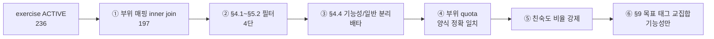

풀이 비면 어디서 막혔는지 이 순서로 짚으면 된다. 특히 **① inner join** 과 **④ 양식 정확 일치**가 조용히 후보를 줄이는 지점이다.

---

## 13. 알려진 갭

| # | 내용 | 영향 |
|---|---|---|
| 1 | `BodyPartGeneralCount` 주석이 "가중치 미적용"인데 코드는 `PRIMARY_PART_WEIGHTS` 사용 | 부위 배열 순서에 따라 분배가 주석과 갈린다 |
| 2 | `createRngFromDto` 의 dto-기반 seed 경로가 API에서 실행되지 않음 | 결정성 재현 시 recommendator 직접 호출 필요 |
| 3 | `GENERAL_FALLBACK_PROFILES` 의 2번과 3번이 동일 | fallback 5단계가 실질 4단계 |
| 4 | `GOAL_TO_SPECIFIC_COMPATIBILITY[STRENGTH_GAIN]` 이 `ENDURANCE` 만 참조 | `functionalCount=0` 이라 호출되지 않아 현재 무영향 |
| 5 | 상수 13곳이 모듈 최상단 import | 값을 바꿔 테스트하려면 `jest.mock` 필요 |
| 6 | `getAllActiveExercises()` 를 요청마다 전량 재조회 + OneToMany 5개 조인 | 카티전 곱 · 캐싱과 `relationLoadStrategy: 'query'` 검토 대상 |
