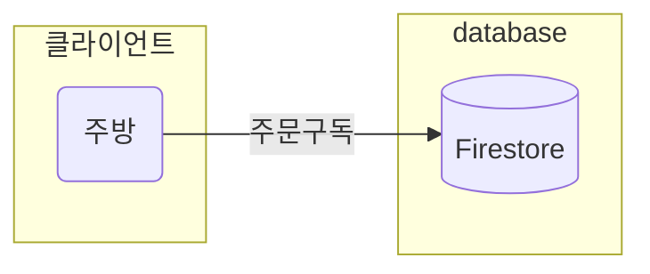
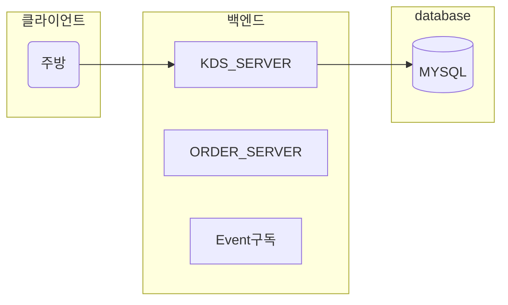
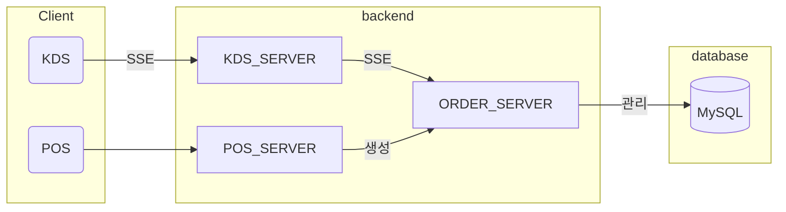
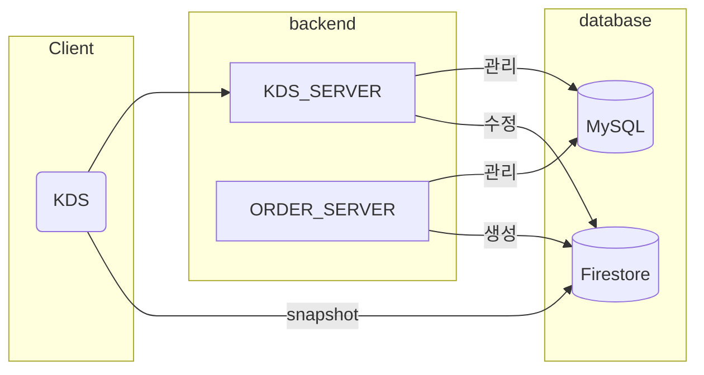
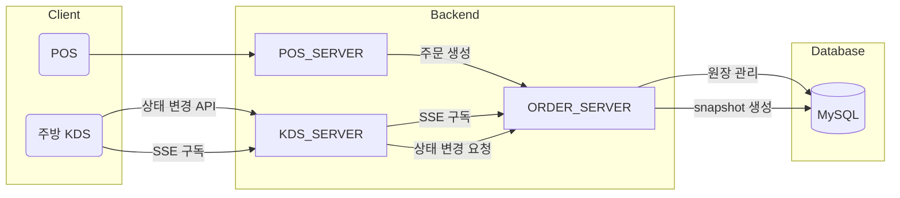
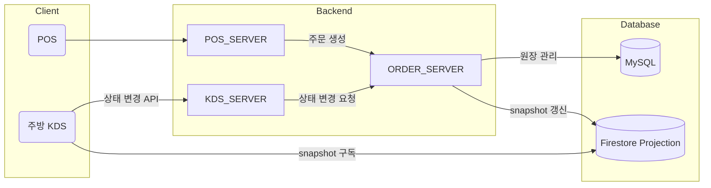
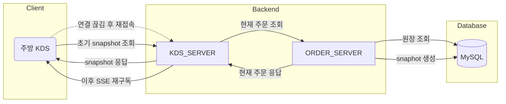
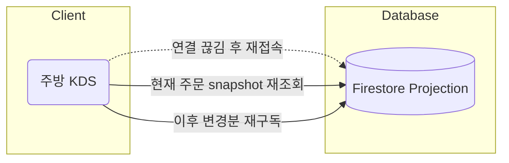

## TODO
KDS 신규 아키텍처

- ASIS

- TOBE  
KDS_SERVER: KDS 관련 서버  
ORDER_SERVER: 주문 입력 서버

- 주문 구독 방법  
  SSE 통신
- 이벤트 트리거  
  a. ORDER_SERVER에서 주문 입력 즉시
  b. KDS_SERVER에서 DB log 구독

a, b중 어느쪽으로 가야할지 고민

선택 기준

||Firestore|SSE|
|--|--|--|
|장애복구| snapshot만 보면됨 | 직접설계
|구현난이도| 구현되어있음 | snapshot, stream, 복구 직접
|운영비용| firestore console | 연결/전달/재연결 운영
|확장성| 현재상태 모두 소화 | 이벤트 직접 통제로 높음
|보안| 별도의 DB규약 | 서버 중심 일원화

- SSE

- Firestore projection으로 사용

- A

- B

### 장애발생
- A

- B
