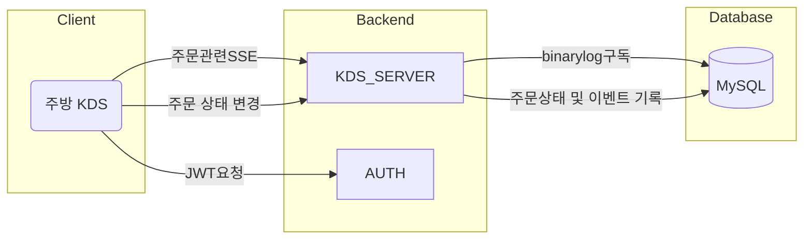

## TODO
### 아키텍처

### 역할
주방 KDS: 포지션별 조리 업무  
KDS_SERVER: 주문 이벤트 발행, 주문 상태 변경
AUTH: 인증용 JWT생성

ORDER_SERVER: 프레퍼스의 모든 주문 생성

조회용 테이블
order_status outbox 처럼 쓸 예정

웹훅을 사용해서 KDS_SERVER에 알리는 방법도 있습니다.
ORDER_SERVER -> KDS_SERVER 요청을 피하려는 이유
KDS는 BFF 입니다. 데이터 흐름이 역방향으로 진행되면 혼란이 늘어날까 걱정되기 때문입니다.

### 일정
- [주문 이벤트 설계] 1d
- [Snapshot 문서 구조 설계] 1d
- [KDS_SERVER용 토큰 발급] 1d
- [KDS SSE 이벤트 구현] 1d
- [DB binarylog 읽기 구현] 1d
- [상태변경API 개발] 4d
- [Snapshot 갱신 로직 연동] 2d
- [주문 이벤트 구현] 2d
- [통합 테스트] 2d
- [배포] 1d
- [모니터링] 4d

### 가산 디지털 배민 매출 시트 업데이트 안됨

### 이슈
오늘 CS가 은근히 들어왔따.
- 메타베이스 행제한 이슈 (Jenny) - cs export로 해결
- 라즈베리파이 굽기 2개
- 가산디지털단지 배달 매출 시트 업데이트 (Green) - 장부대장 연결 안됨
- 구로디지털단지 키오스크 주문 누락 375 (Green) - (4-20 13:34:00) 원인파악 불명 셀버스에 로그 요청 필요
