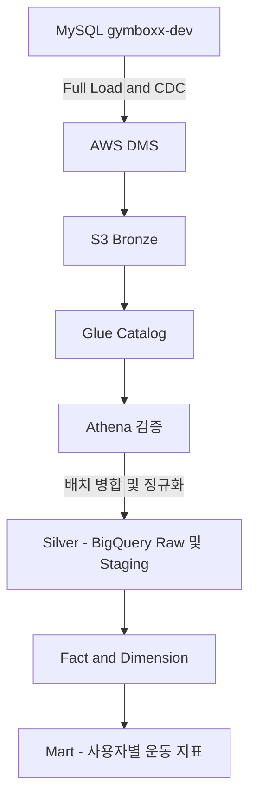

# 운동기록 DW 화이트보드 정리

> 2026-08-25 화이트보드의 검정색 메모를 기준으로 구조화한 초안이다.
> 사진에서 명확하지 않은 표현은 문맥에 맞게 보완했으며, 확정 설계가 아닌 항목은 `결정 필요`로 표시했다.
>
> 관련 문서: [운동기록 DW 배치 파이프라인 PoC 진행상황](../../project/데이터자산화/PoC-진행상황.md), [인프라 스택 구현 이슈](../../project/데이터자산화/인프라-스택-구현-이슈.md)

## 1. 목적

운동기록 원천 데이터를 분석 가능한 형태로 적재하기 위해 다음 흐름을 정리한다.

- MySQL의 원천 데이터를 AWS DMS로 S3 Bronze 계층에 복제한다.
- Glue Catalog에서 S3 데이터의 스키마와 테이블 메타데이터를 관리한다.
- Athena에서 Bronze 데이터가 정상적으로 조회되는지 검증한다.
- 배치 작업으로 CDC 이벤트를 병합하여 Silver 계층의 최신 상태를 만든다.
- BigQuery에서 Fact와 Dimension 모델을 구성해 사용자별 운동 횟수 등의 지표를 제공한다.

현재 PoC의 확정 범위는 `gymboxx-dev`의 합성 데이터와 아래 두 테이블이다.

- `user_exercise_session_history`
- `user_exercise_set_history`

화이트보드에 적힌 `user`, `gym`, `membership` 등은 이후 모델 확장을 위한 후보이며, 현재 PoC의 필수 적재 범위는 아니다.

## 2. 전체 데이터 흐름



계층별 책임은 다음과 같이 구분한다.

| 계층 | 역할 | 주요 처리 |
| --- | --- | --- |
| Source | 서비스의 원천 데이터 | 운동 세션·세트 생성 및 변경 |
| Bronze | 원천 보존 계층 | Full Load와 CDC 결과를 가급적 원형 그대로 저장 |
| Silver | 정제·통합 계층 | 타입 정규화, 중복 제거, CDC `INSERT/UPDATE/DELETE` 병합 |
| Warehouse | 분석 모델 계층 | Fact와 Dimension 구성, Grain 고정 |
| Mart | 지표 제공 계층 | 사용자별 운동 횟수, 완료율 등 목적별 지표 제공 |

## 3. Bronze 적재 구조

### 3.1 Full Load와 CDC

초기 적재와 변경분을 분리해 보관한다.

```text
S3 Bronze
├── user_exercise_session_history/
│   ├── full/
│   └── cdc/
└── user_exercise_set_history/
    ├── full/
    └── cdc/
```

화이트보드의 `user_exercise_full`, `user_exercise_cdc`, `user_full`, `user_cdc`는 위와 같은 분리 방식을 표현한 것으로 본다. 실제 경로는 DMS 출력 구조와 기존 `platform-iac` 설정을 확인한 뒤 확정한다.

날짜 디렉터리 형식은 `yyyy-mm-dd`를 사용한다.

```text
s3://<bucket>/<environment>/<domain>/<database>/<table>/<load_type>/yyyy-mm-dd/
```

날짜값을 원천 데이터의 업무 발생일과 적재일 중 어느 쪽으로 정할지는 배치 실행 기준을 정할 때 함께 결정한다. 업무 발생일이 필요하면 원천의 `created_at`, `updated_at`, `end_at` 등을 별도 컬럼으로 유지한다.

### 3.2 스키마 관리와 조회

- **Glue Catalog**: S3 파일의 테이블 정의, 컬럼, 타입, 파티션을 관리한다.
- **Athena**: Glue Catalog의 메타데이터를 사용해 S3 데이터를 SQL로 조회한다.
- **BigQuery**: GCP에 적재된 Raw·Staging·Fact·Mart 테이블의 스키마와 쿼리를 담당한다.

따라서 화이트보드의 “GCP에서 Schema 관리? Athena 같은 역할?”은 하나의 도구로 대응하기보다 역할을 나누어 이해해야 한다. AWS Lake 구간은 Glue와 Athena가 맡고, Warehouse 이후는 BigQuery가 맡는다.

## 4. Silver 처리 원칙

Silver에서는 Full Load 결과를 기준 상태로 삼고 이후 CDC 이벤트를 순서대로 반영한다.

처리 시 최소한 다음 항목이 필요하다.

1. 원천 테이블의 기본키를 기준으로 동일 레코드를 식별한다.
2. CDC 이벤트의 작업 종류를 `INSERT`, `UPDATE`, `DELETE`로 구분한다.
3. 동일 기본키에 여러 이벤트가 있으면 이벤트 발생 순서를 기준으로 최신 상태를 선택한다.
4. 삭제 이벤트는 실제 행 삭제 또는 `is_deleted` 표시 중 한 방식으로 통일한다.
5. 재실행해도 결과가 중복되지 않도록 멱등성을 보장한다.

초기 Silver 후보는 다음과 같다.

- `user_exercise_session_history`
- `user_exercise_set_history`

확장 후보는 다음과 같다.

- `user`
- `gym`
- `membership`

## 5. Warehouse 모델

### 5.1 Grain

화이트보드에는 Grain이 “운동기록”으로 적혀 있으나, 실제 Fact를 만들기 전에는 한 행의 의미를 더 구체적으로 고정해야 한다.

| 모델 후보 | 한 행의 의미 | 주요 용도 |
| --- | --- | --- |
| `fact_workout_session` | 사용자의 운동 세션 1건 | 운동 횟수, 운동 시간, 세션 완료 여부 |
| `fact_workout_set` | 세션 안에서 수행한 운동 세트 1건 | 세트 수, 볼륨, 세트 완료율 |

PoC의 최종 지표가 “일별 세션당 평균 세트 완료율”이므로 세션 Fact와 세트 Fact를 분리하고, 세트 Fact가 세션 Fact를 참조하는 구성이 자연스럽다.

### 5.2 Dimension

화이트보드에서 확인되는 Dimension 후보는 다음과 같다.

- `dim_date`: 일·주·월 등 시간 축
- `dim_user`: 사용자 속성
- `dim_gym`: 지점 속성

회원권 분석이 필요하면 `membership`을 Dimension으로 만들지, 사용자와 지점 사이의 이력형 관계 테이블로 만들지 별도로 결정한다. 회원권은 기간과 상태가 바뀌므로 단순 현재값 Dimension만으로는 과거 시점 분석이 틀어질 수 있다.

### 5.3 예상 지표

- 사용자별 운동 횟수(`exercise_count`)
- 일별 운동 세션 수
- 세션당 평균 세트 수
- 일별 세션당 평균 세트 완료율
- 지점별 활성 운동 사용자 수

지표를 구현하기 전에 “완료된 세트”와 “완료된 세션”을 판정하는 상태값과 시간 컬럼을 먼저 확정해야 한다.

## 6. 원천 컬럼 메모

화이트보드에서 식별된 운동기록 관련 컬럼은 다음과 같다.

```text
id
user_id
gym_id
created_at
end_at
session_cnt
status
```

`session_cnt`는 사진 판독이 불확실하므로 실제 스키마에서 컬럼명을 다시 확인한다. 또한 현재 PoC 대상은 `user_exercise_session_history`와 `user_exercise_set_history`이므로, 위 컬럼을 그대로 모델 계약으로 사용하지 말고 원천 DDL과 대조해야 한다.

## 7. Naming Convention 초안

화이트보드의 `bronze_gymboxx`, `dev_bronze_gymboxx` 메모를 바탕으로 환경·계층·도메인을 이름에 일관되게 포함한다.

| 대상 | 예시 | 비고 |
| --- | --- | --- |
| S3 Bucket | `gymboxx-dev-data-lake` | Bucket에는 계층보다 환경과 용도를 표현 |
| S3 Prefix | `bronze/gymboxx/<database>/<table>/<load_type>/` | 계층과 테이블은 Prefix에서 구분 |
| Glue Database | `dev_bronze_gymboxx` | `<env>_<layer>_<domain>` |
| Glue Table | `user_exercise_session_history_cdc` | 원천 테이블과 적재 유형 표현 |
| BigQuery Dataset | `bronze_gymboxx`, `silver_gymboxx`, `mart_gymboxx` | 프로젝트에서 환경을 이미 구분하면 환경명 생략 가능 |

최종 명명 규칙은 S3, Glue, DMS, BigQuery 전체에서 다음 항목을 통일해야 한다.

- 환경: `dev`, `stg`, `prod`
- 계층: `bronze`, `silver`, `mart`
- 도메인: `gymboxx` 또는 `workout`
- 데이터베이스와 테이블명
- 적재 방식: `full`, `cdc`
- 날짜 디렉터리 형식: `yyyy-mm-dd`

## 8. 결정이 필요한 항목

### 배치 실행 기준

회의에서 합의된 기준은 없으며, 아래 항목은 작성자가 직접 결정해야 한다.

- 실행 주기: 시간 단위, 일 단위 또는 수동 실행
- CDC 마감 시점과 배치가 읽을 구간
- 날짜 디렉터리의 기준값: 업무 발생일 또는 적재일
- 지연 도착 데이터의 허용 범위
- 실패 후 재실행과 Backfill 방법

### 초기 적재

- 모든 대상 테이블을 한 번에 Full Load할지, 테이블별로 순차 실행할지
- Full Load 중 발생한 변경을 CDC가 누락 없이 이어받는지
- Full Load 완료를 판단할 행 수와 샘플 대조 기준

### Silver 병합

- DMS 이벤트 순서를 판정할 컬럼
- `UPDATE`가 전체 행 이미지인지 변경 컬럼만 포함하는지
- `DELETE`의 물리 삭제·논리 삭제 처리 방식
- 중복 이벤트 제거와 멱등성 보장 방식

### 보관 정책

- S3 Bronze 원본 보관 기간
- Full Load 파일과 CDC 파일의 보관 기간 차등 여부
- 오래된 파일을 Glacier로 전환할지 여부
- 재처리와 감사에 필요한 최소 보관 기간

## 9. 다음 실행 체크리스트

- [ ] 실제 S3 적재 경로와 문서의 경로가 일치하는지 확인한다.
- [ ] Bronze Athena PR의 리뷰·머지·적용 상태를 확인한다.
- [ ] Athena에서 대상 두 테이블의 행 수를 원천 MySQL과 대조한다.
- [ ] 각 테이블의 샘플 값을 원천 MySQL과 대조한다.
- [ ] Full Load와 CDC 검증 증거의 저장 위치를 기록한다.
- [ ] DMS CDC 이벤트의 작업 종류와 순서 관련 컬럼을 확인한다.
- [x] 날짜 디렉터리 형식을 `yyyy-mm-dd`로 확정한다.
- [ ] Batch 실행 주기와 날짜값의 기준을 결정한다.
- [ ] S3·Glue·DMS·BigQuery Naming Convention을 확정한다.
- [ ] S3 Bronze Retention 정책을 결정한다.
- [ ] 운동 세션 Fact와 운동 세트 Fact의 Grain을 확정한다.

## 10. 화이트보드 판독 보류 사항

사진만으로 확정하기 어려워 추가 확인이 필요한 부분이다.

- 원천 컬럼으로 적힌 `session_cnt`의 정확한 이름과 의미
- `user_exercise`가 실제 테이블명인지, 운동기록 도메인을 가리키는 약칭인지 여부
- `bronze_gymboxx`와 `dev_bronze_gymboxx` 중 실제 적용할 명명 순서
