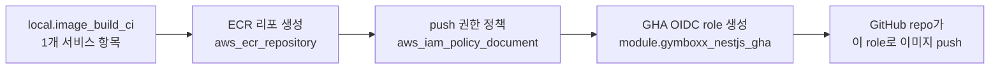

# `stacks/ecr/gymboxx/image-build-ci.tf` 동작 흐름

`local.image_build_ci`라는 서비스 목록(맵) 하나를 축으로 삼아, 그 목록을 `for_each`로 돌며 서비스마다 동일한 리소스 세트(ECR 리포 + lifecycle 정책 + GHA용 IAM)를 반복 생성하는 구조다.

## 단순 버전 (이 파일 내부만, 서비스 1개 기준)



이 파일이 하는 일은 사실 이 네 단계뿐이다: **서비스 이름을 정하면 → ECR 리포가 생기고 → 그 리포에만 push할 수 있는 권한이 만들어지고 → 그 권한을 쓸 수 있는 GitHub Actions role이 생긴다.** `for_each`가 이 체인을 서비스 개수만큼(현재 8개) 반복할 뿐이고, lifecycle 정책이나 output은 부수적인 부분이다.

## 상세 버전 (전체 리소스 + 파일 밖 연결)


flowchart TD
    L["local.image_build_ci<br/>서비스별 ecr 경로 맵"]

    L -->|for_each| REPO["aws_ecr_repository.gymboxx_nestjs<br/>name = ecr 경로 예: gymboxx/community/api<br/>IMMUTABLE 태그"]
    L -->|for_each| LIFE["aws_ecr_lifecycle_policy.gymboxx_nestjs<br/>untagged 7일 만료 / 최근 30개만 유지"]
    L -->|for_each| ROLENAME["local.gymboxx_nestjs_role_name<br/>ecr 의 슬래시를 대시로 치환"]

    REPO -->|arn| POLICYDOC["data.aws_iam_policy_document.gymboxx_nestjs_gha_push<br/>GetAuthorizationToken, Push 권한"]

    ROLENAME --> GHAROLE["module.gymboxx_nestjs_gha<br/>iam/gha-oidc-role"]
    POLICYDOC --> GHAROLE

    GHAROLE -->|OIDC trust| GHREPO["GitHub repo<br/>suppliesfitness/gymboxx-서비스명<br/>branches: develop, main"]

    REPO -->|repository_url| OUT1["output<br/>gymboxx_nestjs_repository_urls"]
    GHAROLE -->|role_arn| OUT2["output<br/>gymboxx_nestjs_gha_role_arns"]

    GHREPO -.->|GitHub Actions<br/>platform-ci nestjs-docker-ecr-build.yml<br/>env-빌드시각KST-git-sha8 태그 push| REPO

    subgraph EXT["이 파일 밖, 연결은 수동/이름 일치"]
        UPDATER["argocd-image-updater<br/>dev-eks/k8s/argocd-image-updater.tf<br/>registries.prefix 는 계정ID+리전 host만"]
        GITOPS["platform-gitops Application<br/>image-list 어노테이션<br/>host + ecr 경로 예: gymboxx/community/api"]
    end

    REPO -.->|이름을 사람이 그대로<br/>GitOps 어노테이션에 복사| GITOPS
    GITOPS --> UPDATER
    UPDATER -.->|새 태그 감지시 write-back| GHREPO
```

## 단계별 설명

1. **`local.image_build_ci`** — 서비스 키(`app-server`, `community-server` 등)마다 ECR 리포 경로(`ecr`)를 매핑한 표. `community-server`만 새 3단 경로 규칙(`gymboxx/community/api`)을 쓰고 나머지 7개는 구 규칙(`gymboxx/{서비스}`) 그대로다.
2. **`aws_ecr_repository.gymboxx_nestjs`** — 이 표를 `for_each`로 돌며 서비스별 ECR 리포를 실제 생성. `IMMUTABLE` 태그 정책이라 같은 태그로 재푸시가 안 되고, GHA 워크플로우가 매 빌드마다 `{env}-{KST시각}-{git-sha8}` 형태 새 태그를 쓰는 전제와 맞물린다.
3. **`aws_ecr_lifecycle_policy.gymboxx_nestjs`** — untagged 7일 만료 + 최근 30개만 유지로 리포 용량을 정리.
4. **`local.gymboxx_nestjs_role_name`** — IAM 이름 제약(`/` 불가) 때문에 `ecr` 경로의 `/`를 `-`로 바꿔 role/policy 이름을 파생.
5. **`data.aws_iam_policy_document.gymboxx_nestjs_gha_push`** — GetAuthorizationToken(전체 리소스 필요) + 해당 리포 ARN에만 한정된 Push 권한 문서.
6. **`module.gymboxx_nestjs_gha`** — 위 정책을 붙여 `suppliesfitness/gymboxx-{key}` GitHub 레포용 OIDC role을 생성. `develop`/`main` 브랜치에서 온 GitHub Actions만 이 role을 assume할 수 있고, 이 role로 push하면 자기 서비스 리포 외엔 건드릴 수 없다(공용 dev 리포를 계속 쓰면 이 격리가 불가능했다는 게 파일 상단 주석의 이유).
7. **output 2개** — 리포 URL 맵과 role ARN 맵을 다른 스택/워크플로우 설정에 넘기기 위해 노출.

## 파일 밖에서 일어나는 연결 (다이어그램 점선 부분)

GHA가 이 리포로 이미지를 push하면, `argocd-image-updater`(host 정보만 가진 `registries.conf`)가 platform-gitops의 `image-list` 어노테이션(이 파일이 정한 `ecr` 경로 문자열을 사람이 그대로 복사해 넣은 것)을 보고 새 태그를 감지해 write-back한다 — 코드 레벨 참조는 없고 이름 일치로 묶여 있다.
