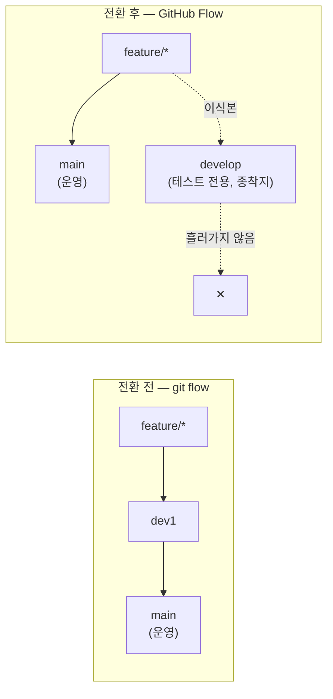
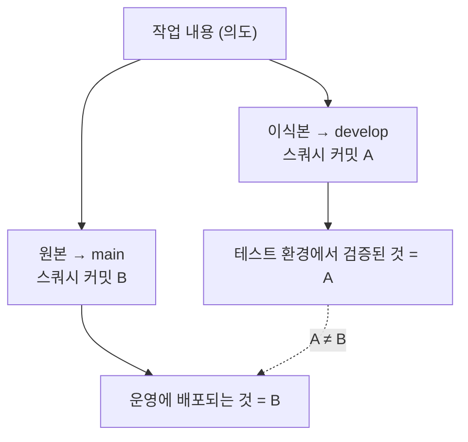

# develop 브랜치는 왜 계속 아픈가

> git flow → GitHub Flow 전환이 절반만 끝난 상태에 대한 진단
>
> - **브랜치 이름은 남았는데 역할이 뒤집혔다.** 예전 `dev1`은 main으로 *승격되는* 통합 브랜치였고, 지금 `develop`은 어디로도 흘러가지 않는 *종착지*다.
> - 그래서 모든 변경을 **두 번 만들게 된다.** 실측 결과 논리적 작업 35건에 PR 64건.
> - 가장 큰 비용은 불편이 아니라 **테스트한 커밋과 배포하는 커밋이 다르다**는 것이다.

측정 기준일: 2026-09-09 · 대상 저장소: `gymboxx-app-server`

---

## 1. 무슨 일이 있었나

브랜치 전략을 git flow에서 GitHub Flow로 바꿨다. 그 과정에서 통합 브랜치 `dev1`은 `develop`으로 이름이 바뀌었다 (PR #684 `feature/tech-797/dev-branch-to-develop`).

바뀐 것은 이름만이 아니었다. **브랜치가 하던 일이 통째로 바뀌었는데, 그 사실이 명시된 적이 없다.**

| | 전환 전 (`dev1`) | 전환 후 (`develop`) |
|---|---|---|
| `→ main` PR 수 | **45건** | **0건** |
| 역할 | 모든 변경이 모였다가 main으로 승격되는 **간선** | 테스트 배포만을 위한 **종착지** |
| main의 정체 | dev1의 검증된 스냅샷 | 운영 배포선, 유일한 간선 |

`dev1 → main` PR이 45건 있었다는 건 그 브랜치가 실제로 승격 경로였다는 뜻이다. 지금 `develop → main` PR은 **0건**이다. develop에 들어간 커밋은 develop에만 남는다.



---

## 2. 왜 이 구조가 구조적으로 아픈가

GitHub Flow의 전제는 하나다. **간선은 하나뿐이고, 환경은 브랜치가 아니라 배포 대상이다.**

- git flow에서 develop은 *브랜치로 표현된 환경*이었다. 모든 변경이 그 위를 지나가므로 통합 지점 역할이 성립했다.
- GitHub Flow에서 테스트 환경은 브랜치가 아니라 **"어떤 커밋을 어디에 배포했는가"** 로 표현되어야 한다.

지금의 develop은 둘 중 어느 쪽도 아니다. 간선도 아니면서(아무데도 안 흘러감) 배포 대상도 아니다(브랜치로 존재함). **모든 변경이 두 세계에 각각 존재해야 하는** 제3의 실체가 됐다.

여기서부터 나오는 비용은 전부 이 하나의 원인에서 파생된다.

---

## 3. 증상 — 실측

### 3.1 이중 PR 세금

PR #681 이후 집계:

| 항목 | 값 |
|---|---|
| PR 총 개수 | 64 |
| ├ base `develop` | 37 |
| └ base `main` | 21 |
| 논리적 작업 수 (`-dev` 접미사 제거 후 distinct) | **35** |
| **작업당 PR 수** | **1.83배** |
| 머지되지 못하고 닫힌 PR | 8 |

작업 하나가 PR 다섯 개로 번진 사례도 있다.

```text
feature/exercise-records-wave2
  #716 (develop, MERGED)   #732 (develop, CLOSED)   #734 (develop, MERGED)
  #735 (develop, CLOSED)   #717 (main,    OPEN)
```

손으로 만드는 "이식본" 브랜치(`*-dev`)도 굳어졌다 — #734, #737, #742. PR 제목에 `[develop]`, 본문에 "develop 이식본, 테스트 전용"을 적는 관행까지 생겼다. **관행이 생겼다는 건 구조가 강요하고 있다는 신호다.**

### 3.2 dev 프리릴리스 핀 오염

develop은 테스트용 라이브러리 프리릴리스를 물고 있고, main은 정식 버전을 문다.

```text
main    : "@suppliesfitness/gymboxx-lib": "4.33.0"
develop : "@suppliesfitness/gymboxx-lib": "4.33.1-dev.0"
```

그 결과 **main을 develop에 머지하는 모든 시도가 상시 충돌**한다.

```bash
$ git merge-tree --write-tree --name-only origin/develop origin/main
package.json
package-lock.json
CONFLICT (content): Merge conflict in package.json
CONFLICT (content): Merge conflict in package-lock.json
```

충돌 자체보다 위험한 건 **해소 방향을 틀리면 조용히 망가진다**는 점이다. develop 쪽 `4.33.1-dev.0`을 main 쪽 `4.33.0`으로 덮으면, 테스트 환경이 검증하려던 그 라이브러리 변경분이 사라진 채 초록불이 켜진다.

### 3.3 드리프트

```text
분기 시점 : 95ae3483 (2026-09-03)
develop   : main 대비 38 커밋 앞  (tip 89160f35, 2026-09-08)
main      : develop 대비 4 커밋 앞 (tip 6d6b059c, 2026-09-07)
```

닷새 만에 38커밋이 벌어졌고, 되돌아갈 경로가 없으므로 이 간격은 **단조 증가**한다. 오래된 develop 위에서 테스트한 결과는 시간이 갈수록 main에 대한 근거로서 가치가 떨어진다.

---

## 4. 진짜 문제 — 테스트한 커밋과 배포하는 커밋이 다르다

앞의 것들은 비용이다. 이건 결함이다.

이식본은 develop에 스쿼시 머지되고, 원본은 별개의 PR로 main에 머지된다. 두 경로는 **다른 커밋 객체**를 만든다. 같은 저장소의 [head-and-squash-merge.md](./head-and-squash-merge.md)에 적힌 그대로 — 스쿼시는 내용만 흡수하고 원본 커밋의 정체성을 버린다.



A와 B가 갈라지는 지점은 최소 세 군데다.

1. **라이브러리 핀** — develop은 `-dev.N`, main은 정식 버전. 서로 다른 코드가 링크된다.
2. **충돌 해소** — 두 base가 다르므로 충돌도 따로 나고, 사람이 따로 푼다.
3. **시점** — 이식본은 38커밋 앞선 develop 위에, 원본은 main 위에 얹힌다.

즉 **"테스트했으니 배포해도 된다"는 추론이 성립하지 않는다.** 테스트의 목적 자체가 무효화된다. 이식본 PR이 "테스트 전용"이라는 이유로 리뷰를 덜 받는 관행까지 겹치면, 실제로 돌려본 코드가 가장 리뷰를 덜 받은 코드가 된다.

---

## 5. 규칙이 서로를 배신하는 지점

현재 문서화된 규칙은 두 문장이다.

1. 모든 피처 브랜치는 **main에서 딴다**
2. 기본 PR은 **develop으로** 하나

둘 다 각각은 옳지만 **동시에 지키면 반드시 사고가 난다.** main 기반 브랜치를 develop에 PR하면, 그 PR은 자기 변경 한 줄이 아니라 **main과 develop의 차이 전체를 함께 끌고 들어간다.**

실제 사례 — `.dockerignore` 한 줄짜리 chore PR:

```text
#744 (base main)    MERGEABLE     ← 정상
#743 (base develop) CONFLICTING   ← 충돌 원인은 .dockerignore 가 아니라 lib 핀
```

한 줄 고치는 PR이 **main→develop 동기화의 운반체**가 되어버렸고, 그 안에서 핀 충돌을 풀어야 하는 상황이 됐다. 잘못 풀면 3.2의 조용한 붕괴가 일어난다.

여기에 스택 PR까지 겹친다. #738은 base가 `main`도 `develop`도 아닌 `feature/exercise-records-wave2`다. base 후보가 셋이 되면 사람이 매번 판단해야 하고, 판단 지점이 늘어나면 오류율은 선형으로 늘지 않는다.

---

## 6. 선택지

| | 방식 | 얻는 것 | 치르는 것 |
|---|---|---|---|
| **A** | **PR별 임시 환경** — PR을 열면 그 커밋으로 일회용 환경이 뜨고 닫으면 사라진다 | 테스트 대상 = 머지 대상. 문제의 뿌리가 사라짐 | 인프라 구축·운영 비용. DB/시드 전략 필요 |
| **B** | **develop을 재생성 가능한 통합 브랜치로** — 히스토리를 보존하지 않고, 배포 전마다 `main + 열린 PR들`로 다시 만든다 (force push 전제) | 드리프트·충돌 누적이 원천 제거. 이식본 수작업 불필요 | develop 히스토리 포기. 재생성 자동화 필요 |
| **C** | **main 단일 + 피처 플래그** — 미완성 코드도 꺼둔 채 main에 머지 | 브랜치 문제 자체가 소멸. GitHub Flow의 정석 | 플래그 규율·정리 비용. 팀 합의 필요 |
| **D** | (보조) **dev 핀을 커밋하지 않기** — `-dev.N` 프리릴리스를 `package.json`에 박지 말고 배포 환경에서 주입 | 3.2의 상시 충돌과 조용한 붕괴가 사라짐 | 주입 경로 설계 (dist-tag / overrides / 빌드 인자) |

---

## 7. 권고

**지금 당장 (비용 0)** — 규칙 문장을 고친다. 지금 문장은 실행 불가능하다.

- ✅ `develop` PR은 **`develop`에서 딴 브랜치로만** 연다 (main 기반 브랜치를 develop에 걸지 않는다)
- ✅ 한 브랜치에 base가 다른 PR을 두 개 걸지 않는다
- ❌ "main에서 따서 develop으로 PR" — 이 조합을 금지 목록에 명시한다

**단기** — D + B. D는 독립적으로 즉시 효과가 있고(상시 충돌 제거), B는 이식본 수작업을 없앤다. 둘 다 인프라 투자 없이 가능하다.

**목표** — A 또는 C. 4장의 결함(테스트 커밋 ≠ 배포 커밋)은 A/C 없이는 완화만 될 뿐 사라지지 않는다.

**그만둘 것** — 손으로 `-dev` 이식본 브랜치를 만드는 일. 이건 워크플로가 아니라 구조 결함을 사람이 메우고 있는 것이다.

---

## 한 장 요약

| | 오해 | 사실 |
|---|---|---|
| **develop의 역할** | 예전처럼 통합 브랜치다 | GitHub Flow 전환 후 `develop → main` PR은 **0건**. 종착지다 |
| **이중 PR** | 테스트하려니 어쩔 수 없다 | 작업 35건에 PR 64건(1.83배). 구조가 강요하는 세금이다 |
| **develop 충돌** | 파일이 겹쳐서 난다 | `-dev.N` 라이브러리 핀 때문. main→develop 머지가 **상시** 충돌한다 |
| **테스트의 의미** | develop에서 돌려봤으니 배포해도 된다 | 스쿼시로 만들어진 **다른 커밋**을 검증한 것. 추론이 성립하지 않는다 |
| **현재 규칙** | 두 문장 다 지키면 된다 | "main에서 따서 develop에 PR"은 동시에 지킬 수 없다 |

---

## 부록 — 이 문서의 근거를 재현하는 명령

```bash
# 역할 반전: dev1→main 45건 vs develop→main 0건
gh pr list --state all --limit 200 \
  --json number,headRefName,baseRefName \
  --jq '[.[]|select(.headRefName=="develop" or .headRefName=="dev1")]|length'

# 이중 PR 세금
gh pr list --state all --limit 200 \
  --json number,headRefName,baseRefName,state \
  --jq '[.[]|select(.number>=681)] as $p
        | {total:($p|length),
           develop:([$p[]|select(.baseRefName=="develop")]|length),
           main:([$p[]|select(.baseRefName=="main")]|length),
           logical:([$p[]|(.headRefName|sub("-dev$";""))]|unique|length)}'

# 핀 오염과 상시 충돌
git show origin/main:package.json    | grep gymboxx-lib
git show origin/develop:package.json | grep gymboxx-lib
git merge-tree --write-tree --name-only origin/develop origin/main

# 드리프트
git rev-list --count origin/main..origin/develop
git rev-list --count origin/develop..origin/main
```
