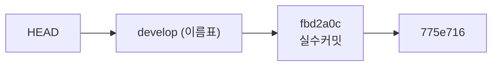
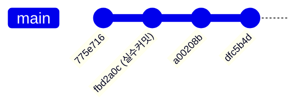
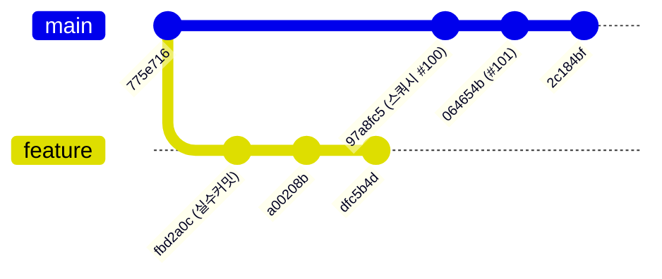
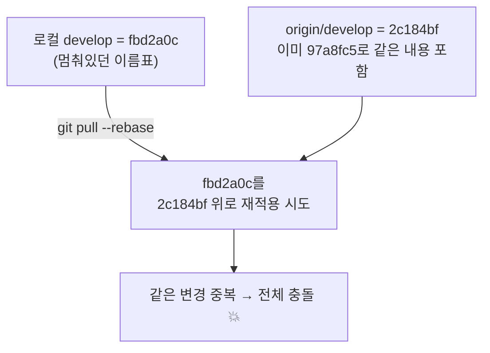

# HEAD와 스쿼시 머지 이해하기

> 실제 사례로 배우는 두 가지 git 핵심 개념
> - **브랜치는 "작업"이 아니라 "포인터"다** (HEAD가 가리키는 것)
> - **스쿼시 머지는 원본 커밋을 이어받지 않는다** (새 커밋을 만든다)

---

## 1. 무슨 일이 있었나 (실제 사례)

TECH-236 치킨 옵션 고기타입 작업을 하다가 아래 순서로 진행했다.

1. **로컬 `develop`에서 실수로 직접 커밋** → `fbd2a0c`
2. 그 지점에서 `feature/TECH-236/inherit-chicken-option` 브랜치를 따서 작업 이어감
3. 피처 브랜치를 PR로 올려 origin/develop에 **스쿼시 머지**
4. 며칠 뒤 로컬 `develop`으로 돌아와 `git pull` 실행

기대: "실수커밋 → 피처 브랜치 → 머지" 순서로 작업했으니 develop도 **직선으로 최신까지 이어질 것**이다.

실제: `git pull`이 리베이스를 돌리며 **거의 모든 파일이 충돌**났다.

왜 그랬을까? 두 가지 오해가 겹쳐 있었다.

---

## 2. 오해 1 — 브랜치는 "작업"이 아니라 "포인터"다

`develop`은 작업 덩어리가 아니라 **특정 커밋을 가리키는 이름표**일 뿐이다.
그리고 `HEAD`는 "지금 내가 서 있는 커밋"을 가리키는 포인터다.



핵심은 **이름표는 저절로 움직이지 않는다**는 점이다.

- 피처 브랜치를 따고 PR을 올려 원격이 아무리 앞서 나가도,
- **로컬 `develop` 이름표는 `fbd2a0c`에 멈춘 채 그대로 있다.**

`git checkout develop`으로 돌아왔을 때, 나는 최신 develop이 아니라
**며칠 전 실수커밋 자리로 돌아온 것**이다. 이름표가 거기 멈춰 있었으니까.

> 💡 브랜치 = "이 커밋을 가리키는 이름표", HEAD = "지금 그 이름표 위에 서 있음".
> 원격이 앞서갔다고 내 로컬 이름표가 따라오지 않는다. `pull`/`fetch`로 직접 옮겨야 한다.

---

## 3. 오해 2 — 스쿼시 머지는 원본 커밋을 이어받지 않는다

피처 브랜치는 `fbd2a0c`에서 **정상적으로** 파생됐다. 여기엔 문제가 없다.



문제는 이 피처 브랜치를 **스쿼시 머지**로 origin/develop에 넣을 때 생긴다.

스쿼시 머지는 이렇게 동작한다.

1. 피처 브랜치의 **모든 변경 내용**(`fbd2a0c` + `a00208b` + `dfc5b4d`의 diff)을 하나로 뭉친다.
2. 그걸 **develop의 그 시점 tip(`775e716`) 위에 새 커밋 1개**로 얹는다 → `97a8fc5`.
3. 이때 **원본 커밋 `fbd2a0c`는 부모 사슬에 넣지 않는다.** 내용(diff)만 흡수하고 커밋 객체는 버린다.

즉 origin/develop에 도착한 건 `fbd2a0c`가 아니라,
**`775e716`을 부모로 하는 완전히 새 커밋 `97a8fc5`** 다.

실제로 확인해보면:

```bash
$ git rev-list --parents -n 1 97a8fc5
97a8fc5... 775e716...      # 부모가 775e716 하나뿐 (머지커밋도 아님)
```

부모가 `fbd2a0c`가 아니라 그 직전 `775e716`이다. **`fbd2a0c`는 develop 계보에 절대 들어가지 않았다.**

> 💡 스쿼시 머지 = "내용만 뭉쳐서 base 위에 새 커밋 1개로 얹기".
> 원본 커밋의 해시/정체성은 버려진다. 그래서 원본 커밋은 develop 히스토리에 남지 않는다.

---

## 4. 그래서 "직선"이 아니라 "분기(fork)"가 됐다

두 오해가 합쳐진 결과, 히스토리는 `775e716`에서 **두 갈래로 갈라진다.**


> 위 그림에서 `main` 라인이 origin/develop, `feature` 라인이 피처 브랜치다.

- **피처 라인**: `fbd2a0c → a00208b → dfc5b4d` — 내 작업, fbd2a0c에서 잘 이어짐. (원격 피처 브랜치에 안전하게 백업됨)
- **origin/develop 라인**: `97a8fc5(스쿼시) → 064654b → 2c184bf` — 스쿼시로 새로 만든 커밋들, 부모는 `775e716`.

로컬 `develop` 이름표는 여전히 **피처 라인의 시작점 `fbd2a0c`** 에 멈춰 있다.

---

## 5. `git pull`이 충돌을 일으킨 이유

이 레포는 `pull.rebase = true` 설정이라, develop에서 `git pull` 하면
**"로컬 develop에만 있는 커밋을 origin/develop 위로 리베이스"** 를 시도한다.

```bash
$ git config --get pull.rebase
true
```

리베이스가 하려는 일:

> "로컬 develop에만 있는 `fbd2a0c`를 떼어내서, 최신 origin/develop(`2c184bf`) 위에 다시 얹자."

그런데 `fbd2a0c`의 내용은 이미 `97a8fc5`(스쿼시)로 origin/develop에 들어가 있다.
**같은 변경을 같은 파일에 두 번 얹으려다** 거의 전 영역이 충돌한 것이다.



---

## 6. 올바른 대응

로컬 develop의 `fbd2a0c`는 **버려도 되는 잔재**다. 그 내용은
(1) 피처 브랜치(로컬·원격)에 그대로 있고,
(2) origin/develop에도 스쿼시로 이미 들어가 있다.

```bash
git rebase --abort              # 진행 중인 리베이스 취소 (fbd2a0c 자리로 원복)
git reset --hard origin/develop # 로컬 develop을 원격과 완전히 동일하게 맞춤
```

- `--abort`: 리베이스 시작 전 상태로 되돌린다.
- `reset --hard origin/develop`: 멈춰있던 이름표를 최신 origin/develop으로 강제 이동. stray 커밋 `fbd2a0c`를 버린다.
- 피처 브랜치와 원격 작업물은 **전혀 건드리지 않는다.** 손실 없음.

---

## 7. 다시 겪지 않으려면

- **`develop`(공유 브랜치)에 직접 커밋하지 않는다.** 항상 최신 origin/develop에서 피처 브랜치를 따서 작업한다.
- 실수로 develop에 커밋했다면, 피처 브랜치를 딴 **직후** 로컬 develop을 `git reset --hard origin/develop`로 즉시 되돌려 놓는다. 그러면 나중에 pull 할 때 충돌이 없다.
- PR 머지 방식(스쿼시/머지커밋/리베이스)에 따라 히스토리 모양이 다르다는 걸 기억한다.
  스쿼시는 깔끔한 한 줄 히스토리를 주지만, **원본 커밋의 정체성이 사라진다.**

---

## 한 장 요약

| 개념 | 오해 | 사실 |
|------|------|------|
| **브랜치/HEAD** | develop은 자동으로 최신까지 이어진다 | 브랜치는 이름표(포인터)일 뿐, 저절로 안 움직인다 |
| **스쿼시 머지** | PR 머지하면 원본 커밋이 develop에 이어진다 | 내용만 뭉쳐 **새 커밋**을 만들고, 원본 커밋은 계보에 안 들어간다 |
| **결과** | 직선 히스토리 | `775e716`에서 갈라진 **분기(fork)** |
