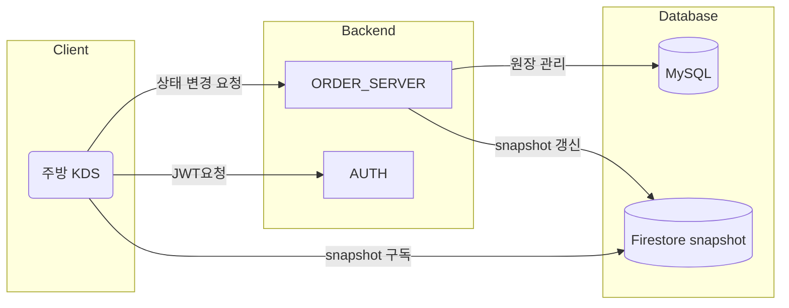

```mermaid
graph LR
  subgraph Client
    KDS(주방 KDS)
  end

  subgraph Backend
    ORDER_SERVER
    AUTH
  end

  subgraph Database
    ledger[(MySQL)]
    snapshot[(Firestore snapshot)]
  end

  KDS --> |상태 변경 요청| ORDER_SERVER

  ORDER_SERVER -->|원장 관리| ledger
  ORDER_SERVER -->|snapshot 갱신| snapshot
  KDS -->|snapshot 구독| snapshot

  KDS --> |JWT요청|AUTH
```

### 역할
주방 KDS: 포지션별 조리 업무  
ORDER_SERVER: 주문정보 관련 진입점  
AUTH: 인증용 JWT생성