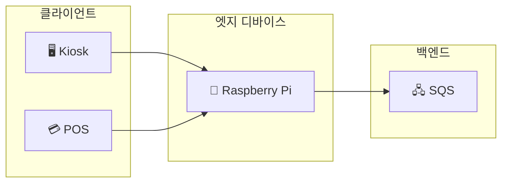

# Order Flow

## 시스템 아키텍처

```mermaid
graph LR
    subgraph Client["클라이언트"]
        Kiosk["🖥️ Kiosk"]
        POS["💳 POS"]
    end

    subgraph Edge["엣지 디바이스"]
        RaspberryPi["🍓 Raspberry Pi"]
    end

    subgraph Backend["백엔드"]
        SQS["🖧 SQS"]
    end

    Kiosk --> RaspberryPi
    POS --> RaspberryPi
    RaspberryPi --> SQS
```
