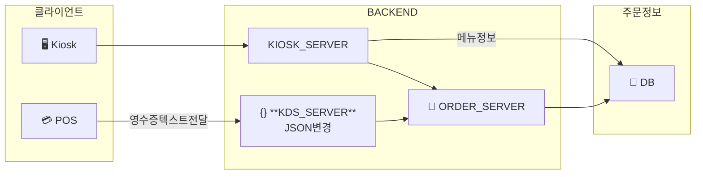
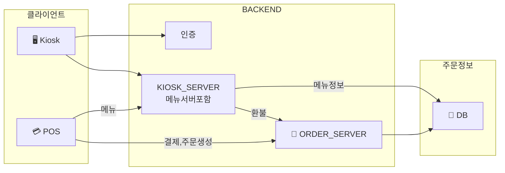
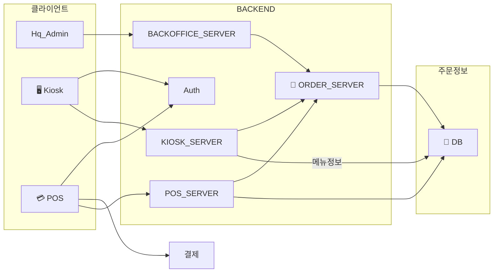

# Order Flow

## 시스템 아키텍처

### ASIS

### A

```mermaid
graph LR
    subgraph Client["클라이언트"]
        Kiosk[🖥️ Kiosk]
        POS[💳 POS]
    end

    subgraph Backend[BACKEND]
        KIOSK_SERVER
        ORDER_SERVER[🥡 ORDER_SERVER]
        KDS_SERVER["{}" **KDS_SERVER**<BR/>JSON변경]
    end

    subgraph DB[주문정보]
        MYSQL[💾 DB]
    end

    Kiosk --> KIOSK_SERVER --> ORDER_SERVER
    POS -->|영수증텍스트전달|KDS_SERVER --> ORDER_SERVER
    ORDER_SERVER --> MYSQL
    KIOSK_SERVER --> |메뉴정보|MYSQL
```

B

```mermaid
graph LR
    subgraph Client["클라이언트"]
        Kiosk[🖥️ Kiosk]
        POS[💳 POS]
    end

    subgraph Backend[BACKEND]
        KIOSK_SERVER[KIOSK_SERVER<br/>메뉴서버포함]
        ORDER_SERVER[🥡 ORDER_SERVER]
        인증
    end

    subgraph DB[주문정보]
        MYSQL[💾 DB]
    end

    Kiosk --> KIOSK_SERVER --> |환불|ORDER_SERVER
    POS --> |결제,주문생성|ORDER_SERVER
    POS --> |메뉴|KIOSK_SERVER
    ORDER_SERVER --> MYSQL
    KIOSK_SERVER --> |메뉴정보|MYSQL

    Kiosk --> 인증
```

```

C

```mermaid
graph LR
    subgraph Client["클라이언트"]
        Hq_Admin
        Kiosk[🖥️ Kiosk]
        POS[💳 POS]
    end

    subgraph Backend[BACKEND]
        BACKOFFICE_SERVER
        KIOSK_SERVER[KIOSK_SERVER]
        ORDER_SERVER[🥡 ORDER_SERVER]
        POS_SERVER
        Auth
    end

    subgraph DB[주문정보]
        MYSQL[💾 DB]
    end

    Kiosk --> KIOSK_SERVER
    
    ORDER_SERVER --> MYSQL
    KIOSK_SERVER --> |메뉴정보|MYSQL
    POS --> POS_SERVER
    POS_SERVER --> MYSQL

    KIOSK_SERVER --> ORDER_SERVER
    POS_SERVER --> ORDER_SERVER
    POS --> 결제

    Hq_Admin --> BACKOFFICE_SERVER --> ORDER_SERVER

    Kiosk --> Auth
    POS --> Auth
    결제
```