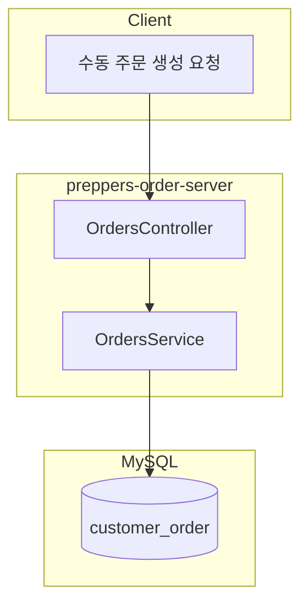

# 주문 API 마이그레이션 및 수동 주문 생성 구현

## 현재 상태 분석

**preppers-kds-lib (소스)**

- [`src/dto/order.ts`](/Users/sungwookkim/workspace/supplies/preppers-kds-lib/src/dto/order.ts): Order, Menu, Option 클래스
- [`src/dto/orderInfo.ts`](/Users/sungwookkim/workspace/supplies/preppers-kds-lib/src/dto/orderInfo.ts): OrderInfo, MenuInfo, OrderInfoFactory - 주문 생성 핵심 로직
- [`src/enum/enum.ts`](/Users/sungwookkim/workspace/supplies/preppers-kds-lib/src/enum/enum.ts): PLATFORM, ORDER_STATUS, MENU_TYPE 등 열거형
- [`src/database/firebase/firestore-db.ts`](/Users/sungwookkim/workspace/supplies/preppers-kds-lib/src/database/firebase/firestore-db.ts): Firebase CRUD 로직

**preppers-order-server (대상)**

- Entity: OrderEntity, OrderMenuEntity, OrderMenuOptionEntity 존재
- Service: OrdersService에 기본 CRUD만 있음 (메뉴/옵션 연동 없음)
- 테스트 파일 없음

---

## 제약사항 및 결정 사항

### 1. 라즈베리파이 키오스크 주문의 foodId 제한

**문제**: 라즈베리파이 키오스크에서 들어오는 주문은 `foodId`를 포함하지 않음
- 키오스크는 로컬 메뉴 데이터를 사용하며, DB의 `food` 테이블과 실시간 동기화되지 않음
- 주문 시점에 `food.id`를 알 수 없어 FK 연결 불가

**결정**: `order_menus`, `order_menu_options` 테이블 사용하지 않음
- 메뉴/옵션 정보는 기존처럼 Firestore에만 저장
- `customer_order` 테이블에는 주문 기본 정보만 저장

**교훈**: 데이터 소스별 제약사항은 실제 데이터 흐름을 확인해야 파악 가능

### 2. Enum 구조 변경 (PLATFORM → PLATFORM_V2)

**변경 내용**: 기존 `PLATFORM` enum이 세 가지로 분리됨

```typescript
// 기존
PLATFORM: 'KIOSK' | 'YOGIYO' | 'BAEMIN' | ...

// 변경
PLATFORM_V2: 'SELVERS' | 'KIOSK' | 'PREPPERS' | 'YOGIYO' | 'COUPANGEATS' | ...
SERVICE_TYPE: 'DELIVERY' | 'HALL' | 'TOGO'
DEVICE: 'KIOSK' | 'POS' | 'DELIVERY_APP'
```

**영향 범위**: `customer_order`, `payments` 테이블에 새 컬럼 추가 필요

---

## 구현 계획

### Phase 1: Enum 및 공통 타입 마이그레이션

1. [`src/common/enums/`](src/common/enums/) 디렉토리 생성
2. 필요한 열거형 복사:

   - PLATFORM, ORDER_STATUS, MENU_TYPE, OPTION_TYPE, MEAT_TYPE
   - MADE_DRINK_STATUS, PLATE_CHANGE_STATUS, ORDER_TYPE, POSITION

### Phase 2: Entity 컬럼 추가

1. `customer_order` Entity에 새 컬럼 추가:
   - `platform_v2`: PLATFORM_V2 enum
   - `service_type`: SERVICE_TYPE enum  
   - `device`: DEVICE enum

### Phase 3: DTO 확장

1. [`src/module/orders/dto/create-order.dto.ts`](src/module/orders/dto/create-order.dto.ts) 확장:
   - platform_v2, service_type, device 필드 추가

### Phase 4: Service 로직 구현

1. [`src/module/orders/orders.service.ts`](src/module/orders/orders.service.ts) 확장:
   - `create()`: 주문 생성 (새 enum 필드 포함)
   - 주문번호 생성 로직 적용

### Phase 5: Controller 엔드포인트 추가

1. [`src/module/orders/orders.controller.ts`](src/module/orders/orders.controller.ts) 확장:

   - `POST /orders/manual`: 수동 주문 생성 (메뉴/옵션 포함)
   - `GET /orders/:id/full`: 메뉴/옵션 포함 상세 조회

### Phase 6: 단위 테스트 작성

1. [`src/module/orders/orders.service.spec.ts`](src/module/orders/orders.service.spec.ts) 생성:
   - create() 테스트
   - findOne() 테스트
   - updateStatus() 테스트

---

## 데이터 흐름



---

## 주요 파일 변경 목록

| 파일 | 작업 |
|------|------|
| `src/common/enums/index.ts` | PLATFORM_V2, SERVICE_TYPE, DEVICE enum 추가 |
| `src/entity/customer-order.ts` | 새 컬럼 추가 (platform_v2, service_type, device) |
| `src/module/orders/dto/create-order.dto.ts` | 새 필드 추가 |
| `src/module/orders/orders.service.ts` | create 로직 수정 |
| `src/module/orders/orders.controller.ts` | 수동 주문 엔드포인트 추가 |
| `src/module/orders/orders.service.spec.ts` | 단위 테스트 |