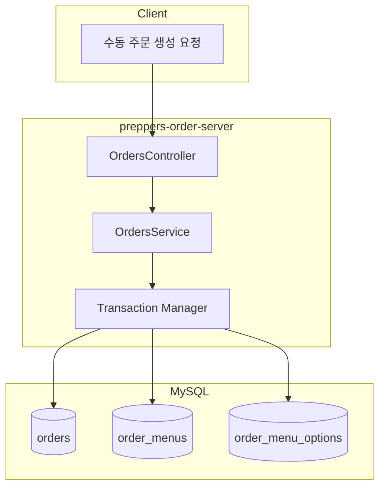

# 주문 API 마이그레이션 및 수동 주문 생성 구현

## 현재 상태 분석

**preppers-kds-lib (소스)**

- [`src/dto/order.ts`](/Users/sungwookkim/workspace/supplies/preppers-kds-lib/src/dto/order.ts): Order, Menu, Option 클래스
- [`src/dto/orderInfo.ts`](/Users/sungwookkim/workspace/supplies/preppers-kds-lib/src/dto/orderInfo.ts): OrderInfo, MenuInfo, OrderInfoFactory - 주문 생성 핵심 로직
- [`src/enum/enum.ts`](/Users/sungwookkim/workspace/supplies/preppers-kds-lib/src/enum/enum.ts): PLATFORM, ORDER_STATUS, MENU_TYPE 등 열거형
- [`src/database/firebase/firestore-db.ts`](/Users/sungwookkim/workspace/supplies/preppers-kds-lib/src/database/firebase/firestore-db.ts): Firebase CRUD 로직

**preppers-order-server (대상)**

- Entity: OrderEntity, OrderMenuEntity, OrderMenuOptionEntity 존재
- Service: OrdersService에 기본 CRUD만 있음 (메뉴/옵션 연동 없음)
- 테스트 파일 없음

---

## 구현 계획

### Phase 1: Enum 및 공통 타입 마이그레이션

1. [`src/common/enums/`](src/common/enums/) 디렉토리 생성
2. 필요한 열거형 복사:

   - PLATFORM, ORDER_STATUS, MENU_TYPE, OPTION_TYPE, MEAT_TYPE
   - MADE_DRINK_STATUS, PLATE_CHANGE_STATUS, ORDER_TYPE, POSITION

### Phase 2: Entity 관계 설정

1. [`src/entity/orders.ts`](src/entity/orders.ts): OrderMenuEntity와 OneToMany 관계 추가
2. [`src/entity/order-menus.ts`](src/entity/order-menus.ts): OrderEntity와 ManyToOne, OrderMenuOptionEntity와 OneToMany 관계 추가
3. [`src/entity/order-menu-options.ts`](src/entity/order-menu-options.ts): OrderMenuEntity와 ManyToOne 관계 추가

### Phase 3: DTO 확장

1. [`src/module/orders/dto/create-order.dto.ts`](src/module/orders/dto/create-order.dto.ts) 확장:

   - CreateOrderMenuDto (메뉴 배열)
   - CreateOrderMenuOptionDto (옵션 배열)
   - 중첩된 주문 생성 지원

### Phase 4: Service 로직 구현

1. [`src/module/orders/orders.service.ts`](src/module/orders/orders.service.ts) 확장:

   - `createWithMenus()`: 메뉴/옵션 포함 주문 생성 (트랜잭션 사용)
   - `findOneWithMenus()`: 메뉴/옵션 포함 주문 조회
   - OrderInfoFactory 로직 일부 적용 (주문번호 생성, 상태 결정)

2. OrderMenuService, OrderMenuOptionService는 별도 생성하지 않고 OrdersService에서 통합 관리

### Phase 5: Controller 엔드포인트 추가

1. [`src/module/orders/orders.controller.ts`](src/module/orders/orders.controller.ts) 확장:

   - `POST /orders/manual`: 수동 주문 생성 (메뉴/옵션 포함)
   - `GET /orders/:id/full`: 메뉴/옵션 포함 상세 조회

### Phase 6: 단위 테스트 작성

1. [`src/module/orders/orders.service.spec.ts`](src/module/orders/orders.service.spec.ts) 생성:

   - create() 테스트
   - createWithMenus() 테스트
   - findOne() / findOneWithMenus() 테스트
   - updateStatus(), completeOrder(), holdOrder() 테스트

---

## 데이터 흐름

---

## 주요 파일 변경 목록

| 파일 | 작업 |

|------|------|

| `src/common/enums/index.ts` | 새로 생성 |

| `src/entity/orders.ts` | 관계 추가 |

| `src/entity/order-menus.ts` | 관계 추가 |

| `src/entity/order-menu-options.ts` | 관계 추가 |

| `src/module/orders/dto/create-order.dto.ts` | 중첩 DTO 추가 |

| `src/module/orders/orders.service.ts` | createWithMenus 등 추가 |

| `src/module/orders/orders.controller.ts` | 수동 주문 엔드포인트 추가 |

| `src/module/orders/orders.module.ts` | Entity 등록 확인 |

| `src/module/orders/orders.service.spec.ts` | 새로 생성 |