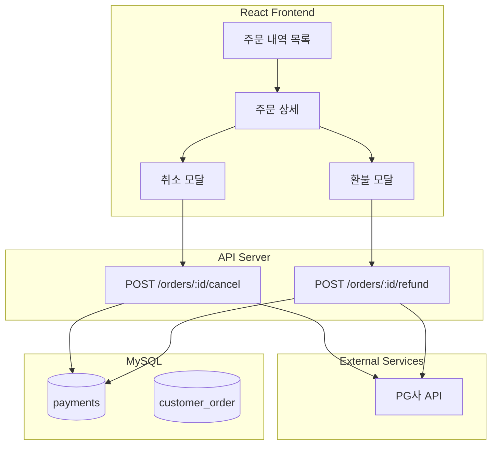

# 취소/환불 처리 화면 플래닝

## 개요

매출 통계 개선 프로젝트의 일환으로, React 기반 취소(PG 승인취소) 및 환불(정산 후 환불) 처리 화면을 구현합니다.

**관련 문서**: [매출 통계 개선](../매출_통계_개선_87008cd3.plan.md)

## 요구사항

- 프론트엔드: React
- 환불 유형: 전액/부분 환불 모두 지원
- 취소 vs 환불: 구분하여 처리
- 승인 프로세스: 즉시 처리 (별도 승인 불필요)

## 취소 vs 환불 정의

| 구분 | 취소 (Cancel) | 환불 (Refund) |
|------|--------------|---------------|
| 시점 | 정산 전 (당일) | 정산 후 |
| PG 처리 | 승인 취소 API | 환불 API |
| payments 타입 | `CANCEL` | `REFUND` |
| 금액 | 전액만 가능 | 전액/부분 가능 |

## 아키텍처



## 1단계: payments 테이블 타입 확장

기존 스키마에서 `type` 필드 확장:

```sql
-- 기존: type: 'PAYMENT' | 'REFUND'
-- 변경: type: 'PAYMENT' | 'CANCEL' | 'REFUND'
ALTER TABLE payments 
MODIFY COLUMN type varchar(20) NOT NULL COMMENT 'PAYMENT, CANCEL, REFUND';
```

## 2단계: API 설계

### 2.1 취소 API

```
POST /orders/:orderId/cancel
```

**Request Body:**
```json
{
  "reason": "고객 요청"
}
```

**Response:**
```json
{
  "success": true,
  "payment": {
    "id": 123,
    "order_id": 456,
    "type": "CANCEL",
    "amount": -15000,
    "created_at": "2025-01-15T10:30:00Z"
  }
}
```

**비즈니스 로직:**
- 당일 결제 건만 취소 가능
- PG 승인취소 API 호출
- payments 테이블에 `type: CANCEL` 레코드 추가 (음수 금액)

### 2.2 환불 API

```
POST /orders/:orderId/refund
```

**Request Body:**
```json
{
  "amount": 5000,
  "reason": "부분 환불 - 메뉴 누락"
}
```

**Response:**
```json
{
  "success": true,
  "payment": {
    "id": 124,
    "order_id": 456,
    "type": "REFUND",
    "amount": -5000,
    "created_at": "2025-01-15T10:30:00Z"
  }
}
```

**비즈니스 로직:**
- 환불 가능 금액 = 원결제 금액 - 기환불 금액
- 부분 환불 시 환불 가능 금액 범위 내에서만 가능
- PG 환불 API 호출
- payments 테이블에 `type: REFUND` 레코드 추가 (음수 금액)

### 2.3 주문 조회 API

```
GET /orders?storeId=1&startDate=2025-01-01&endDate=2025-01-15&status=PAID
```

**Response:**
```json
{
  "orders": [
    {
      "id": 456,
      "store_id": 1,
      "total_amount": 15000,
      "payment_status": "PAID",
      "payments": [
        { "type": "PAYMENT", "amount": 15000 }
      ],
      "created_at": "2025-01-15T09:00:00Z"
    }
  ],
  "pagination": { "page": 1, "total": 100 }
}
```

## 3단계: React 화면 구성

### 3.1 주문 내역 목록 화면

**컴포넌트:** `OrderListPage`

**기능:**
- 기간별 필터 (DateRangePicker)
- 지점별 필터 (Select)
- 결제 상태 필터 (결제완료/부분환불/전액환불/취소)
- 검색 기능 (주문번호, 카드번호 뒷자리)
- 페이지네이션

**UI 구성:**
```
┌─────────────────────────────────────────────────────┐
│ [기간선택] [지점선택] [상태필터] [검색창]              │
├─────────────────────────────────────────────────────┤
│ 주문번호 │ 지점 │ 금액 │ 상태 │ 결제일시 │ 상세      │
├─────────────────────────────────────────────────────┤
│ #1234   │ 강남 │ 15,000│ 결제완료 │ 01-15 09:00 │ [보기] │
│ #1235   │ 홍대 │ 8,000 │ 부분환불 │ 01-15 10:00 │ [보기] │
│ #1236   │ 강남 │ 12,000│ 취소    │ 01-15 11:00 │ [보기] │
└─────────────────────────────────────────────────────┘
│ < 1 2 3 4 5 >                                       │
└─────────────────────────────────────────────────────┘
```

### 3.2 주문 상세 모달/화면

**컴포넌트:** `OrderDetailModal`

**기능:**
- 주문 정보 표시 (메뉴, 수량, 금액)
- 결제 내역 타임라인 (payments 테이블 조회)
- 취소/환불 버튼 (상태에 따라 활성화)

**UI 구성:**
```
┌─────────────────────────────────────────────────────┐
│ 주문 상세 #1234                              [X]    │
├─────────────────────────────────────────────────────┤
│ 주문 정보                                           │
│ ├─ 아메리카노 x 2          4,000원                  │
│ ├─ 카페라떼 x 1            3,500원                  │
│ └─ 합계                   7,500원                   │
├─────────────────────────────────────────────────────┤
│ 결제 내역                                           │
│ ├─ ● 결제 +7,500원   2025-01-15 09:00              │
│ └─ ● 환불 -2,000원   2025-01-15 10:30              │
│    사유: 메뉴 누락                                  │
│                                                     │
│ 현재 결제 금액: 5,500원                             │
├─────────────────────────────────────────────────────┤
│           [취소] [환불]                             │
└─────────────────────────────────────────────────────┘
```

### 3.3 취소 모달

**컴포넌트:** `CancelModal`

**조건:** 당일 결제 건만 활성화

**UI 구성:**
```
┌─────────────────────────────────────────────────────┐
│ 결제 취소                                    [X]    │
├─────────────────────────────────────────────────────┤
│ 주문번호: #1234                                     │
│ 결제금액: 7,500원                                   │
│                                                     │
│ 취소 사유:                                          │
│ ┌─────────────────────────────────────────────────┐ │
│ │ 고객 요청                                       │ │
│ └─────────────────────────────────────────────────┘ │
│                                                     │
│ ⚠️ 취소 시 전액이 취소됩니다.                        │
├─────────────────────────────────────────────────────┤
│                    [취소] [확인]                    │
└─────────────────────────────────────────────────────┘
```

### 3.4 환불 모달

**컴포넌트:** `RefundModal`

**기능:** 전액/부분 환불 선택 가능

**UI 구성:**
```
┌─────────────────────────────────────────────────────┐
│ 환불 처리                                    [X]    │
├─────────────────────────────────────────────────────┤
│ 주문번호: #1234                                     │
│ 결제금액: 7,500원                                   │
│ 기환불액: 0원                                       │
│ 환불가능: 7,500원                                   │
│                                                     │
│ 환불 유형:                                          │
│ ○ 전액 환불 (7,500원)                               │
│ ● 부분 환불                                         │
│   └─ 환불 금액: [2,000    ] 원                      │
│                                                     │
│ 환불 사유:                                          │
│ ┌─────────────────────────────────────────────────┐ │
│ │ 메뉴 누락                                       │ │
│ └─────────────────────────────────────────────────┘ │
├─────────────────────────────────────────────────────┤
│                    [취소] [환불]                    │
└─────────────────────────────────────────────────────┘
```

## 4단계: 공통 유틸리티

### 결제 상태 계산 로직

```typescript
type PaymentType = 'PAYMENT' | 'CANCEL' | 'REFUND';
type PaymentStatus = 'PAID' | 'PARTIAL_REFUND' | 'FULL_REFUND' | 'CANCELLED';

interface Payment {
  id: number;
  order_id: number;
  type: PaymentType;
  amount: number;
  reason?: string;
  created_at: string;
}

function getPaymentStatus(payments: Payment[]): PaymentStatus {
  const hasCancel = payments.some(p => p.type === 'CANCEL');
  if (hasCancel) return 'CANCELLED';

  const total = payments.reduce((sum, p) => sum + p.amount, 0);
  const originalPayment = payments.find(p => p.type === 'PAYMENT');
  const original = originalPayment?.amount || 0;
  
  if (total === 0) return 'FULL_REFUND';
  if (total < original) return 'PARTIAL_REFUND';
  return 'PAID';
}

function getRefundableAmount(payments: Payment[]): number {
  return payments.reduce((sum, p) => sum + p.amount, 0);
}

function canCancel(payments: Payment[], orderDate: Date): boolean {
  const today = new Date();
  const isSameDay = orderDate.toDateString() === today.toDateString();
  const status = getPaymentStatus(payments);
  return isSameDay && status === 'PAID';
}

function canRefund(payments: Payment[]): boolean {
  const status = getPaymentStatus(payments);
  return status === 'PAID' || status === 'PARTIAL_REFUND';
}
```

### 상태별 표시 컬러

```typescript
const statusColors: Record<PaymentStatus, string> = {
  PAID: '#22c55e',        // green
  PARTIAL_REFUND: '#f59e0b', // amber
  FULL_REFUND: '#ef4444',    // red
  CANCELLED: '#6b7280',      // gray
};

const statusLabels: Record<PaymentStatus, string> = {
  PAID: '결제완료',
  PARTIAL_REFUND: '부분환불',
  FULL_REFUND: '전액환불',
  CANCELLED: '취소',
};
```

## 구현 체크리스트

### Backend
- [ ] payments 테이블 type 필드에 CANCEL 타입 추가
- [ ] 취소 API 구현 (POST /orders/:id/cancel)
  - [ ] 당일 결제 건 검증
  - [ ] PG 승인취소 호출
  - [ ] payments 레코드 추가
- [ ] 환불 API 구현 (POST /orders/:id/refund)
  - [ ] 환불 가능 금액 검증
  - [ ] PG 환불 호출
  - [ ] payments 레코드 추가
- [ ] 주문 조회 API 수정 (결제 상태 포함)

### Frontend
- [ ] 주문 내역 목록 화면 구현
  - [ ] 필터 컴포넌트 (기간, 지점, 상태)
  - [ ] 검색 기능
  - [ ] 페이지네이션
- [ ] 주문 상세 모달 구현
  - [ ] 주문 정보 표시
  - [ ] 결제 내역 타임라인
- [ ] 취소 모달 구현
  - [ ] 당일 결제 건 검증
  - [ ] 취소 사유 입력
- [ ] 환불 모달 구현
  - [ ] 전액/부분 환불 선택
  - [ ] 환불 금액 입력 및 검증
  - [ ] 환불 사유 입력
- [ ] 공통 유틸리티 함수 구현

## 통계 쿼리 (참고)

```sql
-- 일별 매출 통계 (취소/환불 구분)
SELECT 
  DATE(created_at) as date,
  SUM(CASE WHEN type = 'PAYMENT' THEN amount ELSE 0 END) as total_payment,
  SUM(CASE WHEN type = 'CANCEL' THEN ABS(amount) ELSE 0 END) as total_cancel,
  SUM(CASE WHEN type = 'REFUND' THEN ABS(amount) ELSE 0 END) as total_refund,
  SUM(amount) as net_sales
FROM payments
WHERE store_id = ?
  AND created_at BETWEEN ? AND ?
GROUP BY DATE(created_at);
```
