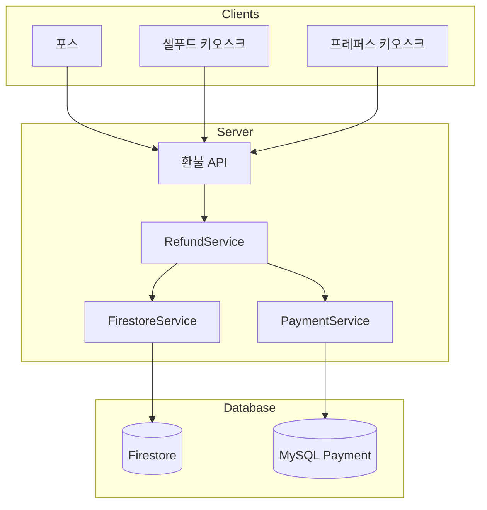

# 환불 API 구현

## 현재 상태 분석 (AsIs)

### 문제점

1. **KDS Client → Firestore 직접 수정**
   - 비즈니스 로직이 클라이언트에 분산
   - 여러 클라이언트에서 동일 로직 중복 구현

2. **환불 데이터 누락**
   - Firestore에서만 취소 처리
   - MySQL Payment 테이블에 환불 데이터 미기록

### 현재 흐름

```
포스/키오스크
├─ KDS취소 → Firebase 취소 (SDK 직접 호출)
└─ 카드취소 → 앱/키오스크에서 처리
```

---

## 목표 상태 (ToBe)

### 변경 포인트

1. **서버 API로 환불 로직 중앙화**
2. **Firestore 취소 + Payment 생성 트랜잭션 처리**

### 목표 흐름

```
포스/키오스크
├─ KDS취소 → 환불 API → Firestore 취소 + Payment 생성
└─ 카드취소 → 앱/키오스크에서 처리 (변경 없음)
```

---

## 아키텍처



---

## 구현 계획

### Phase 1: 현재 로직 분석

1. KDS Client의 환불 SDK 호출 코드 분석
2. Firestore 주문/환불 데이터 구조 확인
3. Payment 테이블 스키마 확인

### Phase 2: API 설계

#### Request DTO

```typescript
interface RefundRequestDto {
  orderId: string;          // Firestore 주문 ID
  storeId: string;          // 매장 ID
  refundReason?: string;    // 환불 사유
  refundAmount: number;     // 환불 금액
  refundType: 'FULL' | 'PARTIAL';  // 전체/부분 환불
}
```

#### Response DTO

```typescript
interface RefundResponseDto {
  success: boolean;
  refundId: string;         // 생성된 환불 ID
  paymentId: string;        // Payment 테이블 ID
  message?: string;
}
```

### Phase 3: 서비스 구현

#### FirestoreService

```typescript
class FirestoreService {
  async cancelOrder(orderId: string, storeId: string): Promise<void>;
  async getOrder(orderId: string, storeId: string): Promise<Order>;
}
```

#### PaymentService

```typescript
class PaymentService {
  async createRefundPayment(refundData: RefundPaymentData): Promise<Payment>;
}
```

#### RefundService (통합)

```typescript
class RefundService {
  async processRefund(dto: RefundRequestDto): Promise<RefundResponseDto> {
    // 1. 주문 정보 조회
    const order = await this.firestoreService.getOrder(dto.orderId, dto.storeId);
    
    // 2. Pi 데이터 여부 확인
    const isPiOrder = this.checkPiOrder(order);
    
    // 3. Firestore 취소 처리
    await this.firestoreService.cancelOrder(dto.orderId, dto.storeId);
    
    // 4. Payment 생성 (Pi 데이터인 경우)
    if (isPiOrder) {
      await this.paymentService.createRefundPayment({...});
    }
    
    return { success: true, ... };
  }
}
```

### Phase 4: 컨트롤러 구현

```typescript
@Controller('refunds')
class RefundsController {
  @Post()
  async createRefund(@Body() dto: RefundRequestDto): Promise<RefundResponseDto>;
}
```

### Phase 5: KDS Client 수정

```typescript
// Before (SDK 직접 호출)
await firestoreDb.cancelOrder(orderId);

// After (API 호출)
await refundApi.createRefund({
  orderId,
  storeId,
  refundAmount,
  refundType: 'FULL'
});
```

### Phase 6: 테스트

| 테스트 케이스 | 검증 항목 |
|--------------|----------|
| 포스 환불 | Firestore 취소 + Payment 생성 |
| 셀푸드 키오스크 환불 | Firestore 취소 + Payment 생성 |
| 프레퍼스 키오스크 환불 | Firestore 취소 + Payment 생성 |
| Pi 데이터 분기 | Pi → Payment 생성 / 비Pi → Payment 미생성 |
| 부분 환불 | 환불 금액 정확성 |
| 트랜잭션 롤백 | Firestore 실패 시 Payment 미생성 |

---

## 주요 파일 변경 목록

| 파일 | 작업 |
|------|------|
| `src/module/refunds/dto/refund-request.dto.ts` | Request DTO 생성 |
| `src/module/refunds/dto/refund-response.dto.ts` | Response DTO 생성 |
| `src/module/refunds/refunds.service.ts` | 환불 통합 서비스 |
| `src/module/refunds/refunds.controller.ts` | 환불 API 엔드포인트 |
| `src/module/firestore/firestore.service.ts` | Firestore 환불 처리 |
| `src/module/payments/payments.service.ts` | Payment 환불 레코드 생성 |
| KDS Client 환불 모듈 | SDK → API 호출 변경 |

---

## 고려 사항

### 1. 트랜잭션 일관성

- Firestore와 MySQL은 다른 DB이므로 분산 트랜잭션 필요
- Saga 패턴 또는 보상 트랜잭션 적용 검토

### 2. 에러 처리

- Firestore 취소 성공 + Payment 생성 실패 시 보상 로직 필요
- 재시도 메커니즘 구현

### 3. 하위 호환성

- KDS Client 업데이트 전까지 기존 SDK 방식도 지원 필요
- 점진적 마이그레이션 전략
