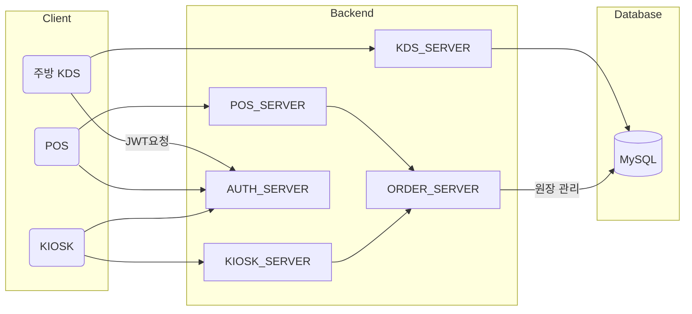

KDS(Kitchen Display System): 주방에서 포지션별로 주문을 실시간으로 확인 및 처리
POS: 배달 플랫폼 및 카운트 주문 접수
KIOSK: 현장 무인 주문 접수
AUTH_SERVER: 인증 및 토큰 발행
ORDER_SERVER: 표준 주문 생성

```mermaid
graph LR
  subgraph Client
    KDS(주방 KDS)
    POS(POS)
    KIOSK(KIOSK)
  end

  subgraph Backend
    KDS_SERVER
    ORDER_SERVER
    POS_SERVER
    KIOSK_SERVER
    AUTH_SERVER
  end

  subgraph Database
    ledger[(MySQL)]
  end

  KDS_SERVER --> ledger
  ORDER_SERVER -->|원장 관리| ledger
  KDS --> KDS_SERVER
  KDS --> |JWT요청|AUTH_SERVER

  POS --> POS_SERVER
  POS --> AUTH_SERVER
  POS_SERVER --> ORDER_SERVER

  KIOSK --> KIOSK_SERVER
  KIOSK --> AUTH_SERVER
  KIOSK_SERVER --> ORDER_SERVER
```