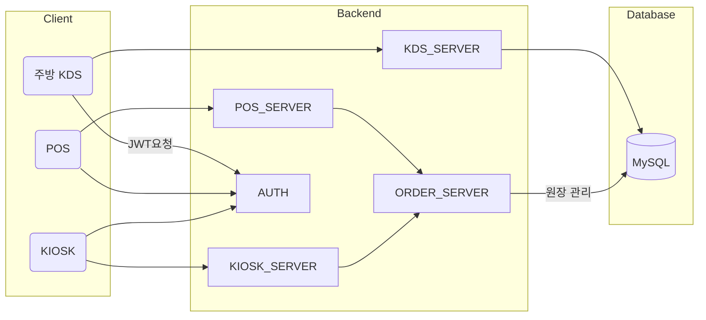
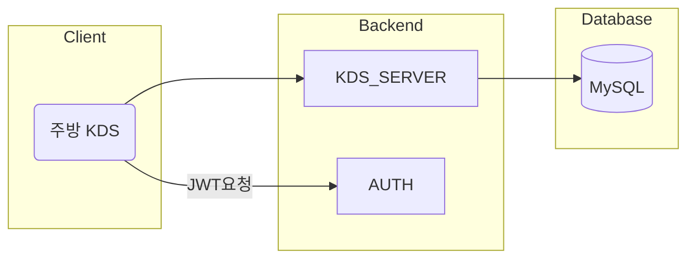

```mermaid
graph LR
  subgraph Client
    KDS(주방 KDS)
    POS(POS)
    KIOSK(KIOSK)
  end

  subgraph Backend
    KDS_SERVER
    ORDER_SERVER
    POS_SERVER
    KIOSK_SERVER
    AUTH
  end

  subgraph Database
    ledger[(MySQL)]
  end

  KDS_SERVER --> ledger
  ORDER_SERVER -->|원장 관리| ledger
  KDS --> KDS_SERVER
  KDS --> |JWT요청|AUTH

  POS --> POS_SERVER
  POS --> AUTH
  POS_SERVER --> ORDER_SERVER

  KIOSK --> KIOSK_SERVER
  KIOSK --> AUTH
  KIOSK_SERVER --> ORDER_SERVER
```

```mermaid
graph LR
  subgraph Client
    KDS(주방 KDS)
  end

  subgraph Backend
    KDS_SERVER
    AUTH
  end

  subgraph Database
    ledger[(MySQL)]
  end

  KDS_SERVER --> ledger
  KDS --> KDS_SERVER
  KDS --> |JWT요청|AUTH
```

### 역할
주방 KDS: 포지션별 조리 업무  
KDS_SERVER: 주문 이벤트 발행, 주문 상태 변경
AUTH: 인증용 JWT생성