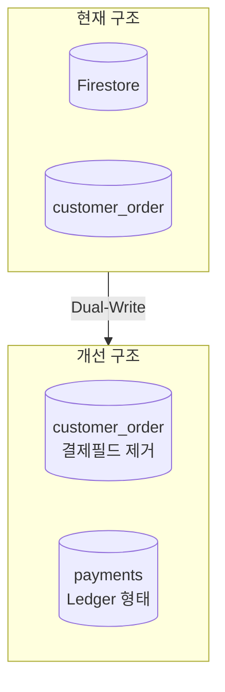
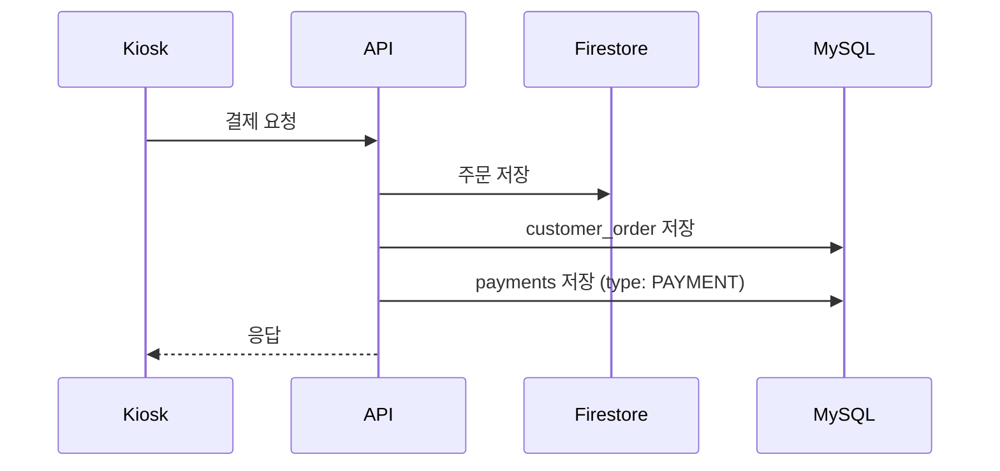

# 매출 통계 개선 개발 플래닝

## 현재 문제점

- Firestore 3레벨 nested document 구조로 메뉴/옵션 조회 비용이 큼
- 통계 데이터 집계가 어려움

## 아키텍처 개요



## 1단계: 스키마 변경

### customer_order 테이블 수정

결제 관련 필드 제거:

- `card_company`, `card_number4`, `approved_number`
- `card_expired_at`, `installment`, `approved_at`

### payments 테이블 생성 (Ledger 형태)

```sql
CREATE TABLE `payments` (
  `id` int unsigned NOT NULL AUTO_INCREMENT,
  `order_id` int unsigned NOT NULL COMMENT 'customer_order.id',
  `store_id` int NOT NULL COMMENT '지점 ID',
  `type` varchar(20) NOT NULL COMMENT 'PAYMENT, REFUND',
  `amount` int NOT NULL COMMENT '금액 (PAYMENT: +, REFUND: -)',
  `card_company` varchar(20) DEFAULT NULL COMMENT '카드사 이름',
  `card_number4` varchar(4) DEFAULT NULL COMMENT '카드번호 앞 4자리',
  `approved_number` varchar(20) DEFAULT NULL COMMENT '승인 번호',
  `card_expired_at` varchar(5) DEFAULT NULL COMMENT '카드 만료일 MM/YY',
  `installment` varchar(2) NOT NULL DEFAULT '00' COMMENT '할부 개월 수',
  `approved_at` datetime DEFAULT NULL COMMENT '승인 시간',
  `created_at` datetime NOT NULL DEFAULT CURRENT_TIMESTAMP,
  PRIMARY KEY (`id`),
  KEY `idx_order_id` (`order_id`),
  KEY `idx_store_id_created` (`store_id`, `created_at`)
) ENGINE=InnoDB DEFAULT CHARSET=utf8mb4 COMMENT='결제 원장 테이블';
```

Ledger 형태의 장점:

- 결제/환불 이력이 모두 개별 row로 기록
- `SUM(amount)` 로 최종 결제 금액 계산
- 부분 환불 처리 용이

## 2단계: Dual-Write 구현



- 기존 Firestore 저장 로직 유지
- MySQL에 동시 기록 추가
- 점진적으로 Firestore 의존성 제거

## 3단계: 결제 내역 화면

### 조회 기능

- 기간별 결제/환불 내역 조회
- 지점별 필터링
- 결제 수단별 통계

### 환불 처리

- payments 테이블에 `type: REFUND` row 추가
- 환불 금액은 음수로 기록
- 원 결제 건과 order_id로 연결

## 통계 쿼리 예시

```sql
-- 일별 매출 통계
SELECT 
  DATE(created_at) as date,
  SUM(CASE WHEN type = 'PAYMENT' THEN amount ELSE 0 END) as total_payment,
  SUM(CASE WHEN type = 'REFUND' THEN ABS(amount) ELSE 0 END) as total_refund,
  SUM(amount) as net_sales
FROM payments
WHERE store_id = ?
  AND created_at BETWEEN ? AND ?
GROUP BY DATE(created_at);
```