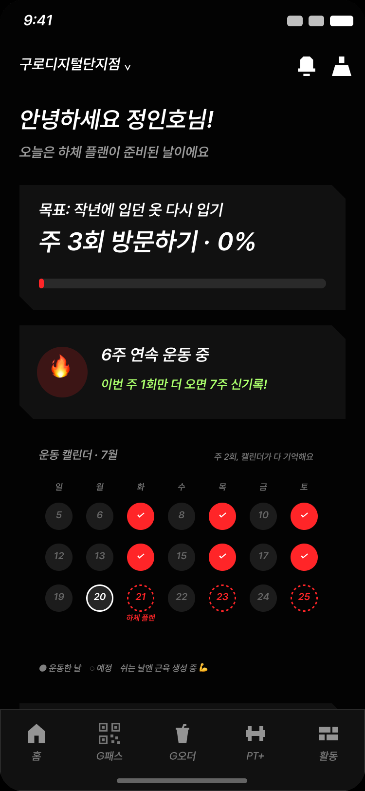
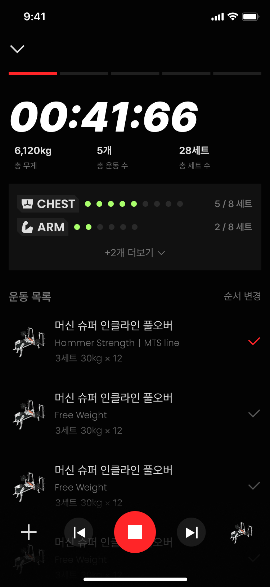
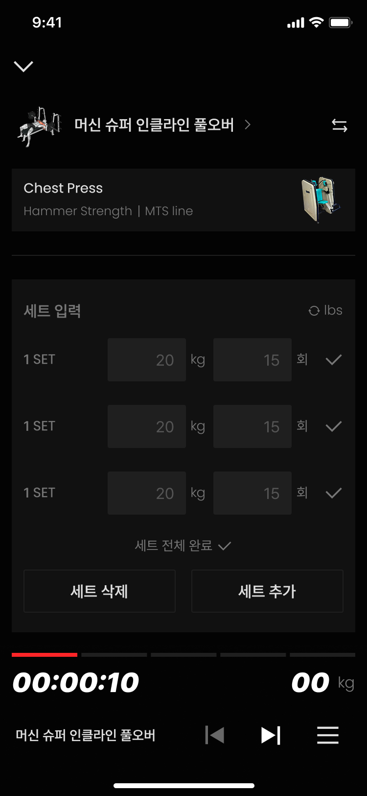
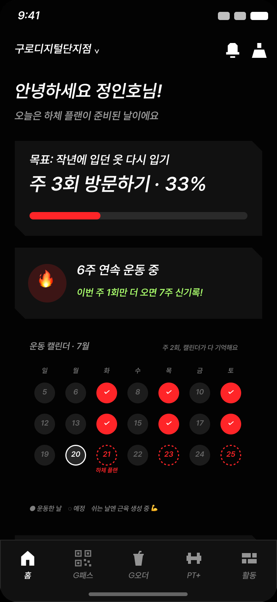

# 운동 목표 · 운동 기록 — 개발 회의 문서

> 2026 하반기 1단계 — 운동 습관을 형성해주는 짐박스 앱

| 항목 | 내용 |
| --- | --- |
| 회의 목표 | 전체 그림 공유 → 논의 필요 항목 확인 → 즉시 착수 가능 작업 합의 |
| 작성 | vonn · 2026-08-13 |
| 구분 | GYMBOXX × SUPPLIES · 사내 문서 |

> 원본: `운동 목표·운동 기록 개발 회의 문서.pdf` (16페이지) 를 마크다운으로 변환

## 목차

1. [하반기 목표](#1-하반기-목표)
2. [이번 단계 기능 범위](#2-이번-단계-기능-범위)
3. [사용자 관점 프로세스](#3-사용자-관점-프로세스)
4. [운동 목표](#4-운동-목표)
5. [운동 목표 달성률 계산 시스템](#5-운동-목표-달성률-계산-시스템)
6. [운동 기록 DB 고도화](#6-운동-기록-db-고도화)
7. [회의 안건 정리](#7-회의-안건-정리)

---

## 1 하반기 목표

**사용자들의 운동 습관을 형성해주는 짐박스 앱**

| 항목 | 내용 |
| --- | --- |
| 배경 1 | 신규 회원의 결정 구간은 첫 6주~3개월 — 이 구간에서 습관이 붙거나 이탈 |
| 배경 2 | 자체 코호트 실측 — 주 3~4회 방문 회원의 잔존율 74.1% vs 주 1회 미만 27.5% |
| 방향 | 회원이 "왜 운동하는지"를 목표로 붙잡고, 매주 자신의 진행을 숫자로 확인하는 루프 구축 |

---

## 2 이번 단계 기능 범위

| 기능 | 구분 | 내용 |
| --- | --- | --- |
| 운동 목표 | 신규 | 목표 선택(온보딩) + 달성률 계산 + 홈 상시 노출 |
| 운동 기록 | 고도화 | 앱 화면 개편 + 데이터 분류·수집 체계 고도화 + DB 구조 변경 |

- 두 기능의 관계 — 운동 목표가 운동 기록 데이터를 소비 · 기록 구조가 목표 계산의 성립 조건

---

## 3 사용자 관점 프로세스

### 3-1. 전체 흐름 5단계

| 단계 | 1 | 2 | 3 | 4 | 5 |
| --- | --- | --- | --- | --- | --- |
| 행위 | 운동 목표 선택 | 짐박스 방문·운동 | 운동 기록 등록 | 달성률 계산 | 홈에서 상시 확인 |
| 설명 | 연령·성별 맞춤 문구 | 출입 = 자동 실적 | 세트·시간 입력 후 종료 | 기록 종료 즉시 반영 | 동기부여 루프 |

### 3-2. 화면 흐름 — Figma 9개 화면

#### STEP 1 — 운동 목표 선택 (화면 1~4)

| 화면 | 설명 |
| --- | --- |
| 1 | 운동 목표 선택 — 연령·성별 맞춤 목표 문구 7개 중 1개 선택 |
| 2 | 목표 선택 이유 작성 — 자유 입력 + 예시 칩 |
| 3 | 목표 달성 방법 선택 — 방문·유산소·근력 중 행동 1개 + 수치 조절 |
| 4 | 운동 스케쥴 선택 — 요일·시간 고정 |

| 1 | 2 | 3 | 4 |
| --- | --- | --- | --- |
|  |  |  |  |

#### STEP 2 — 홈: 목표·달성률·스케쥴 상시 확인 (화면 5)



**전부 선택 후 홈 화면**

- 운동 목표 · 달성률 · 운동 스케쥴을 홈 화면에서 항상 확인 가능
- 목표 설정 직후 상태 — 주 3회 방문하기 · 0%
- 이후 방문·기록이 생길 때마다 달성률이 올라가는 출발점

#### STEP 3 — 운동 기록 (화면 6~8)

| 화면 | 설명 |
| --- | --- |
| 6 | 운동 기록 중 — 진행 타이머 · 누적 볼륨 · 운동 목록 |
| 7 | 운동 기록 중 2 — 운동 상세 · 세트 입력 · 기구 연결 |
| 8 | 기록 종료 시점 — 오늘의 운동 강도 입력 |

| 6 | 7 | 8 |
| --- | --- | --- |
|  |  |  |

#### STEP 4 — 기록 후 달성률 반영 (화면 9)



**기록이 달성률로 이어지는 순간**

- 화면 5 (목표 설정 직후) — 주 3회 방문하기 · 0%
- 화면 9 (운동 기록 후) — 주 3회 방문하기 · 33%
- 1회 방문 = 3회 목표의 33% — 계산 결과가 기록 종료 즉시 홈에 반영

---

## 4 운동 목표

### 4-1. 목적·목표

| 항목 | 내용 |
| --- | --- |
| 목적 | 사용자들이 운동할 이유를 구체화하고 계속 떠올려서 끝까지 운동하도록 유도 |
| 목표 | 연령·성별에 맞는 공감할 수 있는 목표를 선택지로 제공 |

### 4-2. 목표 구조 — 3단 선택

| 단계 | 사용자에게 묻는 것 | 예 | 달성률 |
| --- | --- | --- | --- |
| 동기 | 왜 운동하나요 | 작년에 입던 옷 다시 입기 | 계산 없음 — 다음 단계 필터 |
| 행동 | 무엇을 하실 건가요 | 주 3회 방문하기 | 여기서만 계산 |
| 실행 | 언제 하실 건가요 | 화·목·토 저녁 7시 | 부가 지표 |

- 회원당 활성 목표 = 동기 1개 + 행동 1개 · 홈 게이지 단일 노출 · 변경은 교체 방식
- 동기 문구는 성별 × 연령 세그먼트별 분기 · 행동 선택지는 동기에 따라 구성

### 4-3. 운동 목표 선택지 예시

#### 여 20대 — 공감 축: 굶지 않는 감량 · 몸 라인 · 자조적 자기 언어

| 목적 | 목표 문구 A안 | 대안 (B·C·D안) | 행동 선택지 (● 기본 선택) |
| --- | --- | --- | --- |
| 다이어트 | 굶지 않고 옷 태 살리기 | 입고 싶던 옷 편하게 입기 · 원하는 옷 핏 만들기 | ● 주 3회 방문 (2~7회) · ○ 유산소 주 225분 (150~450분) · ○ 근력 주 2회 (2~5회) |
| 근력 | 먹어도 안 찌는 몸 만들기 | 탄탄한 몸 라인 만들기 · 무거운 캐리어 혼자 들기 · 무거운 짐 혼자서도 들기 | ● 주 3회 방문 (2~7회) · ○ 근력 주 3회 (2~5회) · ○ 가슴/등/하체 각 주 4세트 (4~10세트) |
| 습관 | 작심삼일 이번엔 넘기기 | 오운완 꾸준히 찍기 · 일주일에 몇 번은 꼭 나오기 | ○ 주 1회 · ● 주 2회 · ○ 주 3회 · ○ 주 4회 · ○ 주 5회 방문 (각 1~7회) |
| 체력 | 저질 체력 이번엔 탈출하기 | 계단 올라도 숨 안 차기 · 지하철 환승 계단 안 힘들게 | ● 주 3회 방문 (2~7회) · ○ 유산소 주 150분 (60~450분) · ○ 근력 주 2회 (2~5회) |
| 자세 | 거북목 자세 바로잡기 | 구부정한 어깨 펴기 | ● 주 3회 방문 (2~7회) · ○ 근력 주 2회 (2~5회) · ○ 코어/등 각 주 4세트 (4~10세트) |
| 건강 | 무기력한 날 줄이기 | 잔병치레 없이 지내기 · 쉽게 아프지 않은 몸 만들기 | ● 주 3회 방문 (2~7회) · ○ 유산소 주 150분 (60~450분) · ○ 근력 주 2회 (2~5회) |
| 수행능력 | 내 러닝 페이스 앞당기기 | 내 기록 다시 쓰기 · 내 최고 무게 다시 쓰기 · 예전보다 더 무겁게 들기 | ● 주 3회 방문 (2~7회) · ○ 유산소 주 150분 (60~450분) · ○ 근력 주 3회 (2~5회) · ○ 하체/등 각 주 4세트 (4~10세트) |

#### 남 30대 — 공감 축: 출근 전 루틴 · 셔츠 핏 · 검진 첫 경고

| 목적 | 목표 문구 A안 | 대안 (B·C·D안) | 행동 선택지 (● 기본 선택) |
| --- | --- | --- | --- |
| 근력 | 셔츠 핏이 달라지는 몸 만들기 | 옷 위로도 티 나는 몸 만들기 | ● 주 3회 방문 (2~7회) · ○ 근력 주 3회 (2~5회) · ○ 가슴/등/하체 각 주 4세트 (4~10세트) |
| 다이어트 | 허리띠 한 칸 줄이기 | 작년에 입던 옷 다시 입기 | ● 주 3회 방문 (2~7회) · ○ 유산소 주 225분 (150~450분) · ○ 근력 주 2회 (2~5회) |
| 습관 | 출근 전 운동으로 하루 열기 | 바빠도 일주일에 몇 번은 나오기 · 야근한 날도 주 몇 번은 나오기 | ○ 주 1회 · ● 주 2회 · ○ 주 3회 · ○ 주 4회 · ○ 주 5회 방문 (각 1~7회) |
| 자세 | 앉아서 일해도 허리 안 아프기 | 거북목·굽은 어깨 펴기 | ● 주 3회 방문 (2~7회) · ○ 근력 주 2회 (2~5회) · ○ 코어/등 각 주 4세트 (4~10세트) |
| 체력 | 퇴근 후에도 힘이 남아 있기 | 주말을 침대에서 안 보내기 · 계단 올라도 숨 안 차기 · 하루가 덜 힘든 체력 만들기 | ● 주 3회 방문 (2~7회) · ○ 유산소 주 150분 (60~450분) · ○ 근력 주 2회 (2~5회) |
| 건강 | 검진 결과 걱정 없이 받기 | 피로가 쌓이지 않는 몸 만들기 | ● 주 3회 방문 (2~7회) · ○ 유산소 주 150분 (60~450분) · ○ 근력 주 2회 (2~5회) |
| 수행능력 | 3대 중량 목표 채우기 | 내 최고 무게 다시 쓰기 | ● 주 3회 방문 (2~7회) · ○ 유산소 주 150분 (60~450분) · ○ 근력 주 3회 (2~5회) · ○ 하체/등 각 주 4세트 (4~10세트) |

> ● = 기본 선택(프리셀렉) · 괄호 = 사용자 조절 범위 · 세그먼트는 성별 × 연령 8종 전체 준비됨 (위는 2종 발췌)

### 4-4. 특이사항

| # | 내용 |
| --- | --- |
| 1 | 모든 운동 목표 선택지는 운동 기록 데이터 기반으로 달성률 계산 가능 — 선택지 추가·수정 시에도 달성률 계산이 가능한 구조 필수 |
| 2 | 구조적 대응 — 선택지는 하드코딩이 아니라 목표 마스터 테이블(목표 종류 · 계산 유형 · 목표선 수치 · 노출 규칙)로 관리 · 새 선택지 = 마스터 행 추가 |
| 3 | 방문 목표의 원천은 운동 기록이 아니라 출입 기록 — 게이트 통과만으로 달성률 상승 (기록 없이도 굴러가는 가장 문턱 낮은 목표) |
| 4 | 운동 목표 상세 기획은 별도 논의 |

---

## 5 운동 목표 달성률 계산 시스템

### 5-1. 목적·목표

| 항목 | 내용 |
| --- | --- |
| 목적 | 운동은 당장 변화를 느낄 수 없기 때문에 나의 운동이 목표에 어떤 영향을 주는지 직관적으로 표시 |
| 목표 | 운동 기록 데이터 기반으로 모든 운동 목표를 계산할 수 있는 시스템 구축 |

### 5-2. 특이사항 — 정확도의 눈높이

- 달성률은 의학·스포츠 과학적 정밀 측정이 아니라 사용자의 목표 달성 과정을 숫자로 전환하는 장치
- 예시 — 주 3회 출석 목표면 1회 출석 시 33% 달성

> 단 산식의 뼈대(주당 분·세션 수·세트 수)는 WHO·ACSM 등 공식 가이드라인 수치와 정합 유지 — 근거 없는 수치를 만들지 않는 선

### 5-3. 계산 대상 — 목표 유형 5종

| 유형 | 목표 예 | 실적(분자) 계산 | 데이터 원천 |
| --- | --- | --- | --- |
| 방문 횟수 | 주 3회 방문하기 | 주간 방문 일수 — 하루 2회 방문해도 1회 | 출입 기록 |
| 근력 세션 | 근력 운동 주 2회 | 근력 성격 운동을 포함한 세션 수 | 운동 기록 + 운동 성격 분류 |
| 유산소 분 | 유산소 주 150분 | 중강도 분 + 고강도 분 × 2 (고강도 1분 = 중강도 2분 환산) | 운동 기록 + 시간·강도 |
| 부위 볼륨 | 가슴 주 4세트 | 세트 × 부위 기여도(직접 1.0 / 보조 0.5) 합산 | 운동 기록 + 세부부위 기여도 |
| 균형 세션 | 균형 운동 주 3회 (65세+) | 균형 성격 태그 운동 포함 세션 수 | 운동 기록 + 성격 태그 |

- 공통 산식 — 달성률 = 실적 ÷ 목표선 · 주 단위(월요일 00:00 KST 경계) · 상한 300% 캡
- 체중·1RM 같은 결과 지표는 달성률 계산 금지 — 운동량과 결과의 관계가 개인차 커서 행동 목표만 계산 · 결과는 추이로만 표시

### 5-4. 작동 방식 — 이벤트 기반 즉시 계산

```text
   고객              서버            즉시 재계산         주간 진행 테이블      홈 게이지
기록 종료 버튼 / 출입 → 데이터 검증·저장 → 이번 주 달성률   →      갱신      →     반영
```

| 원칙 | 내용 |
| --- | --- |
| 계산 시점 = 고객 행동 시점 | 기록 종료·출입 즉시 재계산 · "방금 운동했는데 안 오름" 방지 · 배치는 주 마감 1종만 |
| 전량 재산출 | 재계산은 누적 가산이 아니라 그 주 원천 데이터 전체 재집계 — 수정·삭제·중복 이벤트에도 항상 정답 |
| 주 마감 | 월요일 00:00 KST에 지난주 결과 확정 · 확정 후 소급 변경 금지 — 늦게 등록한 지난주 기록은 지난주 달성률에 미반영 |
| 저장 | 회원 목표 × 주 단위 진행 테이블 1행 — 홈 조회 시 재집계 없이 저장값 반환 |

### 5-5. 표시 정책

| 항목 | 확정 내용 |
| --- | --- |
| 게이지 | 목표 대비 진척만 표시 · 숫자와 게이지 항상 일치 (67% 달성 = 게이지 67%) — 진척 외 제2의 의미 부여 금지 |
| 100% 초과 | 달성 상태 전환 + 초과분 계속 표시 (133% 등) · 300% 캡 — 과운동 미화 방지 |
| 0% 상태 | 방치하지 않음 — 계산 방식 + 기록 필요성 안내 · 유산소는 기록 진입 버튼 직결 |
| 표현 상한 | "가슴 6세트분 — 권고 구간" 수준까지 · "근육 N% 성장" 같은 효과 단정 금지 |

### 5-6. 주요 확정 사항

| # | 확정 | 내용 |
| --- | --- | --- |
| 1 | 회원당 목표 1개 | 동기 1 + 행동 1 · 홈 게이지 단일 |
| 2 | 주 중간 목표 생성·교체 | 남은 일수 비율로 목표선 조정(일할 비례) — 목요일에 주 3회 목표 생성 시 그 주는 2회 기준 |
| 3 | 주 마감 즉시 확정 | 소급 재계산 없음 · 자정에 걸쳐 진행 중이던 세션도 예외 없이 미반영 (자정 전 종료 인앱 안내로 완화) |
| 4 | 부위 볼륨 분자 | 세부부위 기여도 합산 — 한 세트가 같은 부위 세부부위 여러 곳에 기여하면 1세트분 초과 가능 · 단위 표기 "세트분"으로 통일 |

#### 부위 볼륨 분자(확정 4) 상세 — 세부부위 합산의 의미

| 층위 | 내용 |
| --- | --- |
| 기본 동작 | 세부부위가 달라도 상위 부위가 같으면 합산 — 윗가슴 운동·중간 가슴 운동 모두 '가슴' 목표 실적으로 계상 |
| 합산 방식의 고유 지점 | 한 운동의 한 세트가 같은 부위의 세부부위 여러 곳에 동시 기여하면 전부 합산 — 1세트가 1세트분 초과 가능 |

계산 예 — '가슴 주 4세트' 목표

| 운동 | 수행 | 가슴 기여도 매핑 | 가슴 실적 |
| --- | --- | --- | --- |
| 머신 체스트 프레스 | 4세트 | 중간 가슴 직접 1.0 | 4 × 1.0 = 4.0세트분 |
| 덤벨 인클라인 벤치 프레스 | 4세트 | 윗가슴 직접 1.0 + 중간 가슴 보조 0.5 | 4 × 1.5 = 6.0세트분 |
| **합계** | 8세트 수행 | — | **10.0세트분 → 목표 4세트 대비 250%** |

- 수행 8세트 ≠ 표시 10.0세트분 — 이 인지 차이를 흡수하기 위해 단위 표기 "세트분" 통일
- 다른 부위 기여(예: 삼두 보조 0.5)는 팔 목표에만 계상 — 가슴 목표 미포함
- 대안이었던 "세트당 부위 최대 기여도" 방식(한 세트는 한 부위에 최대 1세트분)은 수행 세트 수와 일치(위 예 8.0세트분)하나 볼륨 산정 근거(fractional volume)와 불일치로 기각 · 재검토 트리거 — "숫자가 이상하다" 관련 CS·문의 발생률

---

## 6 운동 기록 DB 고도화

### 6-1. 목적·목표

| 항목 | 내용 |
| --- | --- |
| 목적 | 운동 목표 달성률 계산 외에도 다양한 활용이 예정 — 데이터 분류 체계·수집 체계 고도화 필요 |
| 목표 | 운동 기록 기능 개편과 DW 대응까지 가능한 구조 |

### 6-2. 특이사항 — 활용 방향성

| 활용처 | 요구 데이터 |
| --- | --- |
| 운동 목표 달성률 계산 | 성격(근력·유산소) · 시간·강도 · 부위 기여도 · 세트 |
| 사용자 부위별 성장 계산 | 세부부위 기여도 · 세트·중량 이력 |
| 부위별 랭킹·종합 랭킹 | 위와 동일 + 측정 방식 통일 |
| 비슷한 수준·비슷한 운동 검색/매칭 | 분류 축(장비·측정·성격·부위) + 기구 연결 |

- 상세 내용 미정이나 이 방향성에 대응 가능한 구조가 요구사항 — 지금 안 쌓은 필드는 그 시점 이전 기록에서 영구 결손이라 수집 구조를 먼저 확정
- 우선순위 — 일단 운동 목표 달성률 계산에 집중 · 나머지는 같은 구조 위에 후속

### 6-3. 현행 구조와 규모

```text
[마스터 — 운영이 관리]                        [기록 — 회원이 만든다]
exercise (운동 273건)                       user_exercise_session (세션)
├ type        varchar(30)                   ├ rpe (세션 강도 1~10)
├ unit        varchar(30) NULL              └ started_at / end_at
├ has_weight  tinyint                              │
├─ exercise_body_part (부위 매핑)                    ▼
├─ exercise_body_part_detail               user_exercise_session_history (운동)
│     └ load_ratio (0.05~1.0)                ├ exercise_id / machine_id
└─ exercise_machine                          └ is_done
                                                   │
body_part (8종) · body_part_detail (21종)           ▼
machine (1,148대)                          user_exercise_set_history (세트)
                                             ├ count (횟수 | 초)
access_history (출입) ← 방문 목표 원천           └ weight (kg)
```

| 대상 | 실측 (2026-08-11~12 프로덕션) |
| --- | --- |
| 운동 마스터 | 273건 (ACTIVE 235) |
| 세션 / 세트 | 271,558건 / 239,480건 · 실질 가동 2026-06부터 — 기록 기능은 사실상 신규, 축적분 대부분 최근 3개월 |
| 유산소 세트 | 3,819건 (전체의 1.6%) |
| 세션 강도(rpe) 수집률 | 완료 운동 보유 세션의 89.4% |

### 6-4. 현행 구조의 특징과 변경 방향 ★

각 카드 = 현행 특징 → 무엇이 막히나 → 변경 방향과 그렇게 바꾸려는 이유

#### 1. 장비 분류가 "프리웨이트 외"라는 부정 정의

| 구분 | 내용 |
| --- | --- |
| 현행 | `type` 컬럼의 PROP 38종 — 케틀벨·밴드·구조물·유산소 기구·소도구가 한 값에 혼재 |
| 막히는 것 | 계산 조건이 부정형(`NOT IN`)으로만 표현 · 새 값마다 예외 누적 |
| 변경 | `equipment_type` 12종 긍정 정의로 재분류 |
| 이유 | 부정 정의는 새 장비가 들어올 때마다 "~외"에 계속 흡수돼 혼재가 반복되는 구조 · 각 값을 판정 질문 하나("부하가 어디서 오는가")로 정의하면 계산·필터 조건이 긍정 조건 하나로 표현되고 예외 누적이 차단됨 |

#### 2. 측정 방식 선언 컬럼 부재 ★ 임계 경로

| 구분 | 내용 |
| --- | --- |
| 현행 | `unit`(SET/MINUTE) × `has_weight`(0/1) 조합에서 매번 추론 · 클라에 폴백 추론 코드 존재(밴드·구조물 오판) |
| 막히는 것 | 무엇을 셀 수 있는 운동인지 코드를 읽어야 판별 |
| 변경 | `measure_type` 4종 단일 선언 (무게+횟수 / 횟수 / 시간 / 거리) |
| 이유 | 측정 방식은 입력 화면의 요청 항목·서버 검증 규칙·계산 가능 범위를 전부 결정하는 정보인데, 추론에 맡기면 화면·서버·계산이 제각각 판단해 오판 발생 · 한 컬럼의 선언으로 세 곳이 같은 답을 읽게 하고 클라 추론 코드를 삭제하기 위함 |

#### 3. 운동 성격(근력·유산소 등) 축 부재

| 구분 | 내용 |
| --- | --- |
| 현행 | 부위 컬럼에 `CARDIO` · `STRETCHING` 이 부위인 척 혼재 |
| 막히는 것 | 근력 세션 판정이 부정 조건 · 유산소·균형 판정 불가 |
| 변경 | `modality` 5종(근력·유산소·이완·균형·플라이오) 신설 + 복수 태그 |
| 이유 | 성격은 부위와 독립 정보(워킹 런지 = 하체 + 유산소)라 부위 칸에 끼워 넣으면 한쪽 정보가 소실 · 별도 축이 있어야 근력·유산소·균형 세션 판정이 긍정 조건으로 성립하고, 복수 태그라야 두 성격을 겸하는 운동의 정보를 보존 |

#### 4. 부위 기여도가 세트 척도가 아닌 분배율

| 구분 | 내용 |
| --- | --- |
| 현행 | `load_ratio` 가 운동별 합계 정확히 1.0 — 부위 볼륨 산식이 요구하는 "세트분" 척도 아님 |
| 막히는 것 | 데드리프트의 둔근 기여 0.1 = 최소 유효 볼륨 도달에 40세트 필요 — 등급 경계 영구 미달 |
| 변경 | `contribution` = 직접 1.0 / 보조 0.5 재부여 · 합계 제약 폐기 |
| 이유 | 볼륨 목표선의 근거(부위당 주 4세트 최소 유효)가 "근육군 세트 수" 단위라, 분모와 분자가 같은 단위여야 달성 판정이 성립 · 분배율은 합계 1.0에 묶여 보조 부위가 목표에 영구 미달하는 왜곡 발생 · 재부여 비용은 새 조사가 아니라 기존 값의 2택 변환(자동 208종 + 수동 3종)이라 낮음 |

#### 5. 서버 검증 부재

| 구분 | 내용 |
| --- | --- |
| 현행 | 세트 무게가 서버에서 optional · 유일한 검증이 클라 한 곳 → 맨몸 풀업에 무게 1,621세트 유입(어시스트 머신 중량과 추가 중량 혼재) |
| 막히는 것 | 달성률 분자·1RM 추정 오염 |
| 변경 | `measure_type` 에서 도출한 서버 검증 — 정의 위반 400 |
| 이유 | 클라 단일 검증은 우회·버전 차이·화면 개편에 뚫리며 오염 1,621세트가 그 실증 · 검증 규칙을 하드코딩이 아니라 `measure_type` 조회에서 도출하면 운동 유형이 늘어도 검증이 자동 확장 |

#### 6. enum 제약 부재 + 이력 없는 교체

| 구분 | 내용 |
| --- | --- |
| 현행 | 분류 컬럼 전부 varchar + UPDATE·DELETE로 매핑 교체(이력 소실) — 7월 정정값 4건이 한 달 만에 회귀·재발 실증 |
| 막히는 것 | enum 밖 값 유입(`FREE_WEIGHT` 166대) · 회귀를 뒤늦게 발견 |
| 변경 | enum 전환 + UNIQUE 제약 · 변경은 INACTIVE + 신규 INSERT로만 |
| 이유 | `varchar` 는 오타·규격 밖 값을 저장 시점에 막지 못하고, UPDATE·DELETE 교체는 잘못된 변경을 발견할 근거(이력)를 지움 · 제약으로 유입을 차단하고 INACTIVE 보존으로 변경 추적·회귀 탐지·롤백을 가능하게 하기 위함 |

#### 7. 유산소 운동에 강도 정보 부재

| 구분 | 내용 |
| --- | --- |
| 막히는 것 | 유산소 분 환산(중+고×2) 불성립 |
| 변경 | `default_intensity` 2종(중강도/고강도) 신설 — 기존 피로도 값 기준 백필 + 트레이너 검수 |
| 이유 | 유산소 환산은 강도 없이 성립 불가한데 회원에게 매번 묻는 방식은 입력 부담으로 기록률을 깎음 · 운동 마스터에 기본값을 두고 프리필하면 입력 부담 없이 계산이 성립 · 기존 피로도 값이 백필 근거라 신규 조사 불필요 |

#### 8. 균형 성격 종목 0종

| 구분 | 내용 |
| --- | --- |
| 막히는 것 | 65세+ 균형 목표 불성립 (대상 169명) |
| 변경 | 균형 종목 6~10종 신규 등록 — 트레이너 자문 |
| 이유 | 균형 목표는 세션 수만 세므로 종목 등록이 유일한 선행 조건 · 종목 0종인 채 목표를 노출하면 그 회원의 달성률이 영구 0%가 되므로 등록이 목표 개방의 전제 |

### 6-5. 운동 분류체계 — 독립 축 5개 (facet 구조)

구조 원칙 — 운동 1개 = 아래 5개 축의 값 조합 · 각 축은 판정 질문 하나에만 답함 · 축끼리 상하위 관계 없음

| 축 | 판정 질문 | 값 | 개수 규칙 |
| --- | --- | --- | --- |
| 1. 효과 | 이 운동을 하면 무엇이 좋아지는가 (설계된 1차 목적 기준) | 근력 · 심폐지구력(유산소) · 유연성(이완) · 균형 · 순발력(플라이오) | 주 효과 1개 + 부가 효과 N개 |
| 2. 부위 | 어느 근육이 좋아지는가 | 부위 6종(가슴·등·어깨·팔·하체·코어) → 세부부위 21종(윗가슴·중간가슴·아랫가슴 등) | 복수 + 기여도 가중 |
| 3. 장비 | 부하가 어디서 오는가 | 핀 머신 · 플레이트 머신 · 스미스 · 케이블 · 유산소 기구 · 바벨 · 덤벨 · 케틀벨 · 밴드 · 구조물(철봉·벤치) · 맨몸 · 소도구 (12종) | 단일 |
| 4. 양 | 무엇을 셀 수 있는가 | 무게×횟수 · 횟수만 · 시간 · 거리 (4종) | 단일 |
| 5. 강도 | 심박 부하가 중간인가 높은가 | 중강도 · 고강도 (2종) | 단일 · 효과=심폐지구력이면 필수 |

#### 축별 보완 설명

| 축 | 내용 |
| --- | --- |
| 1. 효과 | 판정 기준은 "실제로 좋아졌는가(결과)"가 아니라 "좋아지도록 설계된 운동인가(목적)" — 결과는 개인차로 마스터에 부적합, 목적은 운동 자체의 속성 · 균형·순발력 추가 이유 — 65세+ 목표(균형 주 3회)와 버피류 분류에 필요 · 주 1+부가 N 구조로 워킹 런지 = 주 근력 + 부가 심폐 — 정보 손실 없음 |
| 2. 부위 | 2계층(부위→세부부위) · 복수 부위는 균등이 아니라 세부부위 단위 기여도 — 직접(그 근육을 대상) 1.0 / 보조(동원되나 주도 안 함) 0.5 · 예 — 데드리프트: 햄스트링 직접 1.0 · 둔근 보조 0.5 · 척추기립근 보조 0.5 → "등과 하체에 볼륨이 쌓였다"로 판정 (표현은 근육 증가 단정이 아니라 볼륨 충족까지) |
| 3. 장비 | 부위의 하위가 아니라 독립 축인 이유 = 두 축이 직교 — 같은 가슴을 머신으로도(체스트 프레스) 바벨로도(벤치 프레스) 훈련 · 같은 덤벨로 가슴도 팔도 훈련 · 부위 하위에 넣으면 "덤벨"이 가슴 밑에도 팔 밑에도 중복 등장 · 독립 축이면 필터("덤벨 운동만 보기")와 지점 시설 판정이 한 축으로 해결 |
| 4. 양 | '세트'를 무게×횟수(벤치 프레스)와 횟수만(푸시업)으로 분리 — 입력 화면 요청 항목 · 서버 검증 규칙 · 계산 가능 지표(총부하·1RM은 무게×횟수만)가 달라 두 값 필요 |
| 5. 강도 | 유산소 달성률 환산(중강도 분 + 고강도 분×2)에 필수 · 운동마다 기본값을 마스터에 저장(트레드밀 런=고강도 · 워크=중강도)해 회원 입력 없이 프리필 |

#### 예시 — 운동 5종의 5축 값

| 운동 | 1.효과 (주/부가) | 2.부위 (기여도) | 3.장비 | 4.양 | 5.강도 |
| --- | --- | --- | --- | --- | --- |
| 바벨 데드리프트 | 근력 | 햄스트링 1.0 · 둔근 0.5 · 척추기립근 0.5 | 바벨 | 무게×횟수 | — |
| 덤벨 인클라인 벤치 | 근력 | 윗가슴 1.0 · 중간가슴 0.5 · 삼두 0.5 | 덤벨 | 무게×횟수 | — |
| 워킹 런지 | 근력 / +심폐 | 대퇴사두 1.0 · 둔근 0.5 | 맨몸 | 횟수만 | — |
| 트레드밀 런 | 심폐지구력 | — (부위 없음) | 유산소 기구 | 시간 | 고강도 |
| 한 발 서기 | 균형 | — | 맨몸 | 시간 | — |

#### 운영 규칙 4가지

| # | 규칙 |
| --- | --- |
| 1 | 새 운동 등록 시 5축 전부 필수 — 효과=심폐지구력이면 강도도 필수 |
| 2 | 부위 기여도는 직접이 운동당 1개 이상 · 운동별 합계 제약 없음 (한 세트가 여러 근육에 각각 계상) |
| 3 | 경계 사례(데드리프트 주 부위 등)는 판례로 고정 — 등록자마다 다르게 넣는 재발 방지 |
| 4 | 값 추가·변경은 기존 행 수정이 아니라 비활성+신규 행 — 이력 보존 |

스키마 대응 — 효과=`modality` · 부위=`body_part` + `contribution` · 장비=`equipment_type` · 양=`measure_type` · 강도=`default_intensity` (6-4의 변경 방향과 1:1 호환)

### 6-6. 작업 규모와 순서

| 묶음 | 건수 | 비고 |
| --- | --- | --- |
| 회귀·재발 정정 | 4 | ✓ 승인 완료 — 즉시 착수 가능 |
| 장비 재배치 | 44 | PROP 해체 |
| 측정 단위·성격·부위·강도 정정 | 27 | 유산소 강도 부여 포함 |
| 세부부위 매핑 보강 | 6+7 | 미매핑 6종 + 계산 대상 결손 7종 |
| 명명 규칙 정정 | 9 | 장비 접두 통일 |
| 기여도 재부여 | 211종 / 500행 | 자동 208종 + 수동 3종 — 새 조사가 아니라 기존 값의 2택 변환 |
| 균형 종목 등록 | 6~10 | 신규 |

#### 진행 4단계

| 단계 | 1 | 2 | 3 | 4 |
| --- | --- | --- | --- | --- |
| 이름 | 정의 확정 | 스키마·백필 | 수집 구현 | 계산 엔진 |
| 내용 | `measure_type`·판례집 | DDL·시드·정정·검증 | 서버 검증·프리필·화면 | 달성률 산식 |

- 계산 엔진을 마지막에 두는 배경 — 강도 없이 만든 산식은 사후 강도 도입 시 과거 달성률 전면 변동 · 수집이 산식보다 선행
- 지금 착수 가능 — 회귀 4건 정정(승인 완료) · 부위 매핑 UNIQUE 제약 · 기구 enum 오타 정정(2대)

#### 마이그레이션 원칙

| 원칙 | 배경 |
| --- | --- |
| 신규 컬럼 NULL 허용 → 백필 → 검증 → NOT NULL | 무중단 |
| 정정은 멱등 시드로만 · repo 버전 관리 | 현재 마스터 분류값이 전량 DB 직접 입력 — seed·migration 파일 부재 |
| 기존 `type` · `unit` · `has_weight` 삭제 금지 | 추천 엔진·트레이너앱·웹뷰가 참조 |
| 부위 마스터 행 삭제 금지 (INACTIVE만) | 세션 부위 45만 행 FK 참조 |
| 과거 기록 분류 소급 변경 차단 | 이미 계산된 주차 달성률 고정 |

---

## 7 회의 안건 정리

### 7-1. 공유·합의

| # | 안건 |
| --- | --- |
| 1 | 전체 그림 공유 — 사용자 프로세스(3장) · 두 기능의 관계(2장) |
| 2 | 즉시 착수 3건 합의 — 회귀 정정 4건 · UNIQUE 제약 · 기구 enum 오타 |
| 3 | 4단계 진행 순서와 임계 경로(`measure_type` 정의) 합의 |

### 7-2. 논의 필요 — 수집·데이터

| # | 안건 | 쟁점 |
| --- | --- | --- |
| 1 | 유산소 기록 방식 | 타이머 / 기구 QR / 전용 입력 — 타이머는 입력 요청 자체를 제거 |
| 2 | 맨몸 운동 무게 오염 처리 | 풀업 1,621세트의 무게가 어시스트 중량인지 추가 중량인지 — 판별 키는 기구 연결 · 일괄 회복 시 1RM 역방향 오염 |
| 3 | 완료 체크(`is_done`) 정리 | 세트 데이터 존재를 곧 실적으로 볼지 |
| 4 | 체중 데이터 원천 | 인바디 파이프라인 2024-11 중단(커버리지 2.9%) — 재가동 여부 · 불가면 직접 입력이 유일 경로 |
| 5 | 세션 부위 API 전환 | 자동 도출 확정 — 기존 필수 입력 컬럼 유지 여부 · 과거 세션 재도출 여부 |

### 7-3. 논의 필요 — 목표·계산

| # | 안건 | 쟁점 |
| --- | --- | --- |
| 1 | 목표 테이블 5종 신설 스펙 | 전부 미존재 — 주간 진행 테이블 요구 스펙(목표선 스냅샷·진행/확정 상태·확정 시각·부분 주 표식) · 지표 개명 · 성별 노출 조건을 신설 시점에 반영(비용 0) |
| 2 | 계산 트리거 구현 방식 | 이벤트 기반 확정 — 기록 저장 트랜잭션과 분리(비동기) · 조회 시 폴백 여부 |
| 3 | 강도 매핑 검수 | 피로도 값 기준 자동 매핑(≤3 중강도 / ≥4 고강도) — 트레이너 검수 일정 |
| 4 | 균형 종목 선정 | 6~10종 — 트레이너 자문 일정 |
| 5 | 판례집 승인 | 경계 사례 판정 41건(데드리프트 주 부위 등) — 고정하지 않으면 분류 회귀 재발 |
