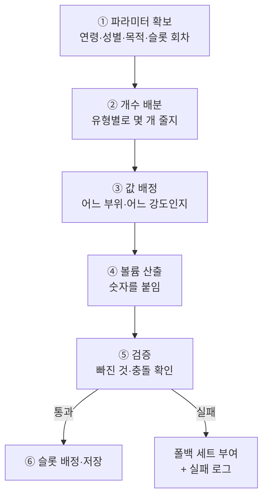

# 미션 생성 시스템 — 개발 기획

> **문서 목적** — 연령·성별·운동 목적을 입력받아 **미션을 자동 생성하는 규칙**의 정본 · 사람의 수작업 개입 없음
>
> **시스템 경계** — 운동목표 기능은 3개로 구성 · ① [운동 목표 문구](운동목표문구.md) — 사용자에게 제공할 문구 40종과 목표 완료 처리 ② **미션 생성 시스템**(이 문서) — 목표에 맞는 미션 자동 생성 ③ [미션 달성률 계산 시스템](미션달성률계산시스템.md) — 운동 기록 기반 달성률 계산 · ②③은 합쳐 `미션 생성 및 달성률 계산 시스템`으로 개발
>
> **데이터 전제** — 계산 원천의 축·컬럼 정본은 [DB 구조 업그레이드 방안](../../DB_구조_업그레이드_방안_섹션별/DB_구조_업그레이드_방안.md) · 개편으로 확보되는 축을 전제로 설계
>
> **작성 단계** — §7 목적별 구성 규칙은 스포츠 과학 문헌 기반 1차 정리 · 트레이너·PM 검수 전 · §5 상수 테이블 수치 미확정
>
> **원본** — [Linear TECH-602](https://linear.app/suppliesfitness/issue/TECH-602)

---

## 1. 미션의 정의와 구성 축

### 1-1. 미션의 단위

| 항목      | 내용                                                                              |
| --------- | --------------------------------------------------------------------------------- |
| 미션 1개  | **구성 축 1개의 값 + 볼륨 수치** (예 `가슴 40세트분` · `유산소 360분`)            |
| 슬롯      | 미션이 담기는 자리 · 동시 **최대 5개** · 1개도 가능                               |
| 표시      | 미션 1개 = 홈 게이지 1개 · 미션끼리 합산·평균하는 지표 없음                       |
| 생애주기  | 슬롯마다 **독립** — 슬롯 A의 미션이 100%에 닿아 교체되어도 슬롯 B~E는 그대로 진행 |
| 볼륨 필수 | 수치가 없으면 달성률 분모가 없어 계산 불성립 — **볼륨 없는 미션 금지**            |

**미션 1개의 볼륨 크기 — 10회 방문 기준**

| 항목           | 내용                                                                                                                                                 |
| -------------- | ---------------------------------------------------------------------------------------------------------------------------------------------------- |
| 기준           | **10회 방문하면 100% 완료되는 볼륨**으로 설정 · 통상적 습관대로 수행할 때 1회 방문이 약 10%                                                          |
| 메인 타겟      | **주 2~3회 방문 회원** — 볼륨 산정의 전제가 되는 방문 빈도                                                                                           |
| 구독 유지 의도 | **19일차 이후 구독 종료가 급증** → **20~25일 구간에 달성률 70%대**가 되도록 유도 · 종료를 검토하는 시점에 "거의 다 채웠다"는 상태를 만드는 것이 목적 |

- 방문 빈도별 도달 시점 — 주 3회는 20일에 약 8~9회 방문(80~90%) · 주 2회는 25일에 약 7회 방문(약 70%) · 두 경우 모두 종료 급증 구간에 70% 이상에 걸림
- **10회는 방문 횟수이지 기간이 아님** — 주 1회 회원은 10주, 주 5회 회원은 2주 소요 · 기간 개념 자체가 없음

### 1-2. 구성 축 3종

| 축            | 값                                        | DB 원천                                                                                                              |
| ------------- | ----------------------------------------- | -------------------------------------------------------------------------------------------------------------------- |
| **운동 효과** | 근력 · 지구력 · 균형 · 순발력 (4종)       | `exercise_effect.effect_tag` + `is_primary`                                                                          |
| **운동 부위** | 가슴 · 등 · 어깨 · 팔 · 하체 · 코어 (6종) | `body_part`.axis = 'MUSCLE' + 세부부위 기여도                                                                       |
| **운동 성격** | 근력 · 유산소 · 스트레칭 (3종)            | exercise.training_type: MUSCLE, CARDIO, STRETCHING |

**스트레칭은 성격 축이 판정 · 효과 축에 이완 없음**

| 근거                                                                                       | 실측                                  |
| ------------------------------------------------------------------------------------------ | ------------------------------------- |
| 효과 축 `MOBILITY` 태그 18종에 **스트레칭 종목 0종** · 스쿼트·플랭크 등 근력 종목이 들어옴 | DB 구조 업그레이드 방안 §0-2·§8       |
| 부위 사전의 스트레칭 라벨 7종(폼 롤링)이 성격 축의 정본                                    | 동작 양식 `신장` 11종에 7종 전량 포함 |
| 이완을 효과 축 값으로 두면 미션 1개가 다른 테이블을 읽는 예외 발생                         | 성격 축 위임으로 예외 소멸            |

### 1-3. 볼륨 단위 5종

| 단위          | 표기 예                                | 무엇을 세는가                                      | 파라미터                                  |
| ------------- | -------------------------------------- | -------------------------------------------------- | ----------------------------------------- |
| 세트분        | `가슴 35세트분`                        | 부위 기여도를 반영한 세트 수 — 직접 1.0 / 보조 0.5 | 부위 6종                                  |
| 총 훈련량(kg) | `가슴 3500kg`                          | 무게 × 반복 수의 합                                | 부위 6종                                  |
| 분 — 유산소   | `유산소 280분` · `고강도 유산소 90분`  | 시간 측정 유산소 종목의 분 · 강도 환산 적용        | 강도(중강도 · 고강도 · 무관)              |
| 분 — 스트레칭 | `스트레칭 50분` · `어깨 스트레칭 30분` | 스트레칭 종목의 분                                 | 부위(선택) — 폼 롤링 7종이 부위 매핑 보유 |
| 회(세션)      | `균형 9회`                             | 해당 값이 주 효과인 종목을 포함한 세션 수          | 효과 값                                   |
| 일            | `운동한 날 9일`                        | 기록이 있는 서로 다른 한국시간 날짜 수             | 없음                                      |

- **회당 표기 금지** — `36분 × 10회` 형태가 아니라 총량(`360분`)으로 표기 · 회당 기준은 볼륨 설계용 내부 기준선(§6)
- 총 훈련량은 **무게·횟수 측정 항목을 모두 가진 종목**에서만 성립
- 분자 계산 방법은 달성률 계산 시스템 §4

---

## 2. 생성 시점 — 2가지

| #   | 시점          | 조건                                                | 생성 범위       |
| --- | ------------- | --------------------------------------------------- | --------------- |
| 1   | **최초 부여** | 운동 목표 선택(문구 5종 또는 기타) 직후             | 슬롯 5개 전체   |
| 2   | **미션 교체** | 미션이 **100% 도달** + 사용자가 `새 미션 받기` 선택 | 그 **슬롯 1개** |

### 2-1. 교체 규칙

| #   | 규칙                             | 이유                                                                                                               |
| --- | -------------------------------- | ------------------------------------------------------------------------------------------------------------------ |
| 1   | **100% 도달한 미션만 교체 가능** | 미달 상태 교체를 허용하면 "어려운 미션 버리기"가 되어 목적 정합이 무너짐 — 이 가드가 핵심                          |
| 2   | **자동 교체 없음 · 사용자 선택** | 100%를 달성 표시로 남겨두고 싶은 회원이 있고, 자동 교체는 "내가 채운 게 사라졌다"로 읽힘 · 닫는 판단은 사용자가 함 |
| 3   | **교체 값은 로테이션 다음 값**   | 같은 값 재부여는 회피 루프를 만들고, 로테이션은 교체를 부위 확장으로 뒤집음 (§7-2·§7-5)                            |
| 4   | 초과분 이월 없음                 | 새 미션의 분자는 그 슬롯의 부여 시각 이후 기록만 누적                                                              |
| 5   | 목표 완료 시 생성 없음           | 목표가 닫히고 사용자가 다음 목표 선택                                                                              |

- 100%에 닿고도 교체하지 않으면 그 미션은 초과율을 계속 올리며 유지 — 교체 시점은 사용자가 정함
  - 100% 단위로 효과가 변경되면 좋음 (이스터에그로 1000% 정도 되면 '죽여줘...'가 나온다던지..)
- 슬롯 5개가 모두 100%인 상태도 정상 — 그 상태를 해소하는 유일한 조작이 교체 선택

## 3. 생성 파라미터 4종

**네 값 모두 시스템이 자동으로 확보** — 사용자가 입력하거나 고르는 값 없음

| 파라미터      | 값                                                | 확보 방식                                                                                          | 출처                                               |
| ------------- | ------------------------------------------------- | -------------------------------------------------------------------------------------------------- | -------------------------------------------------- |
| 연령          | 생년에서 산출한 연령대                            | **회원 정보 조회**                                                                                 | `user` 생년 — 405,013명 보유                       |
| 성별          | 남 · 여                                           | **회원 정보 조회**                                                                                 | `user` 성별 — 405,306명 판별                       |
| 운동 목적     | 다이어트 · 근력 · 건강 · 체력 · 자세 (5종 중 1개) | **사용자 선택에서 파생** — 목적을 묻는 화면 없음 · 문구를 고르면 그 문구에 박힌 목적 코드가 딸려옴 | 문구 선택 시 1:1 · 기타는 룰 베이스 분류 결과(§10) |
| **슬롯 회차** | 그 슬롯에서 몇 번째 미션인가 (1, 2, 3 …)          | **시스템 자동**                                                                                    | 슬롯별 미션 이력에서 산출                          |

**사용자 조작은 전 과정에서 세 번** — 목표 문구 선택(또는 기타 작성) · 100% 도달 미션의 교체 버튼 · 목표 완료 버튼

- **슬롯 회차가 필수 입력** — 없으면 같은 입력에 같은 출력이 나와 교체 시 동일한 미션이 재부여됨
- 용도 — 부위 로테이션 인덱스 · 볼륨 상향 계수(미결 §13)
- 슬롯마다 회차를 따로 관리 — 슬롯 A가 3회차일 때 슬롯 B는 1회차일 수 있음

---

## 4. 진행 프로세스 — 6단계

미션이 만들어지는 전체 순서 · 각 단계가 무엇을 결정하고 어떤 자료를 읽는지 · 상세는 뒤 절



### 4-1. 단계별 설명

**① 파라미터 확보** — 생성에 필요한 값 4개를 모음 · 연령·성별은 회원 정보에서 읽고, 목적은 사용자가 고른 목표 문구에 딸려 오고, 슬롯 회차는 그 자리에 몇 번째 미션인지를 세어 얻음 · 최초 부여 때는 모든 슬롯이 1회차 (§3)

**② 개수 배분** — 목적으로 **유형별 미션 개수**를 정함 · 유산소 몇 개, 부위 몇 개, 스트레칭 몇 개인지까지만 결정하고 구체적인 값은 아직 정하지 않음 · 예 자세 목적 = 부위 3개 + 스트레칭 2개 (§7-1)

**③ 값 배정** — ②에서 정한 개수만큼 **구체적인 값**을 채움

| 유형     | 값을 정하는 방법                                                                                                   |
| -------- | ------------------------------------------------------------------------------------------------------------------ |
| 부위     | 목적 × 성별로 정해둔 **부위 우선순위 목록**의 앞에서부터 배정 · 교체 때는 슬롯 회차를 인덱스로 한 칸씩 이동 (§7-2) |
| 유산소   | 기본은 강도 무관 1개 · 체력 목적만 중강도·고강도 2개로 분리                                                        |
| 스트레칭 | 기본은 부위 무관 1개 · 자세 목적만 전면 이완 부위를 지정해 2개                                                     |

**④ 볼륨 산출** — 각 미션에 **숫자를 붙임** · 연령·성별로 "그 유형을 하는 날의 1회 분량"을 찾아 10을 곱하고, 그 유형을 실제로 수행하는 방문 비율(수행 빈도 계수)을 다시 곱함 · 결과가 **10회 방문에 100%가 되는 총량** (§5·§6)

**⑤ 검증** — 만들어진 세트가 규칙을 지켰는지 확인 · 유산소·부위·스트레칭이 요건대로 들어갔는지, 65세 이상인데 균형 미션이 빠지지 않았는지, 같은 종목을 두 미션이 동시에 세는 조합이 아닌지 검사 · 실패하면 세트를 버리고 폴백 세트를 주며 실패 사유를 로그로 남김 (§8·§9)

**⑥ 슬롯 배정·저장** — 미션을 슬롯 1~5에 넣고 볼륨을 **스냅샷으로 고정** · 이후 기준 테이블이 바뀌어도 진행 중인 미션의 볼륨은 변하지 않음 · 슬롯 회차도 함께 기록

### 4-2. 교체 시에는 ②를 건너뜀

| 단계        | 최초 부여          | 미션 교체                                                                      |
| ----------- | ------------------ | ------------------------------------------------------------------------------ |
| ① 파라미터  | 슬롯 전체 · 회차 1 | 그 슬롯만 · 회차 +1                                                            |
| ② 개수 배분 | 수행               | **건너뜀** — 개수와 축은 그대로 유지                                           |
| ③ 값 배정   | 목록 앞에서부터    | 슬롯 회차 인덱스의 다음 값 · 다른 슬롯에서 진행 중인 값과 겹치면 한 칸 더 이동 |
| ④~⑥         | 슬롯 5개           | 그 슬롯 1개                                                                    |

- 교체 진입 조건 2개 — 그 미션이 **100% 도달** · 사용자가 `새 미션 받기` 선택 (§2-1)

---

## 5. 상수 테이블 — 생성기의 근거 데이터

**저장 위치** — DB 마스터 테이블 또는 코드 내 상수 · 어느 쪽이든 **값 변경이 규칙 코드 수정을 요구하지 않아야 함**

### 5-1. 기준 운동량 테이블

연령대 × 성별별 **1회 방문 운동량** · 미션 볼륨의 근원

| 컬럼               | 내용                                                            | 예              |
| ------------------ | --------------------------------------------------------------- | --------------- |
| `age_band`         | 연령대 구간 — 10~20대 · 30대 · 40대 · 50대+                     | `30대`          |
| `sex`              | 성별                                                            | `M`             |
| `metric_type`      | 미션 유형                                                       | `BODY_PART_SET` |
| `target_param`     | 부위 등 파라미터                                                | `가슴`          |
| `per_visit_amount` | **그 유형을 수행하는 1회 방문의 분량** — 수행하지 않는 방문은 0 | 10 (세트)       |
| `frequency_factor` | 10회 방문 중 이 미션을 수행하는 비율                            | 0.35            |

### 5-1-1. `per_visit_amount` 전량 — 8세그먼트 × 8유형

**전부 1회 방문 시 기준** · 부위는 세트 · 유산소·스트레칭은 분

- 읽는 방법 — `남 30대 가슴 10세트`는 **가슴을 하는 날에 10세트**라는 뜻 · 가슴을 하지 않는 방문에는 0 · 그 "하는 날의 비율"은 수행 빈도 계수(§5-2)가 별도로 관리
- **8유형 값을 합치면 1회 방문 총 운동량이 되지 않음** — 한 방문에 8유형을 모두 하지는 않음 · 남 30대의 실제 1회 방문은 유산소 35분 + 부위 2~3개(각 10세트) + 스트레칭 10분 수준

| 세그먼트   | 가슴 | 등  | 어깨 | 팔  | 하체 | 코어 | 유산소 | 스트레칭 |
| ---------- | ---- | --- | ---- | --- | ---- | ---- | ------ | -------- |
| 남 10~20대 | 12   | 12  | 9    | 9   | 12   | 12   | 40     | 8        |
| 남 30대    | 10   | 10  | 8    | 8   | 10   | 10   | 35     | 10       |
| 남 40대    | 9    | 9   | 7    | 7   | 9    | 9    | 30     | 12       |
| 남 50대+   | 7    | 7   | 6    | 6   | 7    | 7    | 25     | 14       |
| 여 10~20대 | 7    | 9   | 7    | 7   | 14   | 14   | 45     | 10       |
| 여 30대    | 6    | 8   | 6    | 6   | 12   | 12   | 40     | 12       |
| 여 40대    | 5    | 7   | 5    | 5   | 11   | 11   | 35     | 14       |
| 여 50대+   | 4    | 6   | 4    | 4   | 8    | 8    | 30     | 16       |

**수치 도출 방법**

| #   | 근거                                                                       | 적용                                                                                                         |
| --- | -------------------------------------------------------------------------- | ------------------------------------------------------------------------------------------------------------ |
| 1   | ACSM 2026 — 근성장 **주당 근육군 10세트**                                  | 주 3회 방문 · 부위 수행 빈도 0.35 기준으로 역산 → 대근육 1회 방문 **10세트**(남 30대)가 주당 10.5세트에 대응 |
| 2   | NSCA 고령자 지침 — 부위당 다관절 1~2종목 × **2~3세트** · 세션당 8~10종목   | 50대+ 하향의 근거                                                                                            |
| 3   | 소근육(어깨·팔)은 대근육 운동에서 간접 자극                                | 대근육 대비 **약 0.8배**                                                                                     |
| 4   | WHO 2020 — 유산소 주 150~300분                                             | 방문 1회 30~45분 배치                                                                                        |
| 5   | ACSM 유연성 — 주 2~3일 · 근육당 총 60초                                    | 방문 1회 8~16분 배치                                                                                         |
| 6   | 자사 세그먼트 전략 — 여 하체·코어 / 남 가슴·등 강조                        | 여성은 하체·코어 상향 · 상체 하향                                                                            |
| 7   | 연령 계수 — 10~20대 1.15 · 30대 1.0 · 40대 0.9 · 50대+ 0.7                 | 근력 부위 전체에 적용                                                                                        |
| 8   | 스트레칭은 **역방향 계수** — 10~20대 0.8 · 30대 1.0 · 40대 1.2 · 50대+ 1.4 | 유연성이 독립적으로 사망률과 연관(한국인 코호트) · 연령 증가 시 필요 상승                                    |

- **성차 문헌의 적용 범위 주의** — 여성 근력은 상체 약 52% · 하체 약 66%(남성 대비)이나 이는 **무게**의 차이 · 세트 수는 근력이 아니라 선호·습관의 문제이므로 성차 문헌은 `총 훈련량(kg)` 미션 볼륨에만 적용하고, 세트 수 조정은 자사 세그먼트 전략을 근거로 함
- 정확도 수준 — **캐주얼** · 실제 효과의 정밀 보장이 아니라 "이대로 하면 될 것 같다" 규모의 합리적 기준선

### 5-2. 수행 빈도 계수 — 필수 컬럼인 이유

| 항목      | 내용                                                                                                            |
| --------- | --------------------------------------------------------------------------------------------------------------- |
| 문제      | `가슴 100세트분`은 **매 방문 가슴 10세트**를 전제한 값 · 분할 루틴 회원은 가슴을 주 1~2회만 수행                |
| 결과      | 계수를 반영하지 않으면 특정 부위 미션이 3~4회 방문마다 한 번씩만 상승 → 100% 도달에 10회가 아니라 **30회** 소요 |
| 구조 원인 | 미션이 서로 독립이므로 **가장 느린 미션이 병목** · 합산 지표가 없어 다른 미션의 초과가 보완하지 못함            |
| 계수 근거 | 방문 1회에 부위 2~3개를 만지는 분할 루틴 습관 · 유산소·스트레칭은 대부분 매 방문 수행                           |

`frequency_factor` 전량 — 세그먼트 무관 · 유형별 고정

| 유형             | 계수     | 근거                                                           |
| ---------------- | -------- | -------------------------------------------------------------- |
| 가슴 · 등 · 하체 | **0.35** | 분할 루틴에서 대근육은 방문 3회당 1회 · 주 3회 방문이면 주 1회 |
| 어깨 · 팔        | **0.30** | 대근육 운동에 딸려 하는 빈도가 높아 단독 수행 빈도는 더 낮음   |
| 코어             | **0.40** | 다른 부위와 같은 날 붙여 하는 경우가 많음                      |
| 유산소           | **0.80** | 근력일에도 마무리로 수행                                       |
| 스트레칭         | **0.50** | 의도는 있으나 실제로는 절반 정도 빠뜨림                        |

**볼륨 산출 예 — 남 30대**

| 미션     | `per_visit` | `factor` | 볼륨 = × 10 × factor | 주당 환산   |
| -------- | ----------- | -------- | -------------------- | ----------- |
| 가슴     | 10세트      | 0.35     | **35세트분**         | 주 10.5세트 |
| 하체     | 10세트      | 0.35     | **35세트분**         | 주 10.5세트 |
| 어깨     | 8세트       | 0.30     | **24세트분**         | 주 7.2세트  |
| 코어     | 10세트      | 0.40     | **40세트분**         | 주 12세트   |
| 유산소   | 35분        | 0.80     | **280분**            | 주 84분     |
| 스트레칭 | 10분        | 0.50     | **50분**             | 주 15분     |

### 5-3. 목적별 구성 규칙 테이블

§7의 규칙을 데이터로 보관 — 두 테이블로 분리

| 테이블         | 컬럼                                                      | 행수                                       |
| -------------- | --------------------------------------------------------- | ------------------------------------------ |
| 미션 개수 배분 | 목적 · 유형(유산소·부위·스트레칭·균형) · 개수 · 연령 조건 | 목적 5종 × 유형 = **약 20행**              |
| 부위 우선순위  | 목적 · 성별 · 순서 · 부위                                 | 목적 5종 × 성별 2 × 부위 4~6 = **약 56행** |

- 규칙 변경이 배포를 요구하지 않도록 데이터로 보관

---

## 6. 볼륨 산식

```text
미션 볼륨 = per_visit_amount × 10 × frequency_factor
```

| 항목                    | 내용                                                                                      |
| ----------------------- | ----------------------------------------------------------------------------------------- |
| `× 10` 근거             | 회당 10% 기준선 — 통상 1회 운동으로 각 미션이 10%씩 상승 · 10회 성실 수행 시 전 미션 100% |
| `frequency_factor` 근거 | §5-2 — 매 방문 수행하지 않는 미션의 병목 해소                                             |
| 예                      | 가슴 = 10세트 × 10 × 0.4 = **40세트분** · 유산소 = 36분 × 10 × 1.0 = **360분**            |
| 기준선이지 제한선 아님  | 일일 상한·속도 제한 없음 · 상위 1%가 하루에 전 미션 100% 달성해도 정상                    |

### 6-1. 볼륨을 문헌 권고량에서 뽑지 않는 이유

| 근거                       | 수치                                            |
| -------------------------- | ----------------------------------------------- |
| ACSM 체중 감량 권고        | 임상적으로 유의한 감량은 **주 225분 초과** 필요 |
| 주 3회 방문 회원으로 환산  | 회당 유산소 **75분** + 근력 → 한 세션 2시간     |
| 실측 기반 볼륨의 주당 환산 | 360분 ÷ 3.3주 ≈ **주 109분** — 감량 임계값 미달 |

- 두 기준은 화해하지 않음 · 미션은 **처방이 아니라 습관 형성 장치**
- 결론 — **볼륨은 실측 1회 운동량 기준** · 문헌은 **축 선택·비중·최소 요건**에만 사용

## 7. 목적별 구성 규칙

### 7-1. 미션 개수 배분

**목적은 볼륨이 아니라 미션 개수로 표현** · 볼륨은 §6 산식으로만 결정되므로 비중을 볼륨에 곱하지 않음

| 목적         | 유산소              | 부위                 | 스트레칭          | 균형    | 총  |
| ------------ | ------------------- | -------------------- | ----------------- | ------- | --- |
| **다이어트** | 1                   | 3                    | 1                 | —       | 5   |
| **근력**     | —                   | 4                    | 1                 | —       | 5   |
| **건강**     | 1                   | 2                    | 1                 | 65세↑ 1 | 4~5 |
| **체력**     | 2 (중강도 · 고강도) | 2                    | 1                 | —       | 5   |
| **자세**     | —                   | 3 (등 · 어깨 · 코어) | 2 (부위 파라미터) | —       | 5   |

| 목적     | 개수 배분의 의도                                                                     |
| -------- | ------------------------------------------------------------------------------------ |
| 다이어트 | 부위 3개로 대근육 커버리지 확보 + 유산소 1개 — 총 에너지 소비와 제지방 보존을 동시에 |
| 근력     | 부위 4개 집중 · 유산소 미배정                                                        |
| 건강     | 유산소·근력·유연성 세 갈래를 모두 1개 이상 포함 — WHO 두 권고 동시 충족 구조         |
| 체력     | 유산소를 강도별 2개로 분리 — 고강도 미션이 VO2max 개선 프로토콜을 유도               |
| 자세     | 스트레칭 2개(전면 이완) + 후면 부위 3개 · **가슴 근력 미션 배제**                    |

**볼륨 조정 계수를 쓰지 않는 이유** — 볼륨은 그 회원이 실제로 하는 양(`per_visit × 10 × factor`)에서 나옴 · 여기에 목적별 비중을 곱하면 실측보다 부풀어 10회 방문에 100%가 되지 않음 · 목적은 어느 유형을 몇 개 주는지로만 표현

### 7-2. 부위 우선순위 목록 — 로테이션 입력

슬롯 회차를 인덱스로 순환 선택 · 목적 × 성별로 분기

| 목적     | 성별    | 우선순위                                                  |
| -------- | ------- | --------------------------------------------------------- |
| 다이어트 | 남      | 하체 → 등 → 가슴 → 코어 → 어깨 → 팔                       |
| 다이어트 | 여      | 하체 → 코어 → 등 → 가슴 → 어깨 → 팔                       |
| 근력     | 남      | 가슴 → 등 → 하체 → 어깨 → 팔 → 코어                       |
| 근력     | 여      | 하체 → 코어 → 등 → 어깨 → 가슴 → 팔                       |
| 건강     | 남      | 하체 → 등 → 코어 → 가슴 → 어깨 → 팔                       |
| 건강     | 여      | 하체 → 코어 → 등 → 가슴 → 어깨 → 팔                       |
| 체력     | 남 · 여 | 하체 → 코어 → 등 → 어깨 → 가슴 → 팔                       |
| 자세     | 남 · 여 | 등 → 어깨 → 코어 → 하체 (**가슴 · 팔 제외 — 4종만 순환**) |

**순서 결정 근거**

| #   | 근거                                                                                                          |
| --- | ------------------------------------------------------------------------------------------------------------- |
| 1   | **하체 우선** — 인체 최대 근군으로 에너지 소비·기능적 이동 능력에 직결 · 다이어트·건강·체력 세 목적에서 1순위 |
| 2   | **등·코어 상위** — 자세 유지 근군 · 자세 목적에서 등이 1순위                                                  |
| 3   | **가슴·팔 후순위** — 전면 단축을 심화시켜 자세 목적에서 아예 제외 · 전방머리·둥근어깨 교정 RCT 근거           |
| 4   | **근력 목적의 남성 1순위 = 가슴** · 여성 1순위 = 하체 — 성별 공감 축(자사 세그먼트 전략)                      |
| 5   | **팔은 모든 목적에서 최하위** — 대근육 운동에 딸려 자극되고 단독 우선순위가 낮음                              |
| 6   | 성별 분기는 문헌이 아니라 **자사 세그먼트 전략** 근거 — 체력·자세는 기능 목적이라 성별 동일                   |

### 7-3. 목적별 근거

| 목적     | 근거                                                                                                                                                                                                   |
| -------- | ------------------------------------------------------------------------------------------------------------------------------------------------------------------------------------------------------ |
| 다이어트 | 유산소·병행 훈련이 근력 단독보다 지방량 감소에서 우수(≥10주 · MD −1.06 ~ −1.09kg) · 단 **부하를 동일하게 맞추면 모달리티 차이 소멸** → 총량 확보가 우선이고 대근육 선택은 에너지 소비·제지방 보존 목적 |
| 근력     | ACSM 2026 저항운동 가이드라인 — 근성장은 **주당 근육군 10세트** · 근력은 **80% 1RM 2~3세트** · 전 주요 부위 **주 2회 이상** · 실패 지점까지·복잡한 주기화는 선택 사항                                  |
| 건강     | 한국인 성인 코호트 — 유산소 ≥50 MET-h/주 HR 0.82 · **유연성 ≥5일/주 HR 0.80** · 근력 ≥5일/주 HR 0.83 · WHO 두 권고 모두 미충족 시 전체 사망 HR 1.34 · 유연성이 **독립적으로** 사망률과 연관            |
| 체력     | HIIT 메타분석 — **장구간(≥2분)·고볼륨(≥15분)·4~12주** 프로토콜이 VO2max 개선 최대(SMD 0.50~2.48) · 유산소 강도 환산(고강도 분 × 2)이 고강도 수행을 유도                                                |
| 자세     | 전방머리·둥근어깨 교정 RCT — **흉근 신장 + 중·하부 승모근·전거근 강화** · 30분 주 3회 6주 · 자세 약 5도 개선 · 통증 2.1~2.6점(10점 척도) 감소                                                          |

### 7-4. 목적 정합 검증

| 규칙           | 내용                                                                                                               |
| -------------- | ------------------------------------------------------------------------------------------------------------------ |
| 목적 개선 정합 | 목적 카테고리가 **실제로 개선되는 운동**으로 구성                                                                  |
| 금지 예        | 목적이 `자세`인데 근력 운동 100%로 구성 · 자세 목적에 가슴 근력 미션 배정                                          |
| 효과 조합 대응 | 다이어트 = 지구력 + 근력 · 근력 = 근력 · 체력 = 지구력 · 자세 = 근력 + 스트레칭 · 건강 = 특정 효과 아님(전체 총합) |

### 7-5. 로테이션 운영

| 항목              | 내용                                                                                                          |
| ----------------- | ------------------------------------------------------------------------------------------------------------- |
| 방식              | §7-2 우선순위 목록에서 **슬롯 회차를 인덱스로 순환 선택** · 랜덤 금지                                         |
| 최초 부여         | 목록 앞에서부터 필요한 개수만큼 배정 — 예 근력 남 부위 4개 = 가슴·등·하체·어깨                                |
| 교체              | 그 슬롯의 다음 인덱스 값 · 다른 슬롯에서 진행 중인 값과 겹치면 한 칸 더 이동                                  |
| 순환              | 목록 끝에 도달하면 처음으로 · 자세 목적은 4종만 순환                                                          |
| 스트레칭 파라미터 | 자세 목적의 스트레칭 2개는 전면 이완 부위 고정(어깨·가슴 계열) · 다른 목적은 부위 파라미터 없이 전체 스트레칭 |

## 8. 공통 구성 체크리스트

**주당 분량 하한이 아니라 구성 요건으로 검증** · 미션 볼륨은 실측 기준이므로 방문 빈도가 낮은 회원은 문헌 권고량에 구조적으로 미달함 — 하한 미달을 생성 실패로 처리하면 어떤 세트도 생성되지 않음

| 항목      | 구성 요건                                   | 참고 권고량                                       |
| --------- | ------------------------------------------- | ------------------------------------------------- |
| 유산소    | 다이어트·건강·체력 목적에 **1개 이상** 포함 | WHO 2020 — 주 150~300분 중강도                    |
| 근력 부위 | 모든 목적에 **2개 이상** 포함               | WHO 2020 · ACSM 2026 — 주 2일 이상 · 전 주요 부위 |
| 스트레칭  | 모든 목적에 **1개 이상** 포함               | ACSM — 주 2~3일 · 근육당 총 60초                  |
| 균형      | **65세 이상은 필수 1개**                    | WHO 2020 — 주 3일 이상 다요소 운동                |

| 항목               | 내용                                                                                                                  |
| ------------------ | --------------------------------------------------------------------------------------------------------------------- |
| 검증 시점          | 세트 생성 직후 · 요건 미충족 시 생성 실패 로그 + 폴백 세트 부여                                                       |
| 참고 권고량의 용도 | 볼륨 하한 판정이 아니라 계측 해석용 — 주당 환산값이 권고량의 절반 미만으로 오래 머물면 기준 운동량 테이블 상향을 검토 |
| 주당 환산 전제     | 주 3회 방문 · 가정값은 실측으로 갱신(미결 §13)                                                                        |

## 9. 제약 규칙

| #   | 규칙                                                        | 근거                                         |
| --- | ----------------------------------------------------------- | -------------------------------------------- |
| 1   | 미션 **최대 5개** · 1개도 허용                              | 선택 마찰 최소화                             |
| 2   | 모든 미션에 **볼륨 수치 필수**                              | 분모가 없으면 계산 불성립                    |
| 3   | 동시 진행 미션에 **성격 축과 효과 축 중 한쪽만**            | 같은 종목 이중 계상 금지                     |
| 4   | **성격 축** `근력`은 실질적으로 사용 불가                   | 부위 미션이 하나라도 있으면 같은 종목을 계상 |
| 5   | 균형·순발력 미션 추가 시 **부위 미션과의 종목 교집합 검증** | 균형 종목이 하체·코어 라벨을 보유할 수 있음  |
| 6   | 출석형(`운동한 날`) 미션은 **범용 폴백 세트에만**           | 출석은 기록이 아니라 출입 기반 · 최소 사용   |
| 7   | 목적 정합 — 목적이 개선되지 않는 구성 금지                  | §7-3                                         |

### 9-1. 사용 가능한 축 조합

| 조합                            | 성립             | 비고                                   |
| ------------------------------- | ---------------- | -------------------------------------- |
| 부위 축 n개 + 유산소 + 스트레칭 | ✅ **표준 조합** | §7의 5개 구성안 전부 이 형태           |
| 부위 축 + 성격 축 근력          | ❌               | 같은 종목 이중 계상                    |
| 부위 축 + 효과 축 근력          | ❌               | 같은 종목 이중 계상                    |
| 성격 축 유산소 + 효과 축 지구력 | ❌               | 유산소 종목이 지구력 주 효과를 겸함    |
| 부위 축 + 효과 축 균형·순발력   | ⚠️ 조건부        | 종목 교집합 검증 통과 시에만           |
| 같은 축 안의 서로 다른 값       | ✅               | 유산소 종목 A~E 5개 · 가슴·코어 2개 등 |

### 9-2. 개편 선행이 필요한 축

| 값               | 개방 조건                                                       |
| ---------------- | --------------------------------------------------------------- |
| 균형             | 주 효과 기준 판정 + **신규 균형 종목 4~6종 트레이너 검수 등록** |
| 순발력           | 열거형 값만 열린 상태 · **태깅 선행** 필요                      |
| 총 훈련량(kg)    | 세트 환산 무게 컬럼 신설 · 측정 항목 선언                       |
| 유산소 강도 환산 | 유산소 강도 컬럼 신설 — 피로도 컬럼 직독 금지                   |

---

## 질문 — 검토 메모

**1회 운동시 운동량**

- 상수로 계산됨
- 운동별로 되었는가?

**중복 회피**

- 순서가 정해져서 피한다.

**미션의 출석 기준은?**

- 운동 기록이 있어야 한다.
- 출입 기준이 있어야 한다. → **O 아마 이걸로...**
