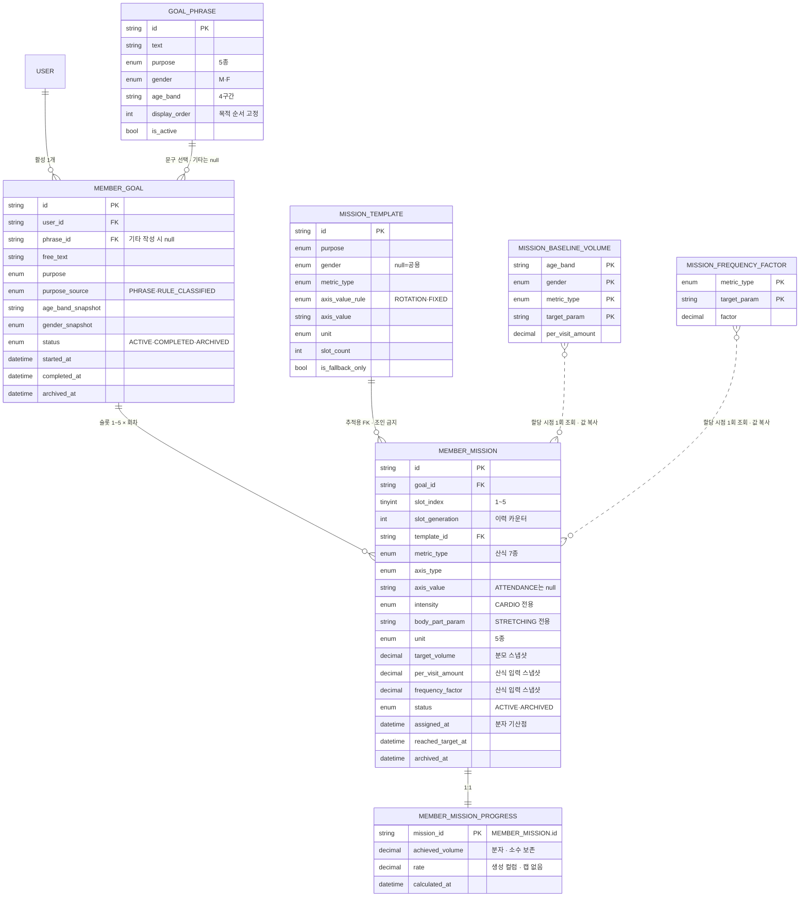
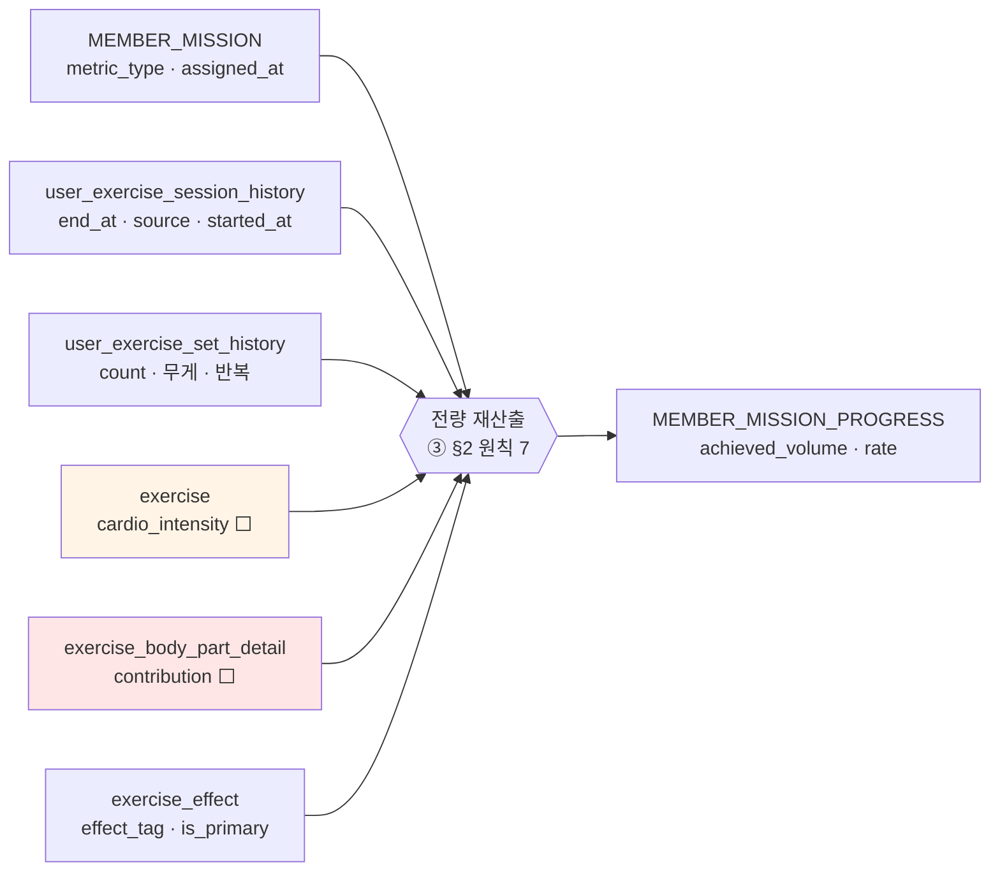

# 미션 생성·달성률 스키마 — draft

> 원천 3종 — ① [운동목표문구.md](운동목표문구.md) (TECH-601) · ② [미션생성시스템.md](미션생성시스템.md) (TECH-602) · ③ [미션달성률계산시스템.md](미션달성률계산시스템.md) (TECH-1382)
> 결정 이력: [미션생선시스템_주의.md](미션생선시스템_주의.md) · 마스터 데이터 변경은 [달성률_테이블_변경_명세.md](../달성률_테이블_변경_명세.md)가 정본
> 작성 2026-09-08 · **draft — 컬럼명·타입 미확정**

## 요약

`MemberMission` 검토 결과 **고칠 것 3개 · 채울 것 3개**. 신설 테이블은 **7개**(인스턴스 3 + 정의 2 + 상수 2).

| # | 항목 | 판단 | ③ 확인 결과 |
|---|---|---|---|
| A | `status` 의 `REPLACED` | **제거** | ③ §6 상태 4종이 전부 파생 가능 — 결론 강화 |
| B | 축 파라미터 표현 불가 | **필드 추가** | 유산소 강도는 ②③ 충돌 → 미결 |
| C | `ATTENDANCE` 는 축이 아님 | `axisValue` nullable | ③ §4 `운동한 날` = 폴백 전용 확인 |
| D | 진행률 없음 | **테이블 분리 신설** | ③ §6 "미션별 1행 · 홈 조회는 저장값 반환" 확정 |
| E | 100% 도달 시각 없음 | `reachedTargetAt` 추가 | ③ §6 `CLEARED` 전이 시각 |
| F | 산식 입력값 스냅샷 없음 | 2컬럼 추가 | ③ §3 "스냅샷 — 소급 없음" 확정 |

③ 확인으로 **이전 draft에서 틀린 것 2개를 정정**한다.

| 정정 | 이전 draft | ③ 확인 후 |
|---|---|---|
| 1 | `MissionProgressLedger` 신설 (멱등키로 delta 가산) | **테이블 자체를 삭제** — ③ §2 원칙 7이 **전량 재산출**이라 원장도 멱등키도 필요 없다 |
| 2 | `progressRate` 저장 안 함 | **저장한다** — ③ §6 "홈 조회는 저장값 반환 · 재집계 없음" |

---

## 1. ERD

### 1-1. 신설 테이블



점선(`}o..o{`)은 **FK 가 아니다** — 할당 시점에 한 번 읽고 값을 복사한 뒤 다시 조인하지 않는다([주의 3](미션생선시스템_주의.md) 스냅샷 원칙). 부위 우선순위·목적별 구성 규칙은 코드 상수라 ERD 에 없다(3-5).

### 1-2. 분자 계산 원천 — 기존 테이블

③ §4 의 미션 유형 7종이 각각 어느 기존 테이블을 읽는지.



`access_history` 는 원천에 **없다** — ③ §4 의 `운동한 날` 은 출입이 아니라 **기록이 있는 서로 다른 KST 날짜 수**다(2-C). 기존 명세 §5 의 `방문 횟수` 달성률은 주간 모델 쪽 지표이며 여기서 폐기 대상이다(§5).

⬜ 붉은 칸은 **컬럼 자체가 없다**, 주황은 **컬럼은 있고 값이 NULL** — [달성률_테이블_변경_명세.md §1·§2](../달성률_테이블_변경_명세.md)가 정본이며 이 스키마보다 **선행**한다. `contribution` 없이는 부위 세트분(③ §4-1)이 계산 불가다.

---

## 2. `MemberMission` 검토

### A. `status` 의 `REPLACED` — 제거

[주의 6-1](미션생선시스템_주의.md)에서 `archivedReason` 을 기각한 근거가 그대로 적용된다. `status` 에 넣으면 이름만 바뀐 같은 컬럼이고, **활성/비활성 이분법이 깨진다.**

```sql
-- REPLACED 를 두면 "종료된 미션" 조회가 전부 2값 나열을 달고 다닌다
WHERE status IN ('ARCHIVED', 'REPLACED')
-- 값이 하나 늘 때마다 이 목록을 빠뜨린 쿼리가 조용히 틀린다
```

③ §6 이 상태 **4종**(`IN_PROGRESS` → `CLEARED` → `REPLACED` / `CLOSED`)을 명시하는데, 확인해 보면 **넷 다 파생 가능**하다.

| ③ §6 상태 | 파생식 |
|---|---|
| `IN_PROGRESS` | `mission.status='ACTIVE' AND progress.rate < 1.0` |
| `CLEARED` | `mission.status='ACTIVE' AND progress.rate >= 1.0` |
| `REPLACED` | `mission.status='ARCHIVED'` + 같은 슬롯에 **후속 회차 존재** |
| `CLOSED` | `mission.status='ARCHIVED'` + 후속 회차 **없음** |

```sql
-- 종료 사유 역산 — 주의 6-1
SELECT m.*,
       CASE WHEN EXISTS (
         SELECT 1 FROM member_mission n
          WHERE n.goal_id = m.goal_id
            AND n.slot_index = m.slot_index
            AND n.slot_generation > m.slot_generation
       ) THEN 'REPLACED' ELSE 'CLOSED' END AS ended_reason
  FROM member_mission m
 WHERE m.status = 'ARCHIVED';
```

즉 **저장 2값 + 파생 4상태**로 ③ §6 을 전부 표현한다. 이 역산은 [주의 7](미션생선시스템_주의.md)의 **소프트 삭제 확정**을 전제한다 — 행이 사라지면 근거가 없어진다. ③ §6 "교체·종료된 미션은 삭제하지 않고 슬롯별로 보존"이 같은 얘기다.

### B. 축 파라미터 — 한 쌍으로 표현 불가

② [§1-3](미션생성시스템.md#L87)은 단위마다 **축 값과 별개의 파라미터**를 정의한다.

| 단위 | 파라미터 (② 원문) | `axisValue` 로 되나 |
|---|---|---|
| 세트분 · 총 훈련량(kg) | 부위 6종 | ✅ |
| 분 — 유산소 | **강도(중강도 · 고강도 · 무관)** | ❌ |
| 분 — 스트레칭 | **부위(선택)** | ❌ |
| 회(세션) | 효과 값 | ✅ |
| 일 | 없음 | — (C) |

깨지는 케이스 두 개.

1. **자세 목적 스트레칭** — ② [§7-5](미션생성시스템.md#L1069) "스트레칭 2개는 전면 이완 부위 고정(어깨·가슴 계열)". **성격 축 + 부위 파라미터가 동시에** 필요하다 → `bodyPartParam` 추가로 해결.
2. **유산소 강도** — ② §1-3 표기 예가 `유산소 280분` 과 `고강도 유산소 90분` 두 종류다. 그런데 **③ 은 강도 지정 미션을 만들지 않는다.**

> ⚠️ **②③ 충돌 (미결 §6-2)** — ③ §4 는 유산소 분 미션이 **1종**이고, 강도를 **분자 환산**에만 쓴다(`중강도 분 + 고강도 분 × 2`). ③ §5-1 계산 예에서도 `유산소 360분` 미션 하나에 고강도 20분이 40분으로 계상될 뿐, 강도 지정 미션이 없다. ② 는 분모에 강도를 붙일 수 있다고 읽힌다.

`intensity` 필드는 **일단 유지**한다 — ② 가 그렇게 정의하고, 나중에 붙이는 것보다 비워두는 비용이 싸다. 다만 ③ 기준으로는 **항상 null** 이며, 채워질 경우 분자 환산과 이중 적용되지 않는지 확인이 필요하다.

### C. `ATTENDANCE` 는 축이 아니다

② [§1-2](미션생성시스템.md#L43)의 축은 **3종**(효과 · 부위 · 성격)이고 출석은 목록에 없다. ② §1-3 에서 단위 "일"의 파라미터는 **"없음"**, ② [§9 규칙 6](미션생성시스템.md#L1145)이 "출석형은 범용 폴백 세트에만". ③ §2 원칙 5 도 "출입만으로 오르는 미션은 폴백 세트의 `운동한 날` 뿐"으로 같은 말을 한다.

`axisType` 에 넣는 것 자체는 실용적이다(미션 종류 판별자가 한 컬럼에 모임). 다만 **`axisValue` 는 반드시 nullable**.

한 가지 더 — ③ §4 는 `운동한 날` 을 **"기록이 있는 서로 다른 한국시간 날짜 수"**로 정의한다. ①②의 "출석"이 아니라 **기록 기반**이다([② 원문 말미 질답](미션생성시스템.md#L1265) "미션의 출석 기준은? — 운동 기록이 있어야 한다"와 일치). `access_history` 가 아니라 세션 날짜를 읽는다.

### D. 진행률 — 별 테이블 신설 (③ §6 으로 확정)

③ §6 저장 항목이 **"미션별 1행(`slot_no` + 슬롯 회차) · 홈 조회는 저장값 반환 · 재집계 없음"** 이다. 분리 신설이 원문대로다.

- **초과 허용** — ③ §2 원칙 4 "분자가 분모를 넘으면 실제 비율 표시(200%) · 캡으로 잘라내지 않음" → `rate > 1.0` 정상
- **소수 보존** — ③ §5 "표시는 정수 반올림 · **저장은 소수 보존**" → `decimal`, 반올림은 표시 계층
- **`rate` 를 저장한다** — 이전 draft 에서 "파생이니 저장 안 함"이라 했던 것을 **정정**한다. ③ §6 이 저장값 반환을 명시한다. 다만 `achieved_volume / target_volume` 과 어긋날 수 없도록 **생성 컬럼**으로 둔다

```sql
rate DECIMAL(10,4) AS (achieved_volume / target_volume) STORED
```

### E. 100% 도달 시각

**자동 교체가 없다**(② [§2-1](미션생성시스템.md#L193) "닫는 판단은 사용자가 함"). 도달과 아카이브 사이 간격이 얼마든 벌어지므로 `archivedAt` 만으로는 "언제 채웠나"를 알 수 없다.

③ §6 의 `CLEARED` 전이 시각이 이것이고, ③ §8-2 계측 지표 **"완료 시점 미션 달성률 분포"**가 이 값을 요구한다. → `reachedTargetAt` 추가, 최초 도달만 기록하고 갱신하지 않는다.

### F. 산식 입력값 스냅샷

② [§6](미션생성시스템.md#L786) `볼륨 = per_visit_amount × 10 × frequency_factor`. `targetVolume=40` 만 남기면 **"왜 40세트분인가"를 설명할 수 없다** — 기준 운동량은 실측으로 갱신되는 값이라 사후 재현이 불가능하다. ③ §3 도 "이후 마스터·기준 테이블 변경의 소급 없음"으로 스냅샷을 못박는다.

→ `perVisitAmount`, `frequencyFactor` 복사 저장.

### G. `metricType` — ③ 으로 도메인 확정

이전 draft 의 미결이었던 부분이 ③ §4 로 풀렸다. **미션 유형 7종**이 곧 분자 산식의 종류다.

| `metric_type` | ③ §4 분자 산식 | `axisType` | `unit` | 파라미터 |
|---|---|---|---|---|
| `CARDIO_MINUTE` | 유산소 세트의 분 · **중강도 + 고강도 × 2** | MODALITY | MINUTE | (강도 — B 참조) |
| `STRETCH_MINUTE` | 스트레칭 종목의 분 | MODALITY | MINUTE | 부위(선택) |
| `STRENGTH_SESSION` | 근력 종목 1개 이상 포함 세션 수 | MODALITY | SESSION | — |
| `BODY_PART_SET` | 완료 세트 × 기여도(직접 1.0 / 보조 0.5) | BODY_PART | SET | 부위 6종 |
| `BODY_PART_KG_VOLUME` | 직접 종목의 무게 × 반복 합 | BODY_PART | KG_VOLUME | 부위 6종 |
| `EFFECT_SESSION` | 해당 효과가 **주 효과**인 종목 포함 세션 수 | EFFECT | SESSION | 효과 값 |
| `ACTIVE_DAY` | 기록이 있는 서로 다른 KST 날짜 수 | ATTENDANCE | DAY | — |

**② §5-1 의 "8유형"과 다른 축이다.** ② §5-1 은 `per_visit_amount` 세그먼트(부위 6 + 유산소 + 스트레칭)이고, ③ §4 의 7종은 **분자 산식 종류**다. 상수 테이블은 `(metric_type, target_param)` 복합키로 잡으면 둘을 함께 표현한다.

`STRENGTH_SESSION` 은 ② [§9 규칙 4](미션생성시스템.md#L1145) "성격 축 근력은 실질적으로 사용 불가"라 도메인에만 있고 실제 부여되지 않는다. `BODY_PART_KG_VOLUME`·`EFFECT_SESSION`(균형·순발력)은 ② [§9-2](미션생성시스템.md#L1239) 개편 선행 대상이다.

### 그 외

| 항목 | 의견 |
|---|---|
| `unit` 5종 | ② §1-3 과 **정확히 일치** ✅ (분이 유산소·스트레칭으로 나뉘어 표는 6줄이지만 단위는 `MINUTE` 하나) |
| `assignedAt` 누락 | **추가 필요** — ③ §2-1·§3 "분자는 그 미션이 슬롯에 부여된 시각 이후 기록만 · **교체 전 초과분 이월 없음**". 기산점이 없으면 교체 후 미션이 이전 실적을 먹는다 |
| `templateId` | [주의 3](미션생선시스템_주의.md) 대로 **추적용 FK만**. ③ §3 주의 박스도 "조회 시 마스터를 다시 조인하지 말 것" |
| `slotIndex: 1\|2\|3\|4\|5` | DDL 은 `tinyint` + `CHECK`. 리터럴 유니온은 TS 레벨에서만 |
| `id: string` | ULID 권고 — 생성 시각 순 정렬이 `slotGeneration` 이력 조회에 유리 |

---

## 3. 스키마 draft

### 3-1. `MemberMission` 수정본

```ts
MemberMission {
  id: string;
  goalId: string;
  slotIndex: 1 | 2 | 3 | 4 | 5;
  slotGeneration: number;      // 1부터 · 이력 카운터 + 종료 사유 역산 + 결정성 시드
                               // 로테이션 인덱스 아님(주의 6-2) · 볼륨 계수 아님(주의 8)
  templateId: string;          // 추적용 FK만 — 조회 시 조인 금지 (주의 3 · ③ §3)

  // 유형과 축 — ③ §4 산식 7종 (2-G)
  metricType: 'CARDIO_MINUTE' | 'STRETCH_MINUTE' | 'STRENGTH_SESSION'
            | 'BODY_PART_SET' | 'BODY_PART_KG_VOLUME' | 'EFFECT_SESSION' | 'ACTIVE_DAY';
  axisType: 'BODY_PART' | 'EFFECT' | 'MODALITY' | 'ATTENDANCE';
  axisValue?: string;          // ATTENDANCE 는 null (2-C)
  intensity?: 'MODERATE' | 'VIGOROUS';  // ③ 기준 항상 null — ②③ 충돌 (2-B · 미결 6-2)
  bodyPartParam?: string;      // STRETCH_MINUTE 전용 · 자세 목적 전면 이완 (② §7-5)

  // 볼륨 — 할당 시점 스냅샷 (② §6 · ③ §3)
  unit: 'SET' | 'KG_VOLUME' | 'MINUTE' | 'SESSION' | 'DAY';
  targetVolume: number;        // 분모
  perVisitAmount: number;      // 산식 입력값 — targetVolume 재현용
  frequencyFactor: number;

  status: 'ACTIVE' | 'ARCHIVED';  // 단방향 · ③ §6 4상태는 파생 (2-A)
  assignedAt: Date;            // 분자 집계 기산점 — 교체 전 실적 이월 방지 (③ §2-1)
  reachedTargetAt?: Date;      // 100% 최초 도달 = CLEARED 전이 (③ §6)
  archivedAt?: Date;
}
```

### 3-2. `MemberGoal`

```ts
MemberGoal {
  id: string;
  userId: string;

  phraseId?: string;           // 문구 40종 FK · "기타 직접 작성" 시 null
  freeText?: string;
  purpose: 'DIET' | 'STRENGTH' | 'HEALTH' | 'FITNESS' | 'POSTURE';
  purposeSource: 'PHRASE' | 'RULE_CLASSIFIED';   // 기타는 룰 베이스 분류 (② §3·§10)

  // 생성 파라미터 스냅샷 — 회원 정보는 변한다
  ageBandSnapshot: string;     // 10~20대 · 30대 · 40대 · 50대+ (② §5-1)
  genderSnapshot: 'M' | 'F';

  status: 'ACTIVE' | 'COMPLETED' | 'ARCHIVED';   // 삭제 = ARCHIVED · 하드 삭제 없음 (주의 7)
  startedAt: Date;
  completedAt?: Date;          // ① §0-4 사용자 완료 클릭 · 되돌리기 불가
  archivedAt?: Date;
}
```

- **연령대·성별 스냅샷** — 부위 우선순위가 `목적 × 성별`(② §7-2), 기준 운동량이 `연령대 × 성별`(② §5-1)이다. 라이브로 읽으면 생일이 지나는 순간 진행 중 목표의 로테이션 목록이 바뀐다.
- **"불러오기" 필드 없음** — ① §0-4 에 4번째 조작으로 남아 있으나 [주의 4](미션생선시스템_주의.md)에서 **기능 자체를 없애기로 확정**. 진척 이어받기 관련 컬럼을 두지 않는다.
- **삭제** — ① §0-4 는 하드 삭제("미션 수행 히스토리도 같이 삭제")지만 [주의 7](미션생선시스템_주의.md)이 소프트로 확정. `ARCHIVED` 로 두고 **히스토리 조회에서 제외**해 ① 의 사용자 관점 동작을 만족시킨다.

### 3-3. `MemberMissionProgress`

```ts
MemberMissionProgress {
  missionId: string;           // PK · MemberMission 과 1:1
  achievedVolume: number;      // 분자 · 소수 보존 (③ §5) · targetVolume 초과 가능 (③ §2 원칙 4)
  rate: number;                // 생성 컬럼 = achievedVolume / targetVolume · 캡 없음
  calculatedAt: Date;          // 마지막 전량 재산출 시각
}
```

**원장 테이블 없음.** ③ §2 원칙 7 이 **"누적 가산이 아니라 원천 전체 재집계 — 중복·수정·삭제 이벤트에도 항상 정답"** 이다. 재산출 자체가 멱등이라 이전 draft 가 상정했던 `MissionProgressLedger`(멱등키 + delta 가산)는 **불필요하고, 오히려 원칙 7 을 위반**한다.

재계산 트리거 (③ §6)

| 트리거 | 비고 |
|---|---|
| 운동 기록 종료 · 수정 · 삭제 | 즉시 · 배치 없음 (③ §2 원칙 6) |
| 미션 부여 · 교체 | 새 회차의 기산점부터 0 에서 시작 |
| 목표 변경 · 삭제 · 완료 클릭 | 슬롯 전체 종료 처리 |

분자 공통 필터 (③ §4) — 해당 회원 · **`assigned_at` 이후** · `end_at IS NOT NULL` · 삭제 세션·INACTIVE 운동 제외 · 외부 운동(`source='OUTSIDE'`) **포함**.

### 3-4. `MissionTemplate`

```ts
MissionTemplate {
  id: string;
  purpose: 'DIET' | 'STRENGTH' | 'HEALTH' | 'FITNESS' | 'POSTURE';
  gender?: 'M' | 'F';          // null = 공용 (체력 · 자세는 성별 동일 ② §7-2)

  metricType: string;          // 2-G 7종
  axisValueRule: 'ROTATION' | 'FIXED';   // 부위 = 로테이션 · 유산소/스트레칭 = 고정
  axisValue?: string;          // FIXED 일 때만
  bodyPartParam?: string;
  unit: 'SET' | 'KG_VOLUME' | 'MINUTE' | 'SESSION' | 'DAY';

  slotCount: number;           // 이 템플릿이 차지하는 슬롯 개수 (② §7-1)
  isFallbackOnly: boolean;     // 출석형 = 범용 폴백 세트 전용 (② §9 규칙 6)
}
```

**볼륨 컬럼이 없다** — [주의 5](미션생선시스템_주의.md)대로 템플릿은 축/개수 정의 수준이고, 볼륨은 할당 시점에 ② §6 공식으로 매번 계산한다.

### 3-5. `GoalPhrase` — 목표 마스터

```ts
GoalPhrase {
  id: string;
  text: string;                // 생활형 언어 · 지표·수치 표현 금지 (① §0-2)
  purpose: 'DIET' | 'STRENGTH' | 'HEALTH' | 'FITNESS' | 'POSTURE';
  gender: 'M' | 'F';
  ageBand: string;             // 10~20대 · 30대 · 40대 · 50대+
  displayOrder: number;        // 목적 순서 고정 — 다이어트→근력→건강→체력→자세 (① §0-2 기준 2)
  isActive: boolean;
}
// UNIQUE (gender, ageBand, purpose)  ← 8세그먼트 × 5목적 = 40행
```

① §0-2 기준 5 **"하드코딩 금지 — 목표 마스터 테이블(문구 · 목적 코드 · 세그먼트 · 노출 규칙)로 관리 · 새 문구 = 마스터 행 추가"**. 기준 4 "전 문구가 미션 생성 가능"이 `purpose` 를 NOT NULL 로 만드는 근거다.

### 3-6. 상수 테이블

② [§5](미션생성시스템.md#L350)가 "DB 마스터 테이블 또는 코드 내 상수 · 어느 쪽이든 값 변경이 규칙 코드 수정을 요구하지 않아야 함"이라 했다. 성질에 따라 가른다.

| 이름 | 내용 | 위치 | 근거 |
|---|---|---|---|
| `MissionBaselineVolume` | 연령대 × 성별 × 유형 → `per_visit_amount` | **DB** | 실측으로 갱신 (② [L1143](미션생성시스템.md#L1143)) |
| `MissionFrequencyFactor` | 유형 → `frequency_factor` | **DB** | 습관 관측치 · 갱신 여지 |
| 목적별 구성 규칙 | 목적 × 성별 → 유형별 개수 | 코드 상수 | ② §7-1 · 변경 = 정책 변경 |
| 부위 우선순위 | 목적 × 성별 → 부위 순서 | 코드 상수 | ② §7-2 · 배포 마찰이 있는 게 낫다 |

```ts
MissionBaselineVolume {
  ageBand: string;  gender: 'M' | 'F';
  metricType: string;  targetParam?: string;
  perVisitAmount: number;
}
// PK (ageBand, gender, metricType, targetParam) — 8세그먼트 × 8유형

MissionFrequencyFactor {
  metricType: string;  targetParam?: string;
  factor: number;      // 가슴·등·하체 0.35 / 어깨·팔 0.30 / 코어 0.40 / 유산소 0.80 / 스트레칭 0.50
}
// PK (metricType, targetParam) — 세그먼트 무관
```

**`frequency_factor` 를 기준 운동량 테이블에서 분리했다.** ② §5-1 은 두 값을 한 테이블에 두는데 ② [§5-2](미션생성시스템.md#L630)가 **"세그먼트 무관 · 유형별 고정"**이라고 명시한다. 한 테이블에 두면 같은 계수가 8세그먼트에 8번 중복돼 갱신 시 일부만 바뀌는 사고가 난다. (원문은 고치지 않으므로 — [주의 6-3](미션생선시스템_주의.md) — 이 분리는 구현 판단으로 여기에만 남긴다.)

부위 우선순위를 코드 상수로 두면 [주의 6-2](미션생선시스템_주의.md)의 `indexOf = -1` fallback 이 실동작 경로가 되지 않는다 — 목록 개정에 배포가 따라오므로 마이그레이션을 같이 붙일 수 있다. DB 로 가면 fallback 을 반드시 구현해야 한다.

---

## 4. 제약·인덱스

| 대상 | 제약 | 이유 |
|---|---|---|
| `member_mission` | `UNIQUE (goal_id, slot_index, slot_generation)` | 회차 중복 = 종료 사유 역산 붕괴 (2-A) |
| `member_mission` | `UNIQUE (goal_id, slot_index)` where `status='ACTIVE'` | 슬롯당 활성 미션 1개 · MySQL 은 부분 인덱스가 없어 생성 컬럼 또는 앱 레벨 |
| `member_mission` | `CHECK (slot_index BETWEEN 1 AND 5)` | ② §9 규칙 1 · ③ §3 |
| `member_mission` | `CHECK (target_volume > 0)` | ② §9 규칙 2 "분모가 없으면 계산 불성립" |
| `member_mission` | `axis_type='ATTENDANCE'` ↔ `axis_value IS NULL` | 2-C |
| `member_mission` | `intensity IS NOT NULL` ⊂ `metric_type='CARDIO_MINUTE'` | 2-B |
| `member_goal` | `UNIQUE (user_id)` where `status='ACTIVE'` | ① §0-4 "활성 목표는 항상 1개" |
| `goal_phrase` | `UNIQUE (gender, age_band, purpose)` | 40종 |
| `member_mission_progress` | `rate` STORED generated | `achieved_volume / target_volume` 불일치 불가 (2-D) |

**DB 제약으로 못 막는 것** — ② [§9 규칙 3~5](미션생성시스템.md#L1145)는 세트 전체에 걸린 불변식이다.

- 규칙 3 — 동시 진행 미션에 성격 축과 효과 축 중 한쪽만
- 규칙 4 — 성격 축 근력 사용 불가
- 규칙 5 — 균형·순발력 미션과 부위 미션의 종목 교집합 검증

행 단위 CHECK 로 표현이 안 되므로 **생성기의 ⑤ 검증 단계**(② §4)에서 잡고, 위반 시 생성 실패 로그 + 폴백 세트를 부여한다(② §8).

---

## 5. 기존 명세와의 충돌 — 주간 진행 모델은 폐기 대상

[달성률_테이블_변경_명세.md §6](../달성률_테이블_변경_명세.md)이 "목표·진행 테이블 5종 신설"로 잡아둔 스펙과 이 모델이 **정면으로 다르다.** ③ 확인으로 확정됐다.

| 항목 | 기존 명세 (회의 문서 기준) | ③ 미션 달성률 계산 시스템 |
|---|---|---|
| 진행 단위 | **주 1행** · 주 경계 월요일 00:00 KST | **기간 없는 절대 총량** — §2 원칙 2 "기간 마감·일할 비례·**자정 경계 없음**" |
| 목표선 | 주마다 스냅샷 · **부분 주 비율 조정** | 할당 시점 1회 스냅샷 · 조정 없음 (§3) |
| 합산 지표 | 목표별 달성률 | **없음** — 미션 1개 = 게이지 1개 (§1) |
| 진행 종료 | 주 확정(확정 시각) | 100% 도달 후 **사용자 교체 선택** (§5) |
| 계산 방식 | 주간 집계 | **전량 재산출** · 배치 없음 (§2 원칙 6·7) |

기존 명세의 **주간 진행 · 목표선 스냅샷 · 부분 주 표식은 이 모델에서 전부 불필요**하다. 특히 §6 이 "특히 중요하다"고 강조한 부분 주 표식은 ③ §2 원칙 2 가 정면으로 부정한다.

반대로 기존 명세 **§1~5(마스터 데이터 정비)는 그대로 필요하다** — 분자 원천이 같기 때문이다. 오히려 ③ §4 가 그 의존을 확정한다.

| 기존 명세 항목 | ③ 에서의 쓰임 | 상태 |
|---|---|---|
| `exercise_body_part_detail.contribution` 신설 | §4-1 부위 세트분 (직접 1.0 / 보조 0.5) | **컬럼 자체 없음 — 최우선** |
| `exercise.cardio_intensity` 값 부여 | §4 유산소 강도 환산 (고강도 × 2) | 컬럼 존재 · 값 NULL |
| `is_primary` 적용 규칙 명문화 | §4 효과 세션 수 "**주 효과**인 종목" | 결정 대기 |
| 균형 종목 6~10종 등록 | §4 `EFFECT_SESSION` | 종목 0건 |

→ **착수 순서는 기존 명세가 먼저다.** 이 스키마를 다 만들어도 `contribution` 없이는 부위 세트분이 계산되지 않는다.

---

## 6. 미결

| # | 항목 | 근거 |
|---|---|---|
| 1 | **주간 진행 모델 폐기 확인** — 기존 명세 §6 의 진행 테이블 5종 스펙을 버리는지 PO 확인 | §5 |
| 2 | **유산소 강도 미션의 존재 여부** — ② §1-3 은 `고강도 유산소 90분` 을 상정, ③ §4 는 강도를 분자 환산에만 사용. `intensity` 를 쓰는지 | 2-B |
| 3 | 100% 초과 표시 상한 | ③ §9-1 — 원문도 미결 |
| 4 | `metric_type` 값 명명 · 테이블명 확정 | ③ §9-2 "DB 구조 개편 작업에서 확정" · 2-G 는 잠정안 |
| 5 | 목표 `삭제` 의 최종 처리 — ① §0-4 하드 삭제 vs [주의 7](미션생선시스템_주의.md) 소프트 확정 | ③ §9-3 이 "PO 논의 중"으로 표기 · 주의 7 은 확정으로 기록 — **표기 불일치** |
