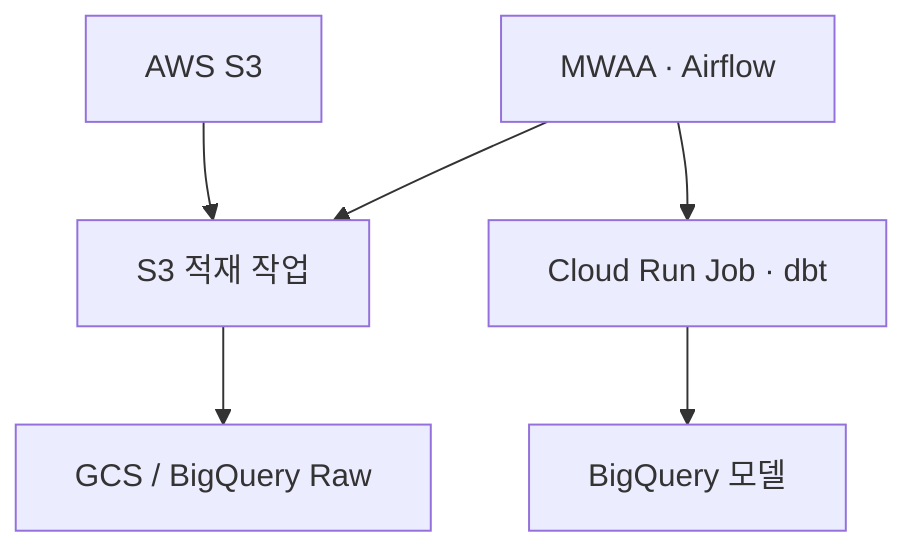
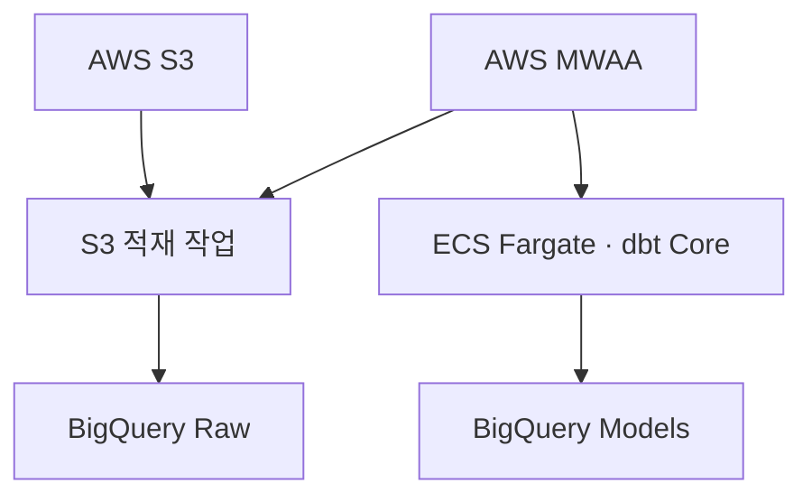
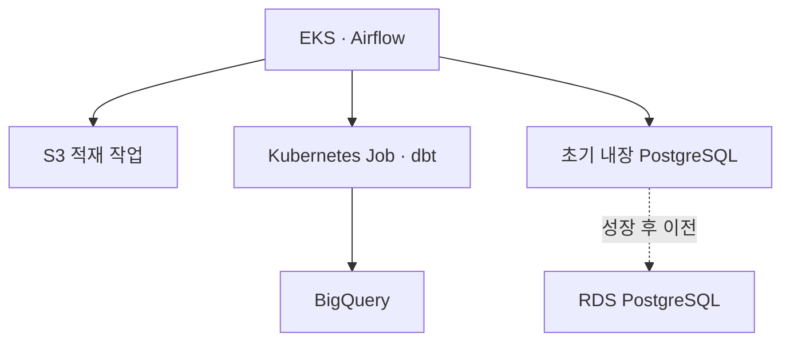

# 배경

S3(AWS)에 있는 원천 데이터를 최종 DW인 BigQuery(GCP)로 적재·변환하는 파이프라인의 오케스트레이션 도구와 dbt 실행 위치를 결정해야 했습니다. AWS와 GCP를 넘나드는 구조라 어느 클라우드를 운영 중심으로 삼을지, EKS를 직접 운영하는 비용까지 고려합니다.

# 검토한 선택지

- **A안: Cloud Composer + Cloud Run(dbt)**
- **B안: MWAA + Cloud Run(dbt)**
- **C안: MWAA + ECS Fargate(dbt)**
- **D안(최종): EKS Airflow + Kubernetes Job(dbt)**

| 평가 기준 | Cloud Composer 3 | AWS MWAA | Kubernetes |
| --- | --- | --- | --- |
| BigQuery/dbt 연계 | 5 | 3 | 4 |
| S3 연계 | 4 | 5 | 4 |
| 운영 부담 | 5 | 5 | 2 |
| 인증 단순성 | 5 | 3 | 3 |
| 실행 격리 | 4 | 4 | 5 |
| 이식성 | 3 | 3 | 5 |
| 종합 | **4.5** | **3.8** | **3.6** |

| 후보 | 격리 | 비용 효율 | BigQuery 인증 | 운영성 | 판단 |
| --- | --- | --- | --- | --- | --- |
| Airflow Worker 내부 | 1 | 3 | 4 | 2 | 비권고 |
| ECS/Fargate | 5 | 5 | 3 | 4 | MWAA 선택 시 유력 |
| Cloud Run Job | 5 | 5 | 5 | 5 | **권고** |
| Kubernetes Job | 5 | 4 | 4 | 2 | 기존 K8s가 있을 때 |

# 결정

### 1. 최초안: Cloud Composer + Cloud Run

S3는 AWS에 있지만 최종 DW가 BigQuery이므로 GCP 중심 구성을 검토했습니다.

**Cloud Composer → Cloud Run dbt → BigQuery**

BigQuery 인증은 편했지만 GCP 운영 경험이 부족하고 향후 AWS 이전 가능성이 있어 제외했습니다.

### 2. AWS 중심 전환: MWAA + Cloud Run

S3 작업은 MWAA가 관리하고 dbt는 BigQuery와 가까운 Cloud Run에서 실행하는 구조였습니다.

**MWAA → Cloud Run dbt → BigQuery**

기술적으로는 깔끔하지만 로그, IAM, 이미지 저장소와 배포가 AWS/GCP로 분리되는 문제가 있었습니다.

### 3. 관리 포인트 통합: MWAA + ECS Fargate

GCP 관리 범위를 줄이고 향후 ECS/EKS 전환을 고려해 dbt 실행 위치를 AWS로 이동했습니다.

**MWAA → ECS Fargate dbt → BigQuery**

CloudWatch, ECR, IAM으로 운영을 통합할 수 있어 당시 조건에서는 가장 적절한 안이었습니다.

### 4. 기존 EKS 운영 조건 확인: EKS Airflow로 변경

EKS 운영이 어렵다지만 상황을 검토해밨습니다.

- 기존 공용 EKS 클러스터 운영 중
- Kubernetes 운영 담당자 존재
- Argo CD/Helm 배포 체계 존재
- 로그, Secret, ingress, autoscaling 표준 존재
- Kubernetes 정기 업그레이드 가능
- 향후 다른 배치도 EKS로 통합 예정

따라서 MWAA를 추가로 도입할 이점보다 기존 EKS를 활용하는 이점이 커졌습니다.

### 5. 최종 현재안: EKS Airflow + Kubernetes dbt Job

DBT를 airflow 내부가 아닌 별도 Kubernetes Job으로 실행하는 이유는 다음과 같습니다.

- 이미지와 배포 주기 분리 — dbt 모델 변경이 Airflow 배포에 안 얽히게
- BigQuery 권한 분리 — 최소 권한 원칙
- 이미지 의존성 충돌 회피 — Airflow와 dbt-bigquery의 Python 패키지를 한 이미지에 안 섞음

## 현재 확정된 결정

| 항목 | 현재 결정 |
| --- | --- |
| Airflow | 기존 공용 EKS에 Helm/Argo CD로 배포 |
| dbt Core | 별도 Kubernetes Job/Pod |
| Airflow/dbt 관계 | 같은 EKS를 사용하지만 이미지·Pod·SA 분리 |
| Executor | KubernetesExecutor 중심 검토 |
| 초기 metadata DB | PVC 기반 내장 PostgreSQL |
| 성장 후 DB | RDS PostgreSQL로 이전 |
| S3 접근 | EKS Pod Identity 또는 IRSA |
| BigQuery 인증 | EKS OIDC 기반 GCP WIF |
| GCP SA | 환경·워크로드별 분리, JSON Key 금지 |
| S3→BigQuery | Airflow가 별도 적재 작업을 오케스트레이션 |
| dbt 책임 | BigQuery Raw 이후 변환과 테스트 |
| Secret/로그 | 기존 EKS/AWS 운영 표준 재사용 |
| 네트워크 | 초기에는 NAT 기반 HTTPS, VPN 없음 |

내장 PostgreSQL에서 RDS로 넘어가는 기준은 Lake 데이터 용량보다 다음 항목으로 판단하는 것이 정확합니다.

- DAG와 Task Instance 증가량
- 실행 이력 보존 기간
- DB 백업·복구 요구
- Airflow 장애 허용 수준
- 운영 SLA
- metadata DB 성능

# 영향

- S3 접근은 EKS Pod Identity 또는 IRSA를, BigQuery 인증은 EKS OIDC 기반 GCP Workload Identity Federation을 사용합니다. GCP Service Account는 환경·워크로드별로 분리하고 JSON Key는 사용하지 않습니다.
- S3→BigQuery 적재는 Airflow가 별도 적재 작업으로 오케스트레이션하며, dbt는 BigQuery Raw 적재 이후의 변환·테스트만 책임집니다.
- Secret·로그는 기존 EKS/AWS 운영 표준을 재사용하고, 네트워크는 초기에는 NAT 기반 HTTPS로 구성하며 VPN은 두지 않습니다.

### 감수하는것

MWAA 등 관리형 서비스가 제공하는 편의(자동 스케일링, 관리형 업그레이드 등)를 포기하는 대신, 기존 EKS 운영팀의 부담이 다소 늘어납니다.
초기 Airflow metadata DB는 PVC 기반 내장 PostgreSQL로 시작합니다. 다만 단일 Pod·단일 볼륨 구조라 자동 페일오버가 없어 노드 장애나 PVC 손상 시 Airflow 전체(스케줄링, 실행 이력, 연결 정보 등)가 함께 멈추는 단일 장애점이 되고, 백업·복구도 관리형 서비스처럼 자동화되어 있지 않아 수동 스냅샷/복구 절차에 의존해야 합니다. DAG·Task Instance가 늘어나면 PVC I/O 성능 한계로 스케줄러 지연이 발생할 수도 있습니다. 이런 위험을 감수할 수 있는 초기 단계에서만 유지하고, 운영 중요도가 올라가면 자동 백업을 지원하는 RDS로 이전합니다.

# 관련 문서

- Airflow KubernetesExecutor — Executor 선택 근거
- Kubernetes PersistentVolume/PersistentVolumeClaim — PVC 기반 metadata DB 구성의 기반 개념
- AWS EKS Pod Identity — S3 접근 인증 방식
- GCP Workload Identity Federation — BigQuery 인증(JSON Key 미사용) 근거
- dbt Core 문서 — dbt Job 분리 실행 관련